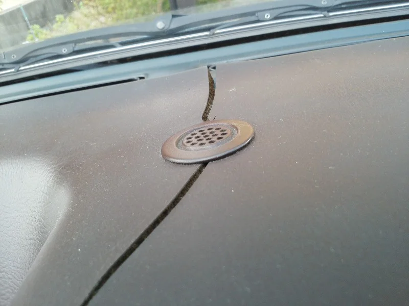
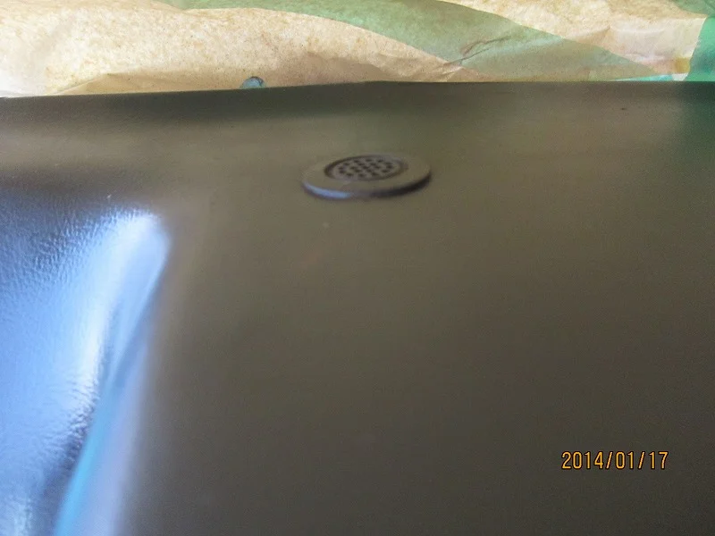

愛車のAE86（スプリンタートレノ）のダッシュボードの割れをリペアしてみました。

この車は頭文字Dの主人公の藤原拓海が乗っていることで有名ですが

もう発売されてから30年？にもなろうかという、すっかり年代ものな為

強い紫外線にさらされるダッシュボードのプラスチックが劣化して

ヒビや割れが入ってしまいます。

いわゆる経年劣化というやつで、リペアしてもまた違うところから割れてくるかも？

ですが、運転席からよく見えて「残念」な感じなので直しました。

ガラスが近くてとってもやりにくかったけどなんとか傷は消せました。

このようにエアコンの吹き出し口など急激な温度変化がある場所が特に割れやすいみたいです。
