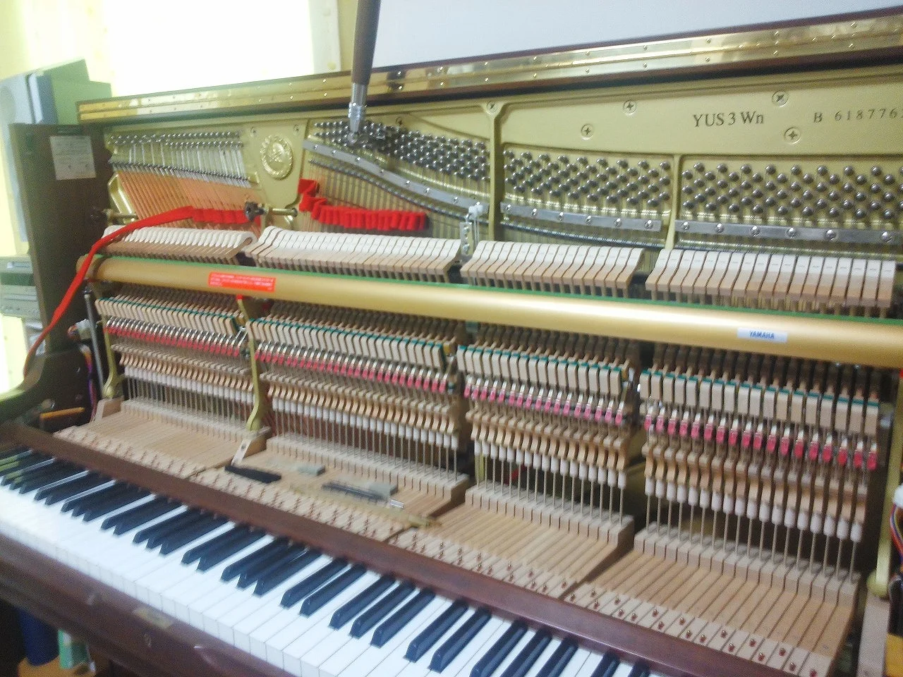
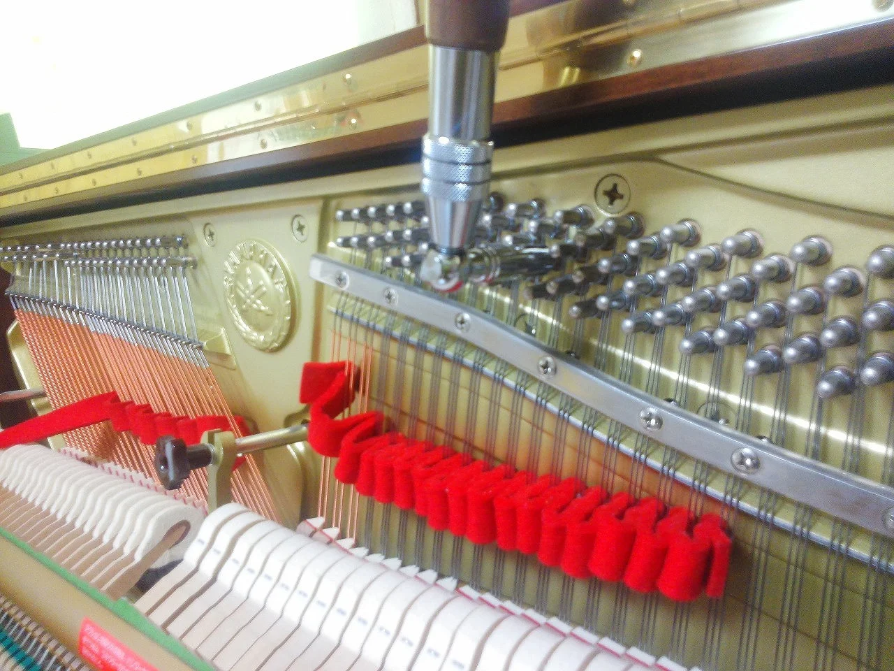
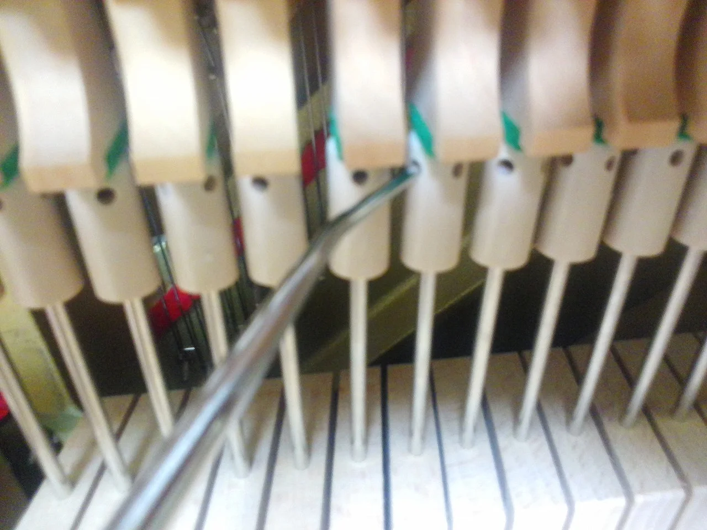
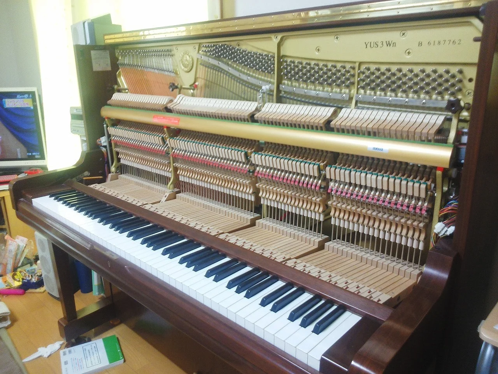

今日はとっても寒い一日でしたね、やっと少し暖かくなったと思ったのに真冬に逆戻りですね・・・。

そんなわけで午前中外に出るのが億劫だったので、家のピアノを調律しました。

外装をあけて音を止めるミュートと調律用ハンマーを使って一音づつ音を合わせていきます。

我が家のピアニストは音にうるさく、少しでも狂い始めるとなかなか厳しい指摘があります。（笑）

よく色んな方から言われるのが、「すごいですね！絶対音感があるんですか？」なんて・・・

でもたぶん勘違いされているようです。

何の基準もないところから感覚だけで全部の音を合わせるなんて、そんな曲芸みたいなことは出来ません。

最初に基準となるAの音を440HZの音叉に合わせて、その後平均律に音階を割り振って全体の音をそれに合わせていくのです。

でもそれをどうやるのか？っていうと、とても言葉で説明するのが難しい作業ですね・・・。

簡単に言うと音の振動には法則があって、周波数の違う２つの音を同時に鳴らしたときそのズレ具合によって「うなり」が出ます。その「うなり」を聴き分けて音を合わせるのです。

音を合わせ終わってから鍵盤を調整すると鍵盤からアクションに動きを伝える部分に微妙なあそびができてしまっていることに気づきました。

これによって弾いた時のレスポンスが少し悪くなるという現象が起きていたので調整しました。

これでうちのピアニストも満足してくれることでしょう。

もうすぐ発表会なのでしっかり練習してもらわねば・・・。

