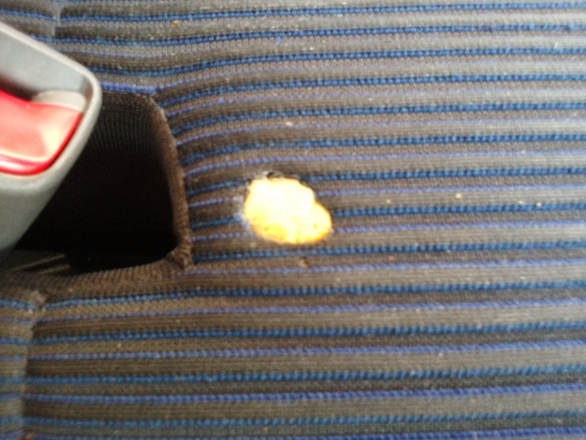
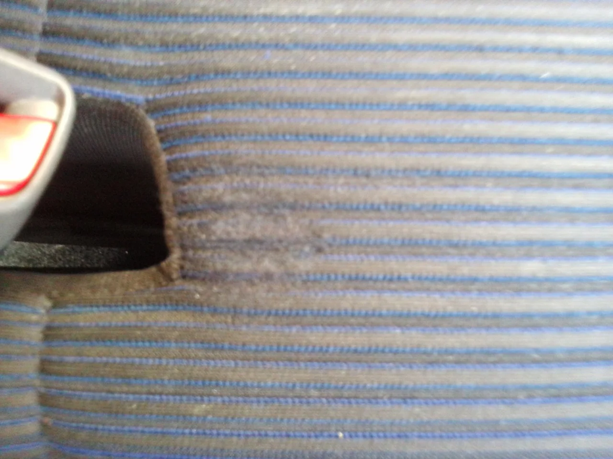

昨日一件ディーラー様から依頼を頂いた「シートのこげ穴のリペア」の件です。

レンタカーで使用されているムーヴのナビシートにかなり大きめの穴があいてしまっていました。

このシートは平織りでしかも色糸のステッチのラインが入っていたので

再現することが困難なシートでした。

ビフォーはこんな感じ（スポンジを埋めてからの写真です、最初の写真を撮り忘れてしまいました(；´Д｀)

）

アフターはこんな感じです。

暗い車内だとぱっと見目立たないくらいにはなりました。
