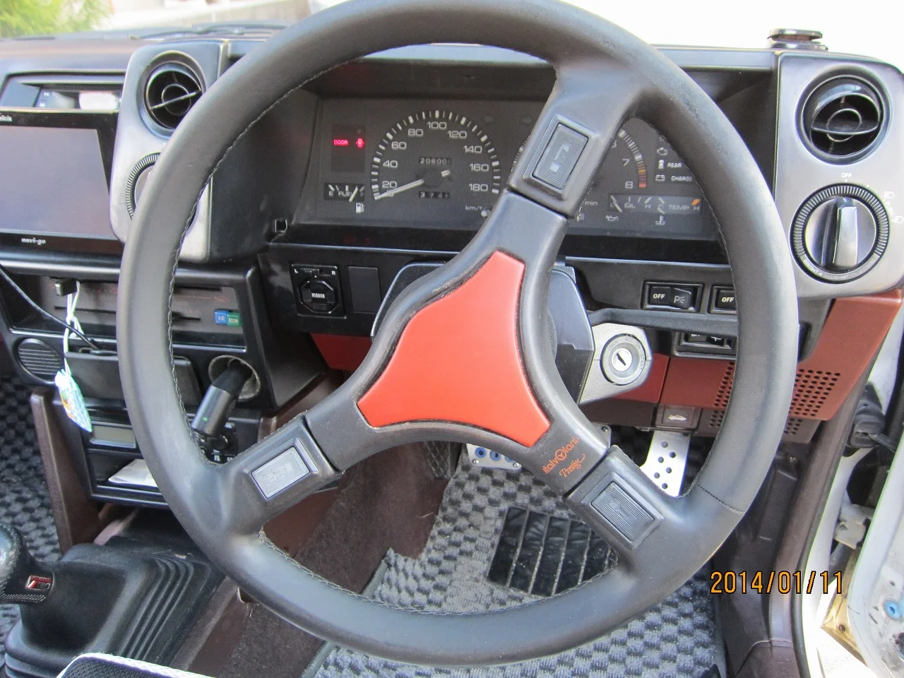
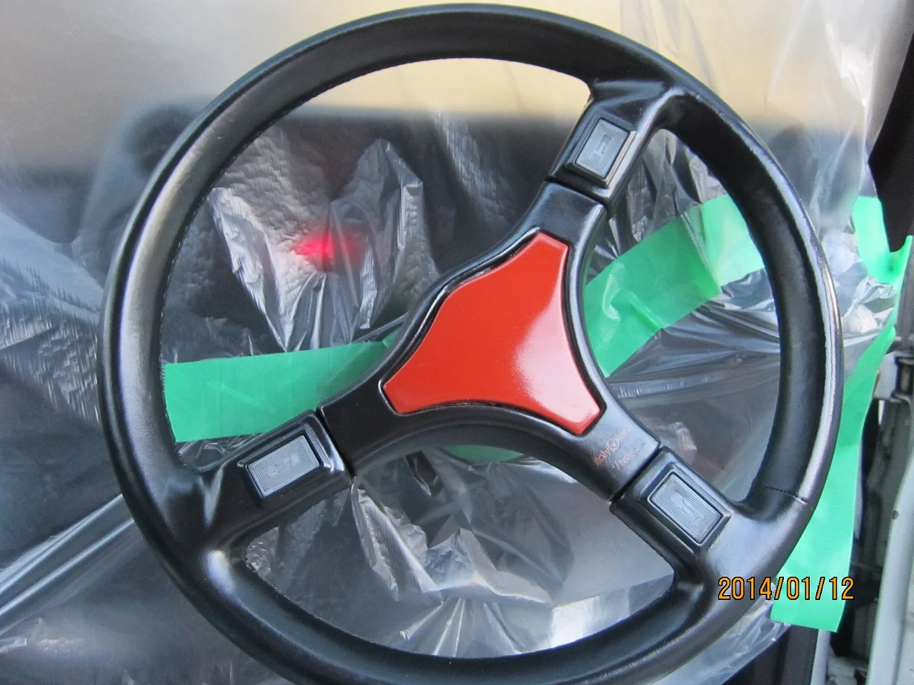

今日はとっても寒かったですね・・、

今の時期は上空で暖かい空気と冷たい空気がせめぎ合っているみたいで

本当に暖かくなるにはもう少しかかりそうですね。

ところで、インテリアのリペア事例でステアリングをアップしたいと思います。

この車は自分が気に入って乗っている（今は妻がメインユーザーですが・・・）車で

製造されてからもう３０年立つ車です。

ステアリングも社外品の「イタルボランテ」ですでに絶版品なので交換はききません。

にぎりの部分が擦れて少しめくれてきているのと、全体に退色してきています。

うちの奥様は手が小さいのでこのハンドルの細い握りが手になじむそうで、気に入っているそうですが・・。

リペア前はこんな感じでした。

なにせ年代ものなので古ぼけた感じは否めません。

余談ですが頭文字Dの主人公藤原拓海も使っていた？らしい（笑）

アニメファンには大変貴重なハンドルだそうです。

そしてリペア後はこんな感じです。

新品のときがどんな状態だったか知りませんが、特に色は塗装していません。

補修材をすり込んで傷をうめ、全体にコーティングしただけです。

かなり艶アップさせたのでちょっと違和感がありますが、奥様は新品みたいと喜んでおります。

自分の好みでもう少し艶を落とすこともできます。

まあ使っていれば徐々にまた艶が落ちてきますから、馴染んでくるとおもいますけど・・・。
