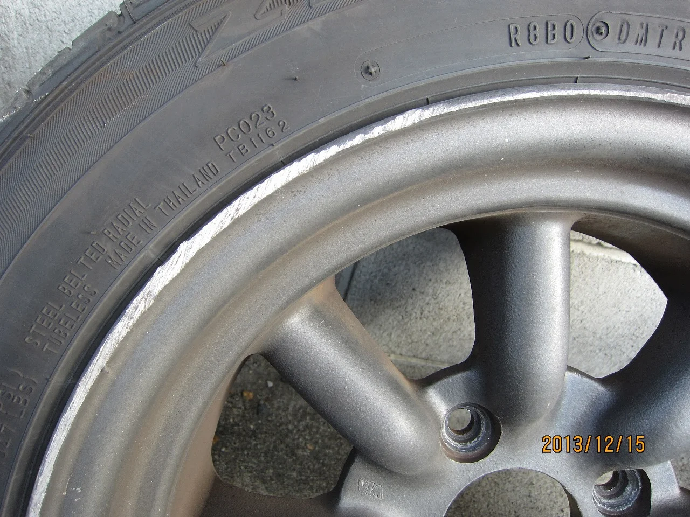
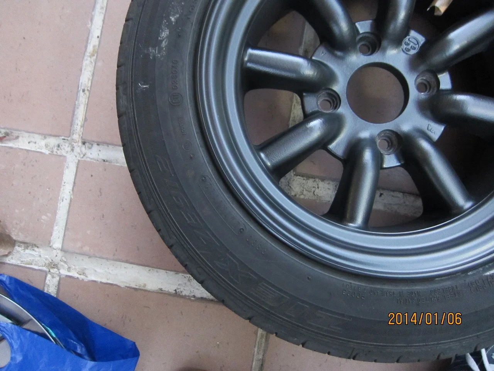
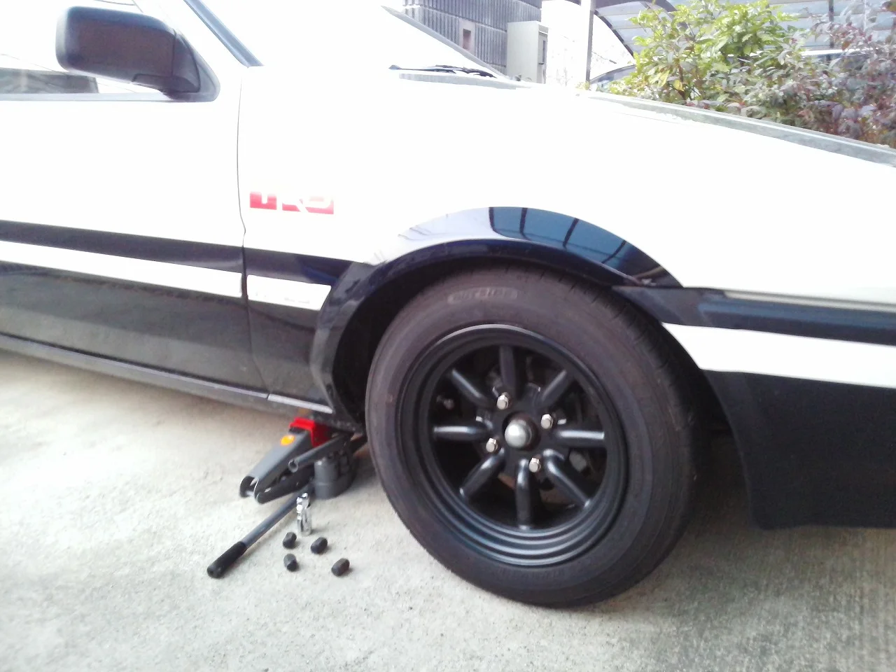

今日はまずまずのお天気だったのでタイヤをスタッドレスから夏用にやっと交換しました。

本当はもっと早くに交換したいところですが、先週はまだ雪がうっすらと積もる日もあったりして、

もう少し様子を見てからと思って見合わせておりました。

マーフィーの法則を信じているわけではありませんが、交換した途端に積雪！？なんてありがちな話なので(笑)

愛車のハチロクは例によって傷をリペアして塗装し直しましたので

結構イケメンな感じになりました。♪゜・*:.。. .。.:*・♪

補修前はこんな感じでリムにガリ傷と色もかなり退色して表面の塗装も劣化しておりました。

リペア後はこんな感じです。

このホイールメーカーはワタナベですが、当然このモデルは絶版品なのでメーカーに確認してもともとの色を聞きました。

完全に同じものは再現できませんが「マグネットブラック」という角度によってすこし青みがかって見える深い黒です。

はめてみると車もすこしイケメンになったような気がします。(笑)

