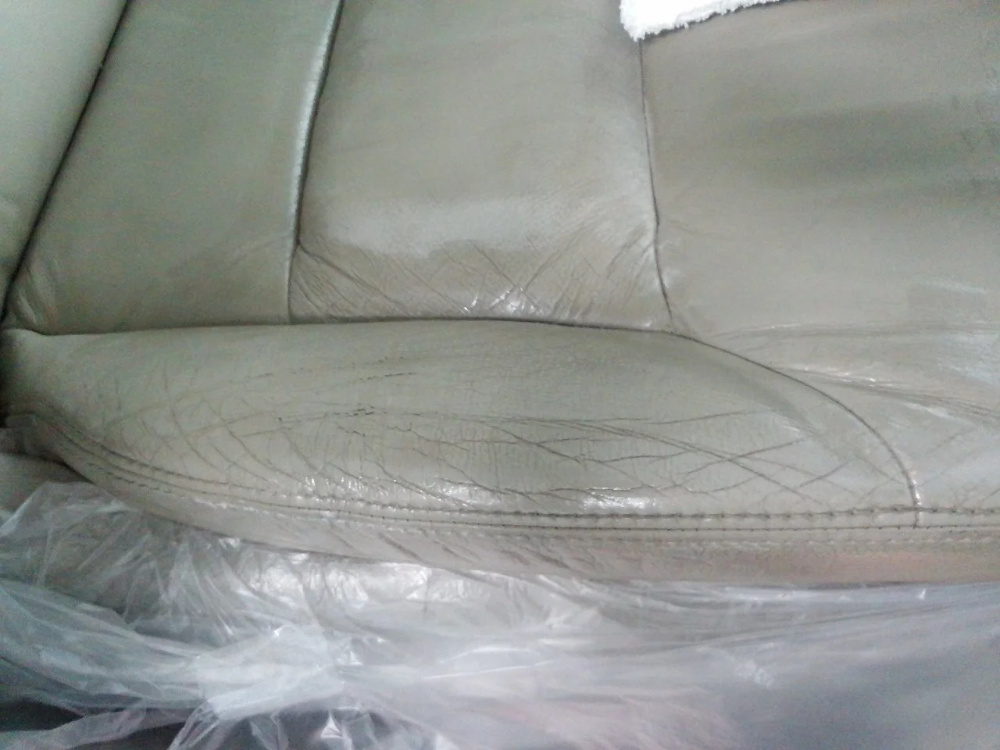
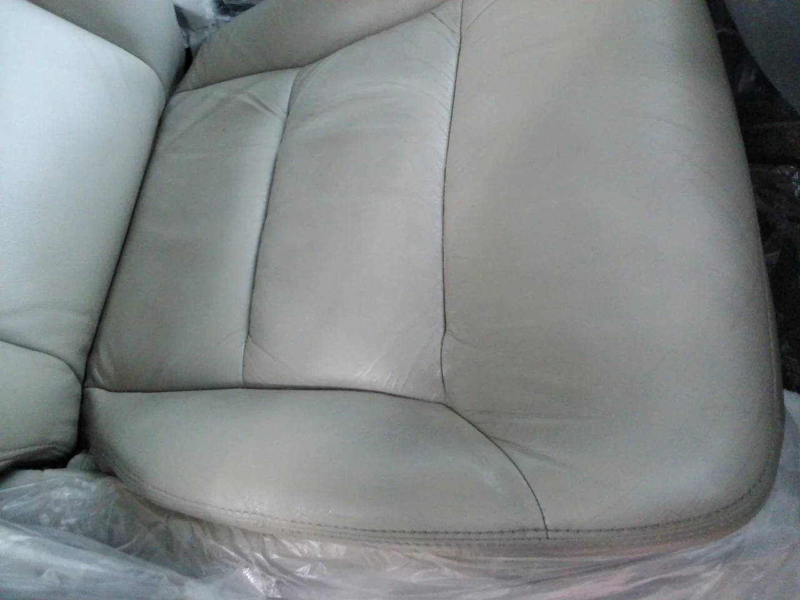
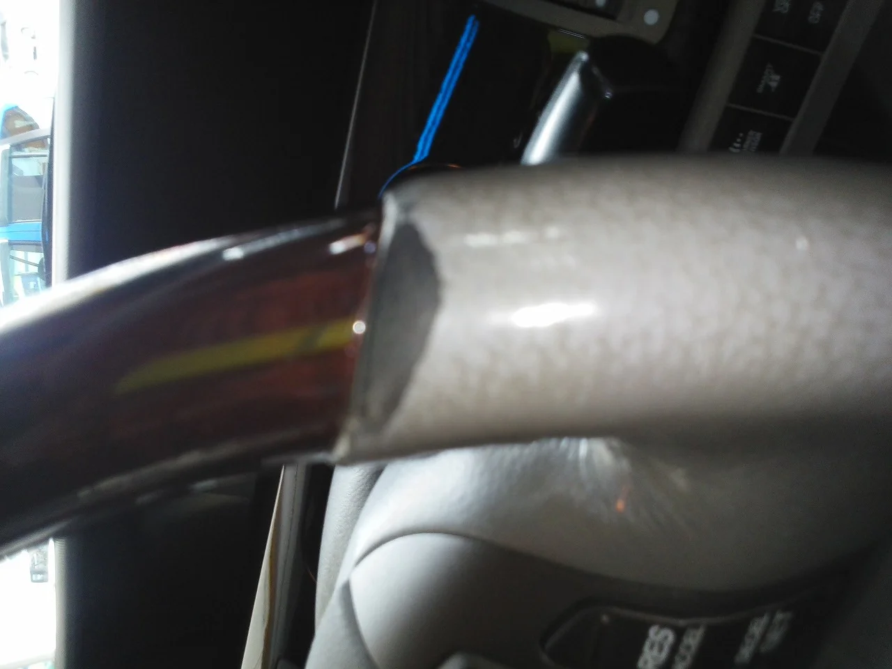
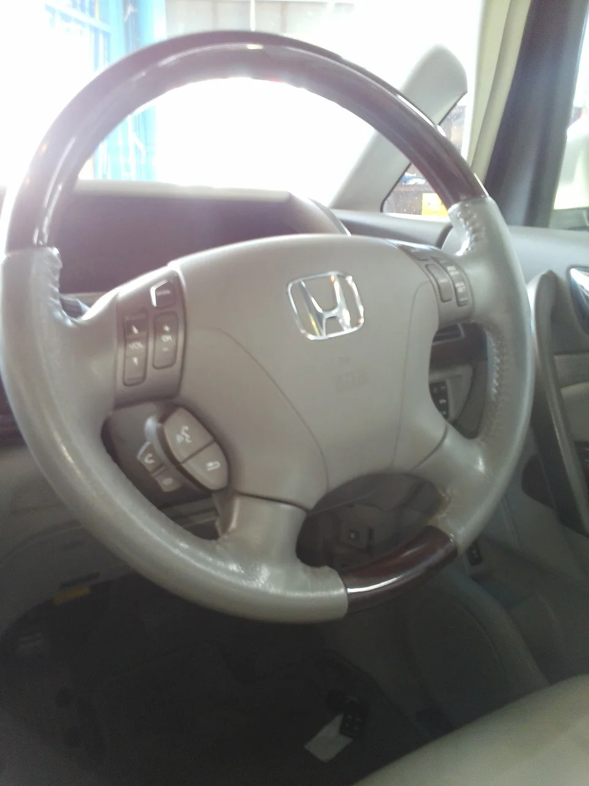

今日は革シートのリペアをやりました。

車はホンダのエリシオン

ビフォーはこんな感じでした。

運転席の、たぶん乗り降りのときに何度も擦れたり押さえられてできた傷みのようです。

色も他と比べて少し黄ばみと黒ずみが出ています。

このままだとかなり使用感があり残念な感じがします。

そして、アフターがこんな感じ！

かなり深いシワがありましたが、補修材でうめながら調色で色をのせました。

しかし、色を作るときにどの部分に合わせるかちょっと悩みますね・・・。

まだ傷んでないキレイなところに合わせると、新品のような感じになりますが、あまりキレイすぎると

まわりと浮いてしまいます。

かと言って劣化したところに合わせると、残念な感じに仕上がっちゃいます。（笑）

なので、間を取って中間ぐらいの色を調色で作りました。

そしてもう一つステアリングも擦れが・・・。

ハンドルのウッドの部分と革の部分との段差にたぶんドライバーさんが指を掛けておられたのでしょう。

ちょうど底の部分が激しく擦れています。

そしてアフターがこれ！

作業が終わった頃に昼下がりの逆光で（笑）あまりうまく撮影できませんでしたが、

使用感満載の感じは消えました。

こちらは見る角度によってツヤが違うので、ツヤを合わせるのもなかなか難しかったです。
