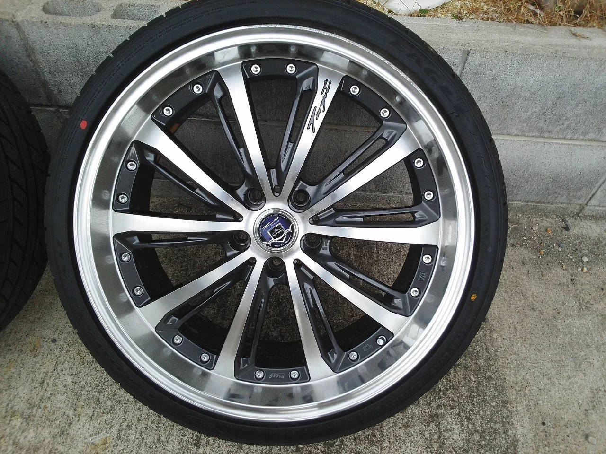
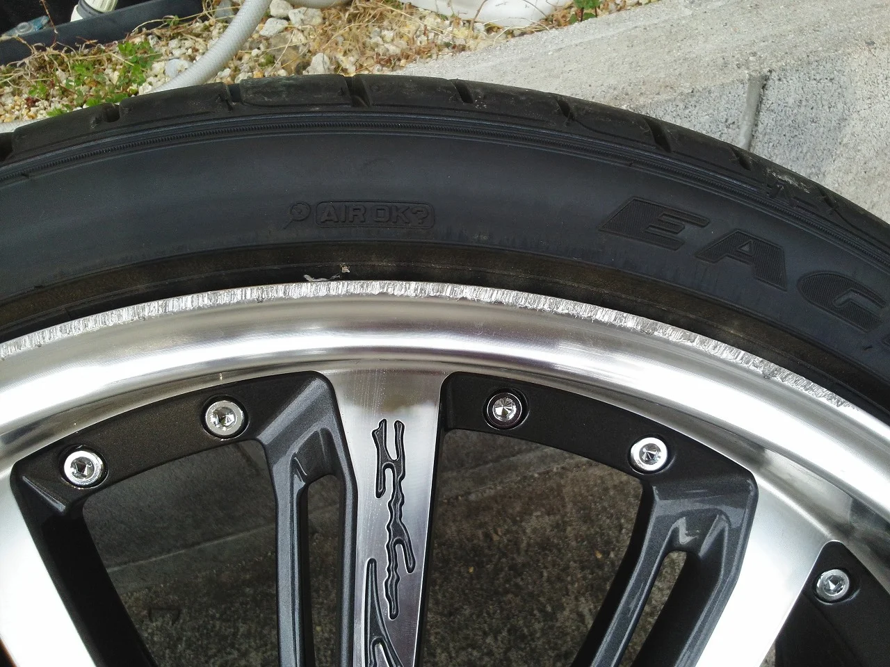
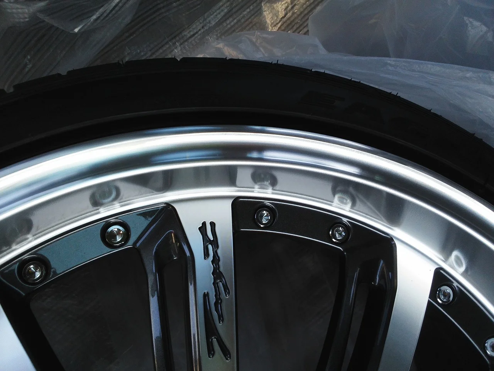

ようやく暖かくなりましたね、厚さ、寒さも彼岸までとは本当ですね。

ところで、タイヤも衣替え？の季節で、冬用から夏用に交換される方が多いと思いますが、

そんな時に気になるのが、ホイールの思わず付いてしまったガリ傷ですね・・・。

特にそのホイールがまだ新しいととってもがっかりしちゃうと思いますが、

大丈夫です、モノによりますがリペアで直せますので今回事例を紹介します。

ポリッシュ加工のとっても綺麗な１９インチのホイールですが、エンブレムの右1/6ぐらいに

ガリ傷が・・・。

幸い中のスポーク部は無事でしたが、少し深いかも？

拡大したのがこれです。

このホイールはポリッシュ加工（ＣＤのうら面みたいなキレイな虹のように見えるヘアラインが入っています。）

されているので塗装では再現できません。

キズの深さまで削る方法でリペアしました。

リペア後の写真がこれ。

しかし今回はリペア部分と他との統一感を出すためにかなり神経を使いました。(^_^;)

中にはリペア出来ないものもありますが、一度ご相談ください。
