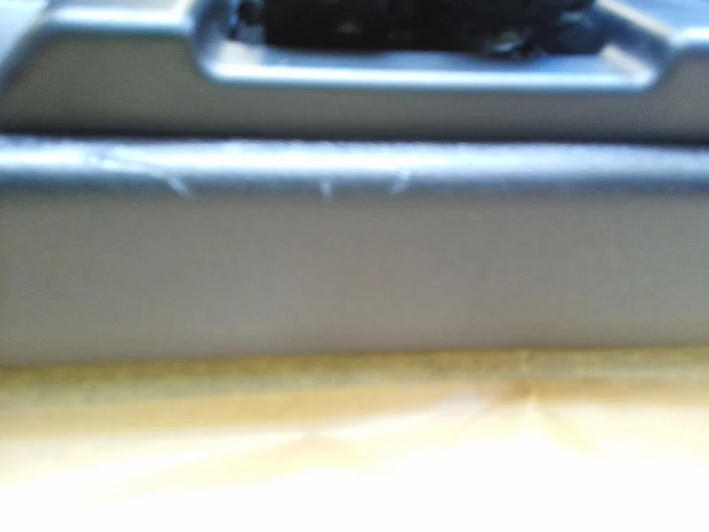
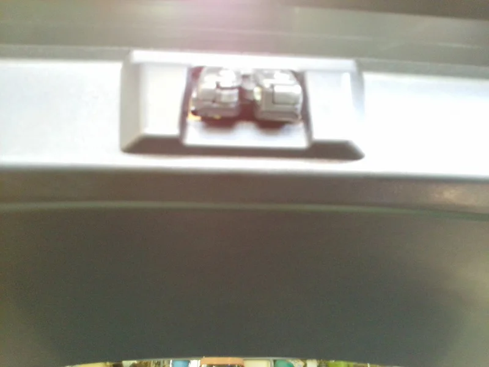

今日はずいぶん暖かい一日でしたね、なんか知らないうちにかなり日焼けしてました。（笑）

ところで、今日のリペアは後ろのハッチバックのドアの内側、リアゲートのキズでした。

車はカローラフィールダー、最近のエコカーは車体を軽くするためか、外も内もプラスチックで

しかも一体化しておりまして・・簡単に交換できないために困っておられました。

ビフォーがこれ

ちょっとピントがあまくてわかりにくいかもしれませんが、明らかにガリ傷が入っています。

そしてアフターがこれ

写真ではわかりにくいですが、全体にシボ模様がついていて再現するのが難しかったです。

そして上向きにスプレーでテクスチャーをつけるのはちょっとタイへンでしたが、なんとかできました。
