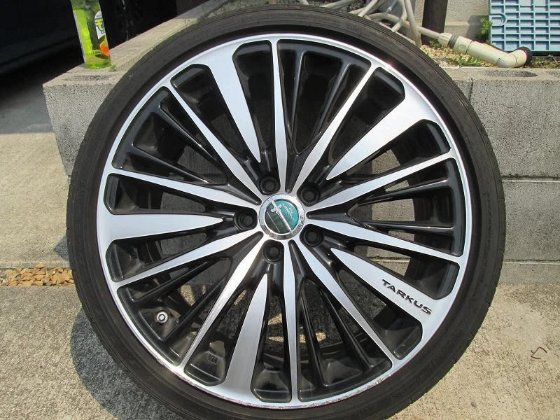
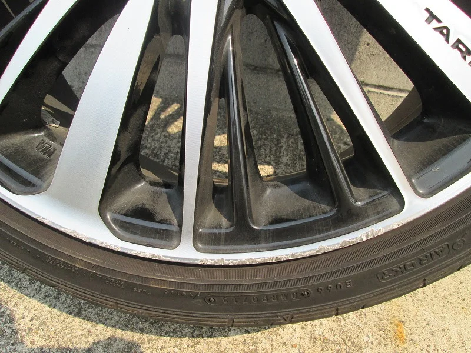
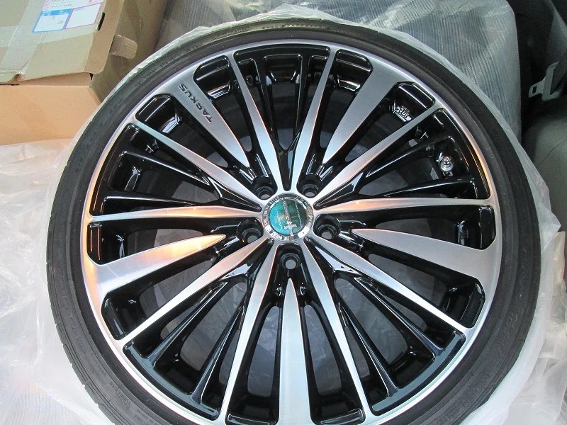
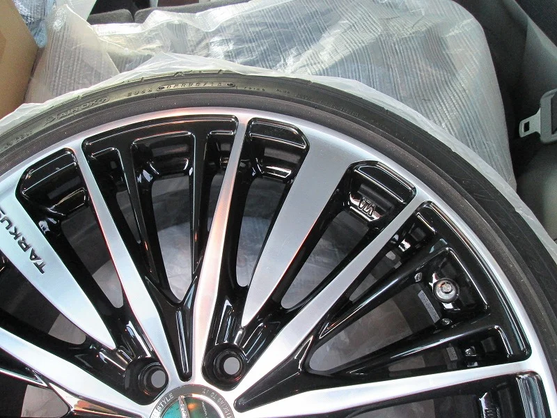

滋賀県甲賀市で車のホイールと、内装インテリアのリペアをさせていただいています。

早いもので、いつのまにか桜の季節も過ぎようとしていますね、

皆様お元気ですか？

最近またホイールのリペアをやりましたのでアップします。

ホイールの種類は「ポリッシュ」です。

このポリッシュは社外製で最近オートバックスやタイヤショップで豊富な種類が販売されています。

比較的安価で表面がまるでCDのディスク面のように虹色にキラキラしてとっても綺麗です。

しかし、その分再現が難しく「リペア泣かせ」といえますが・・（汗）

今回は外側のリム部分だったのでなんとかできました。

ビフォー写真がこれ

ガリ傷の拡大写真がこれ

アフターがこんな感じ

削っての補修なので少し歪みは出ますが

ほぼわからないくらいに綺麗にリペア出来ました。

社外ホイールだと1本だけでは売ってもらえませんので、やはりリペアがお得かと思います。
