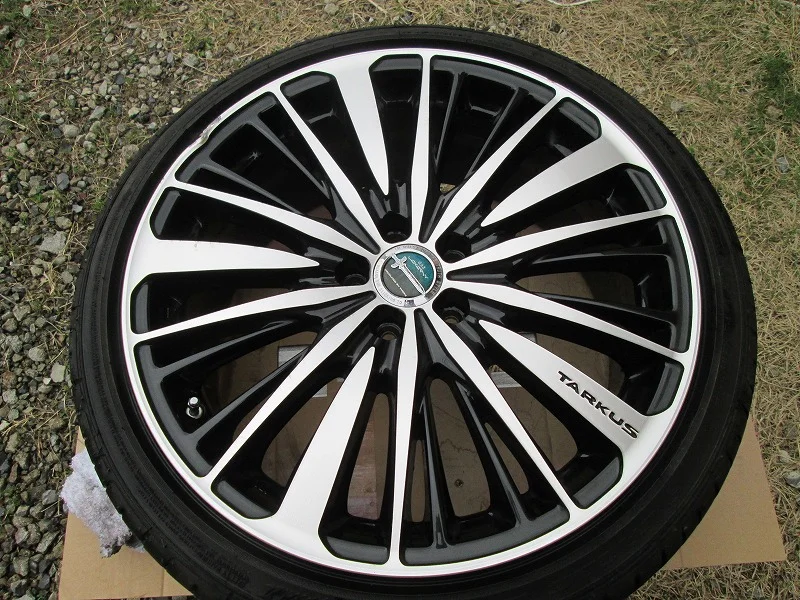
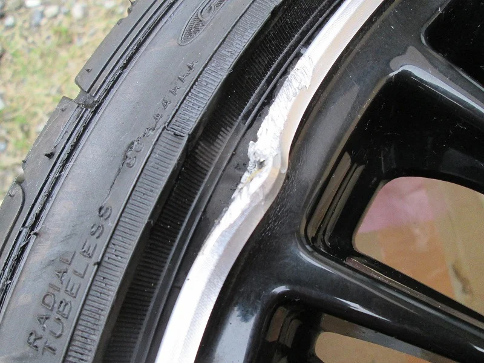
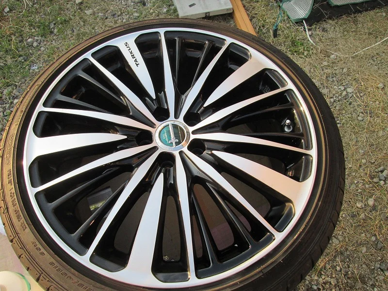
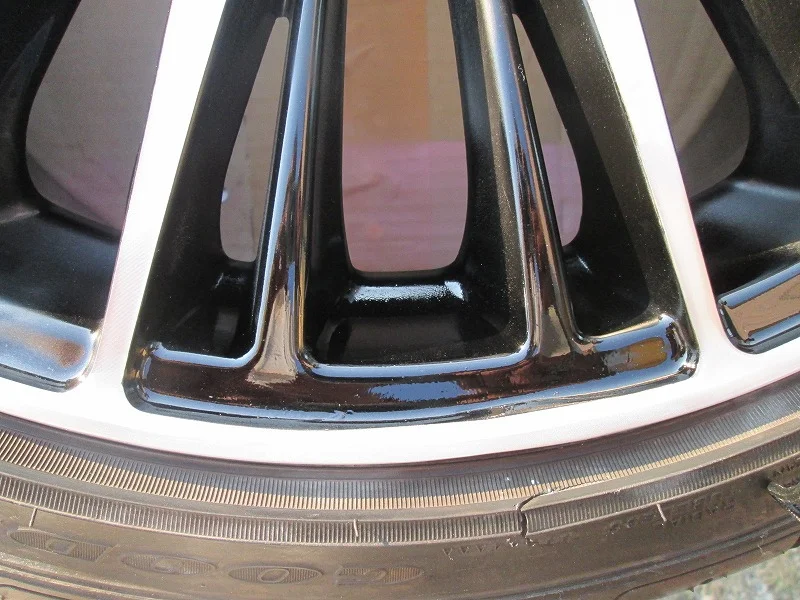
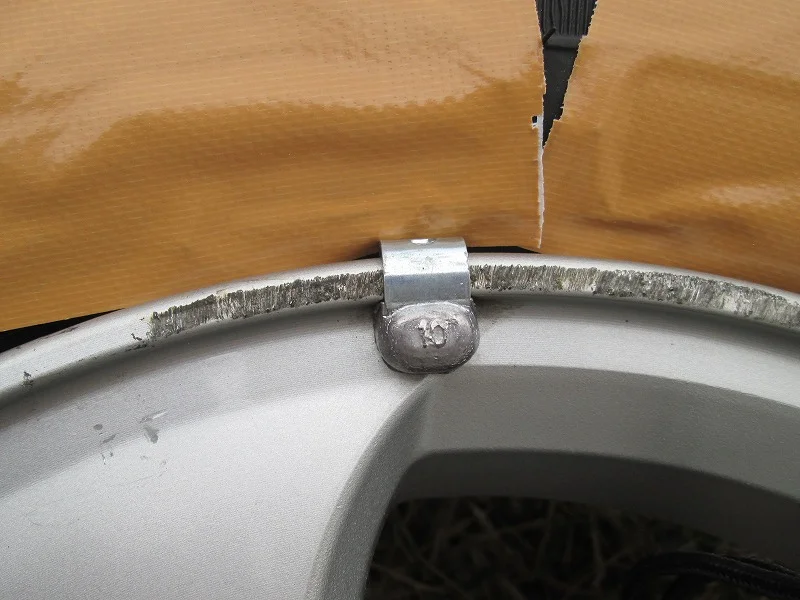
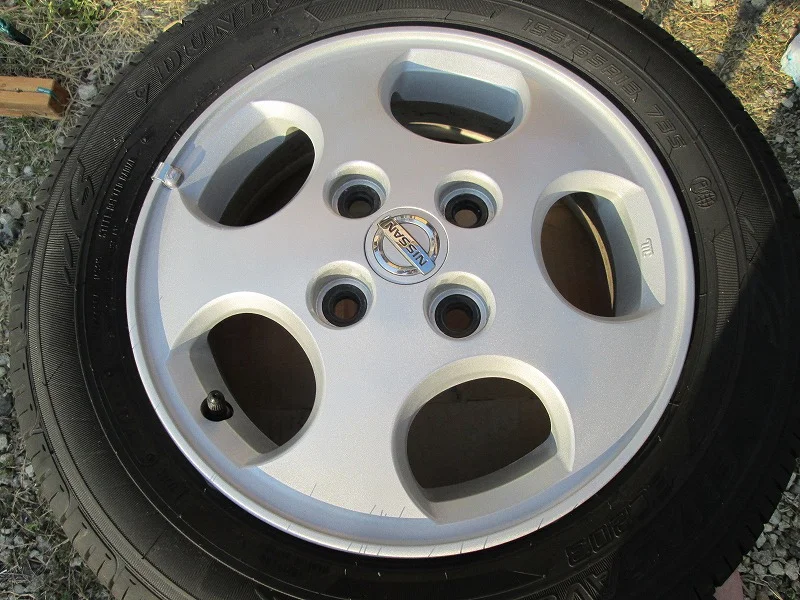

最近またホイールのリペアを2本受けました。

一本目がこれです。

以前に受けたものと同じ車のものですが、リムが強い衝撃を受けて歪んでしまっています。

ここまでくると完全な再現は難しいですが、頑張って修正しました。

リペア後がこれ

歪み部分の拡大写真がこれ

よく見るとまだ少し歪みがありますが、ぱっと見はわからなくなりました。

しかし、今回はちょっと大変でした。

その他、軽自動車（オッティー）の純正ホイールのガリ傷修理です。

全体の写真を撮るのを忘れちゃいましたが、リムの広範囲と、スポークにもほぼ一周にわたって

傷がありました。

リペア後がこれ。

きれいになりましたが、既存の3本のホイールと比べて色の違いがハッキリしちゃうので

しばらく違和感があるかもしれません。
