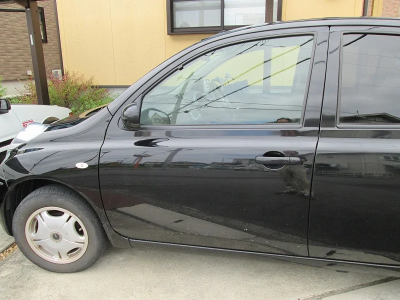
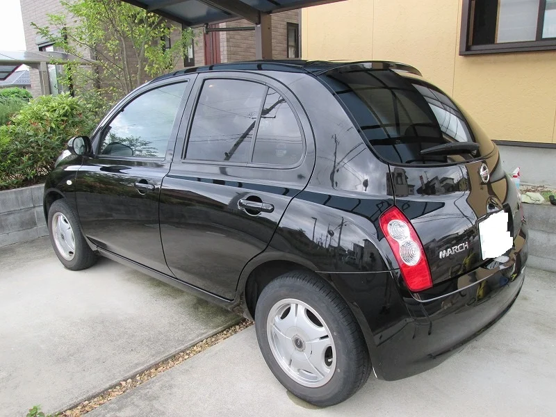
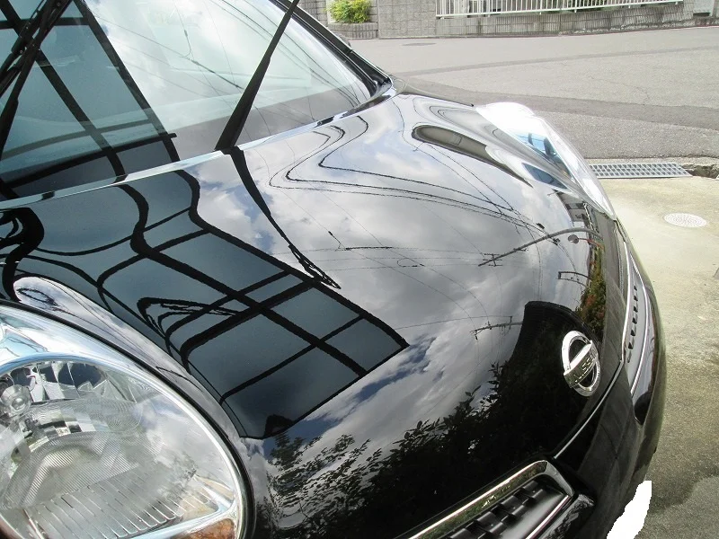
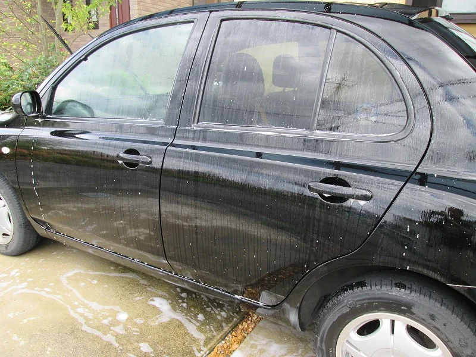
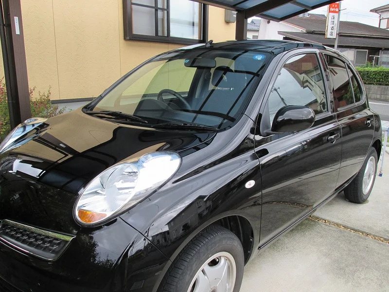

「マニキュアコート」依頼を受けました。

今年の夏はいまいち天候が不順でよく雨が降りますね～、皆様体調管理には注意してくださいませ。

そんな天気の晴れ間をぬって「マニキュアコート」施工しました！

ブラックの車なのでけっこう汚れが目立ちますよね～。

まず全体の下洗いとボディーについた鉄粉除去を行います。

洗い終わりの図です。

そして水分をふき取ったあと、カットコンパウンドでボディー全体をポリシャーで磨きます。

ボンネットにあったブラシやスポンジのスクラッチキズも消えてピカピカになりました。

まるで鏡のよう！

きれいになったらここからやっとマニキュアコートします。

ステップ１の施工です。　全体にリンスして+に帯電をさせます。（10分以上）

充分に帯電させたらステップ１剤を完全に洗い流し、水分をふき取ってからステップ２に移ります。

ステップ２剤を全体にポリシャーでコーティングしたら完成です。

完成図がこれです。

触るとすべすべした肌ざわりです。これでよごれもつきにくくなります。

これで1年間ノンワックス保証です。

車好きの方だけでなく、カーマニアじゃないのでそんなに車にお金はかけたくないという方にもおススメです。

車も洋服とおなじで身だしなみの一部です。面倒だからといってあんまり汚いとカッコ悪いですよね。

特徴は1、速い！（当日仕上げ）2、安い！（車種と作業内容によりますが、10000円～承ります）3、お手軽！（お手入れ超簡単！スポンジで水洗いするだけ）4、1年間の保証書付き！

ご用命があれば出張施工致します。
