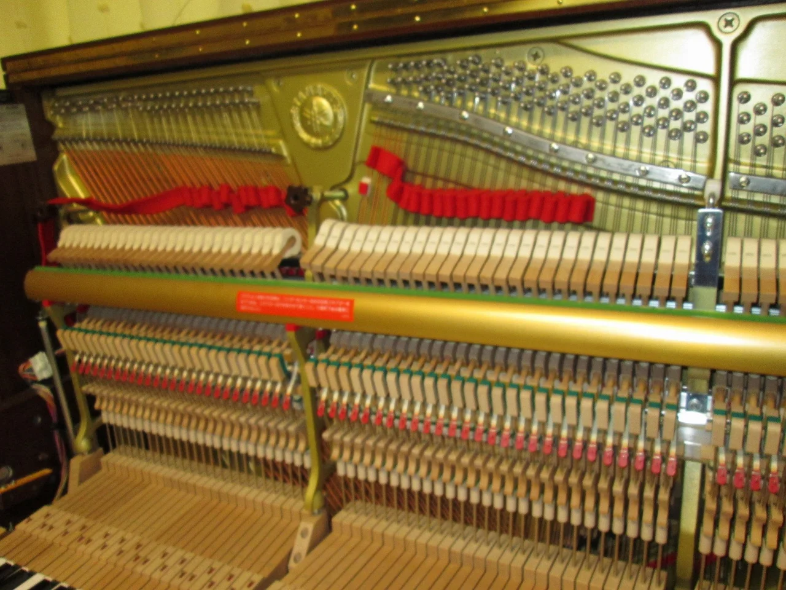
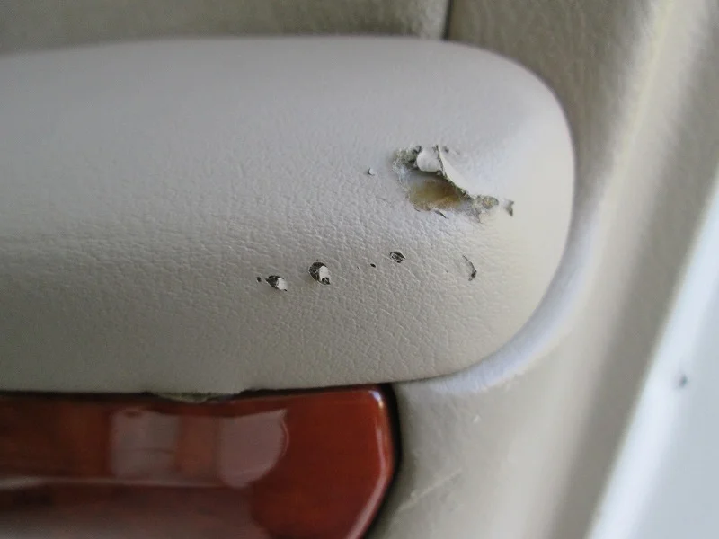
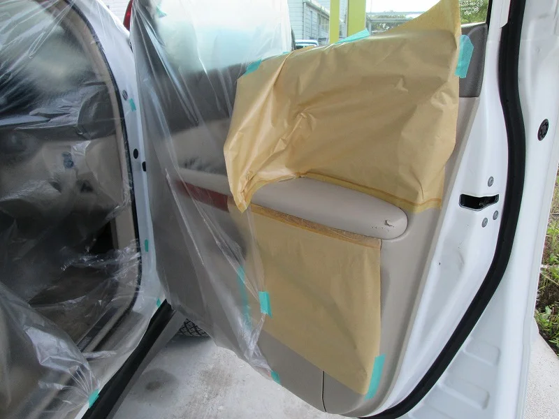
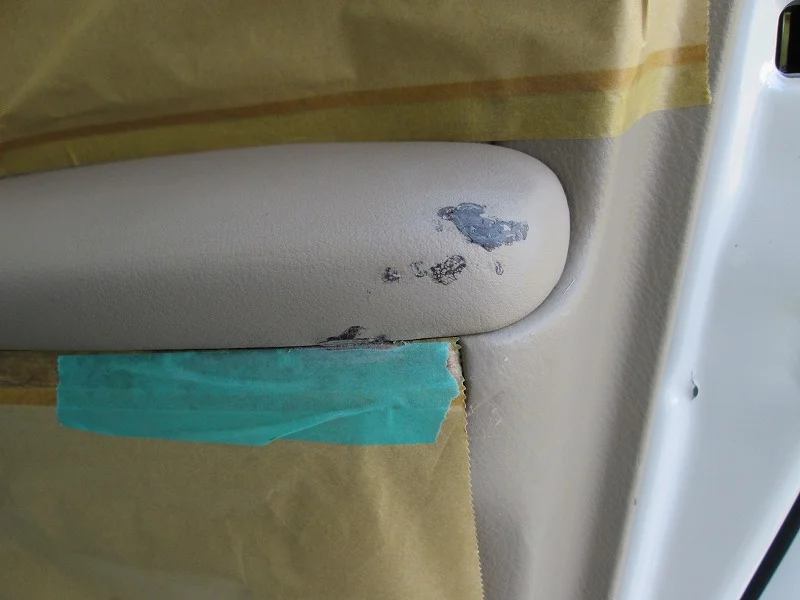
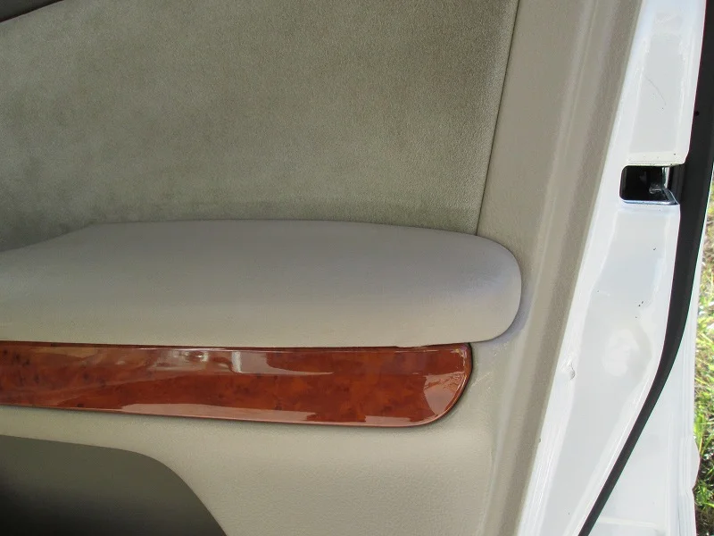

今日は自動車さんでドアの内張りリペアの出張施工でした。

車はTOYOTAのハリアーで、運転席側のドア内張りにキズが入っていました。

更に拡大！

お話によると、シートベルトの金具をはさんで強く締めちゃったかも？とのことでした。

思わずあわててるとやっちゃいますよね・・・。

リペアする前にマスキングを入念に行いました。

今日は風が強く、ドアを開けたままだと塗料が思わぬところまでかかってしまいそうなので、細心の注意を払いました。

そして下地処理は補修材で埋めて強度を確保しました。

これだけ見ると大丈夫か？（笑）と思うかもしれませんが、このあと面をなめらかにした後

調色で色を合わせてお化粧しますので大丈夫です。（笑）

最後にマスキングを外してから、全体の色と艶のバランスを確認して完成

もともと付いていたシボ模様をテクスチャー（人工的に補修材で付けた模様）で再現したので

ほぼわからなくなりました。

この部分は乗り降りの度に必ず目に入る部分なので、傷んでいると残念感が強いので

きっと喜んでいただけると思います。
