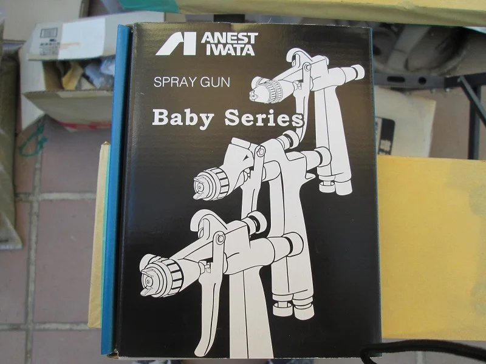
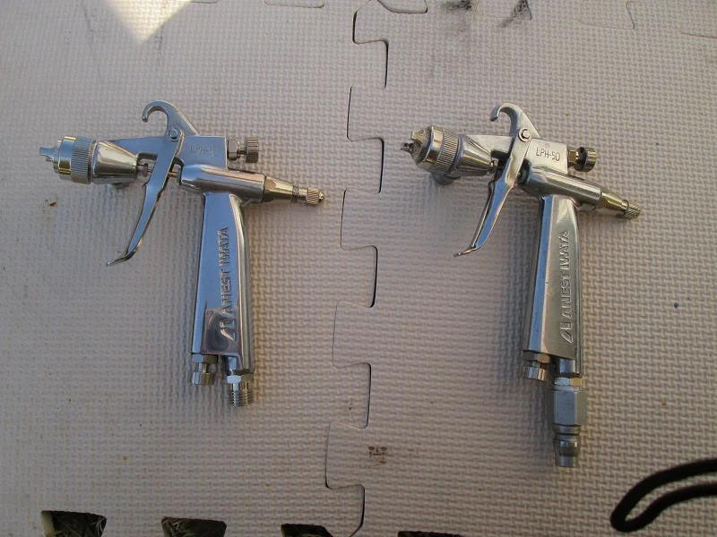
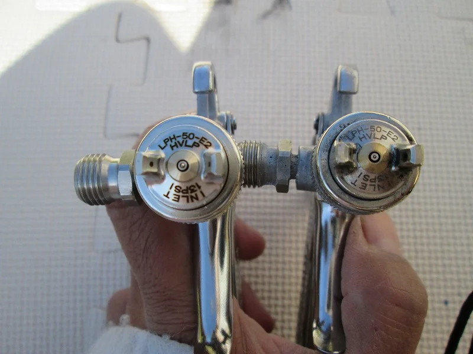
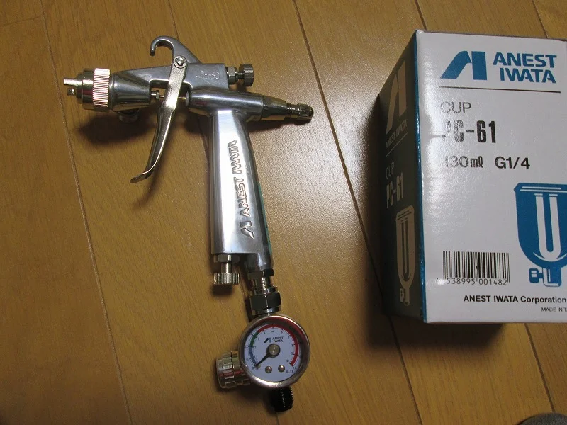

新しいスプレーガンを買いました。

今インテリア用も含めて５丁使っているのですが、それでも足りない時があるので

１丁追加購入しました。

アネスト岩田のLPH50ですが口径が1.0ｍｍのものです。

今まで使っていたのが0.6ｍｍなのですが、ボディーは同じなので口径を見ないと

見分けがつきません。

ボディーが小さいので、スポークが細かいホイールなどにはとても使いやすく、

しかも低圧式なのでエアの吹き返しも少なく、滑らかな塗膜を作ることが出来ます。

このガンは最終仕上げの上塗り用クリアに使用するつもりです。

そして、エアゲージも同時に購入しました。

この岩田のBABYシリーズはより細かい物の塗装など、精密な作業に向いています、

これから更に作業の精度を上げていきたいと思います。
