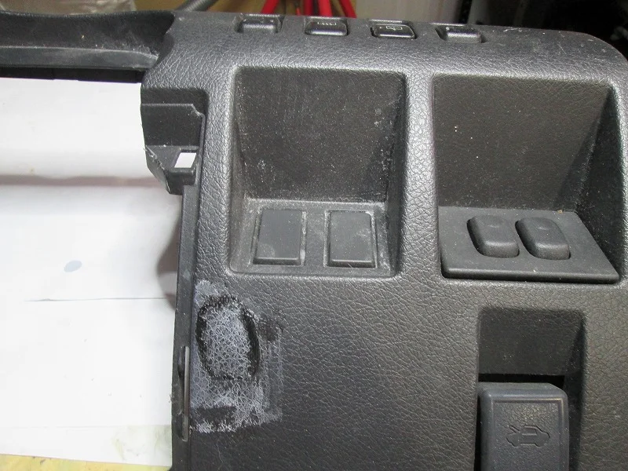
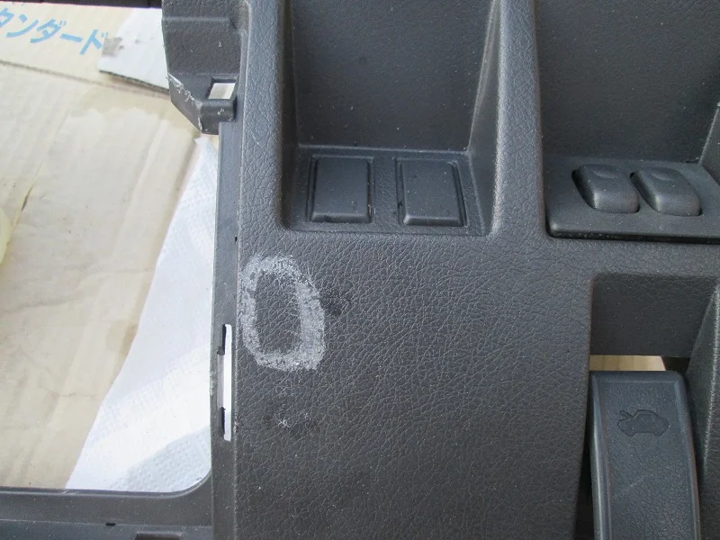
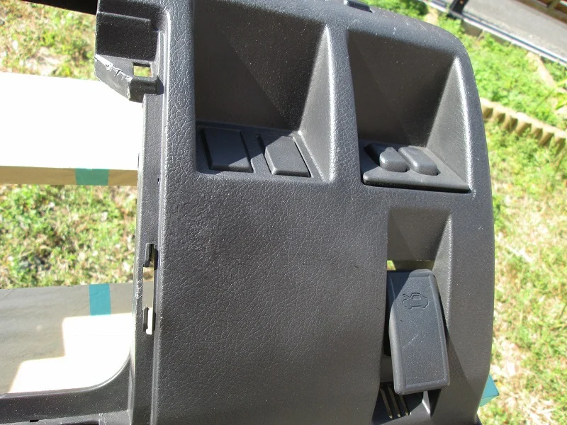

ちょっとダッシュボードのリペアでサンプルの作成も兼ねて練習してみました。

部材は接着剤の貼り跡が痛々しいものを使用

ここまで汚いとまずクリーニングが大変ですね（笑）工房の中に放置されていましたので・・・

クリーニングして下地を整えました。

ここからどうするか、悩むところですが、色、艶を合わせながらテクスチャーで模様をつけていきます。

テクスチャーの中にキズを隠した感じです。

実際に見ると目の錯覚で写真よりキズがわかりにくい感じですが、もう少し表面を平にサンディングして面を出せば

更にクオリティーを上げることは出来ると思います。

しかし、今回は練習なのでここまでにしておきます（笑）

ここまでで作業時間2.0Hぐらいです。
