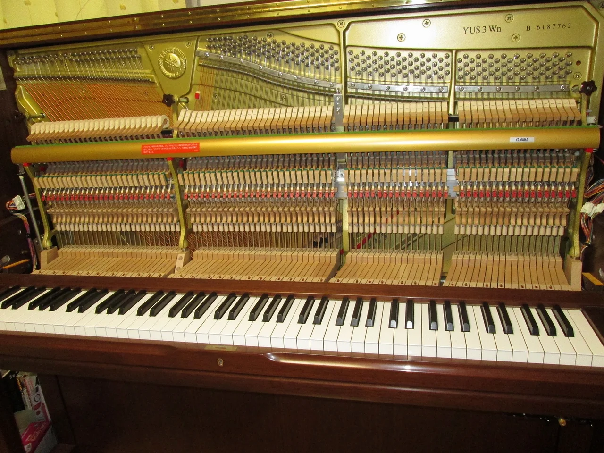
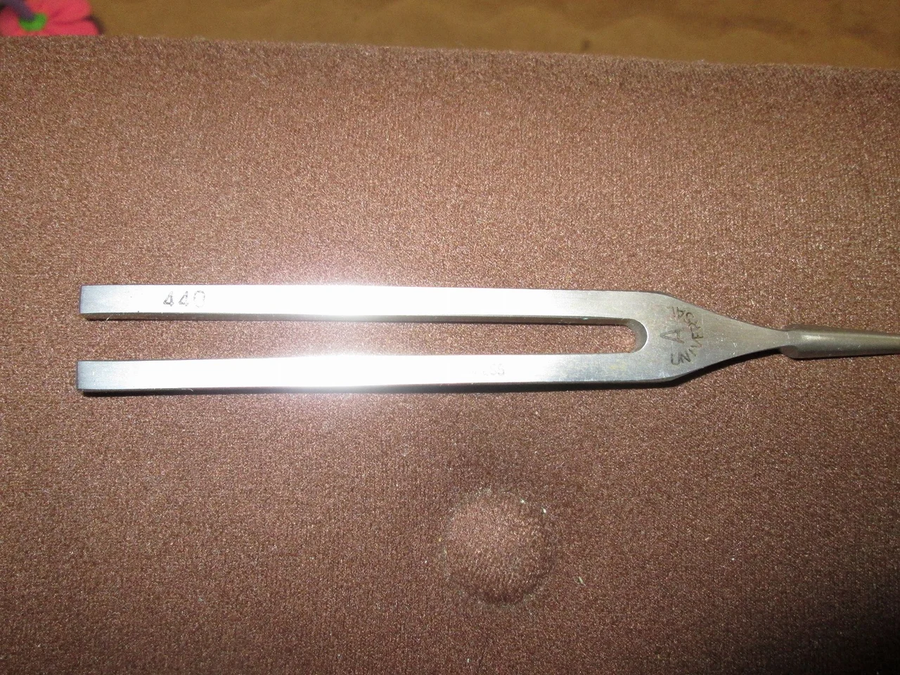

いよいよ１２月ですね、今年もヤマハのヤングピアニストコンクールの時期が近づいてきました。

我が家のピアニストにとっても毎年恒例の行事になっています。

前回調律したのは７月でした。

最近ではレベルが上がり、以前にもまして激しく打鍵されるので（笑）かなり狂いが出ています。

外装を外してピッチを合わせます。

真ん中のラの音を４４０ヘルツ似合わせるのですが、激しい打鍵で落ちてくることを予想して少し高めに合わせました。

これで音にうるさい我が家のピアニストも、やる気を出して練習に励んでくれるでしょう（笑）
