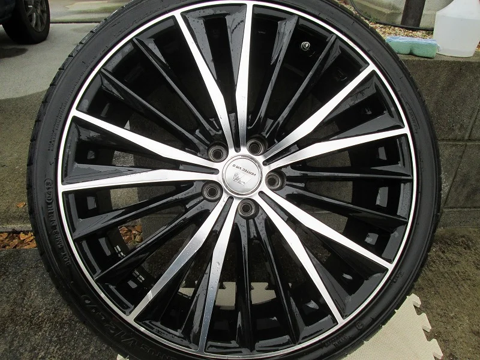
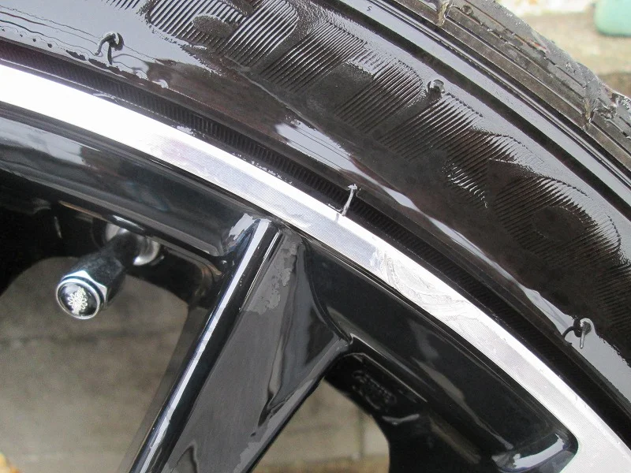
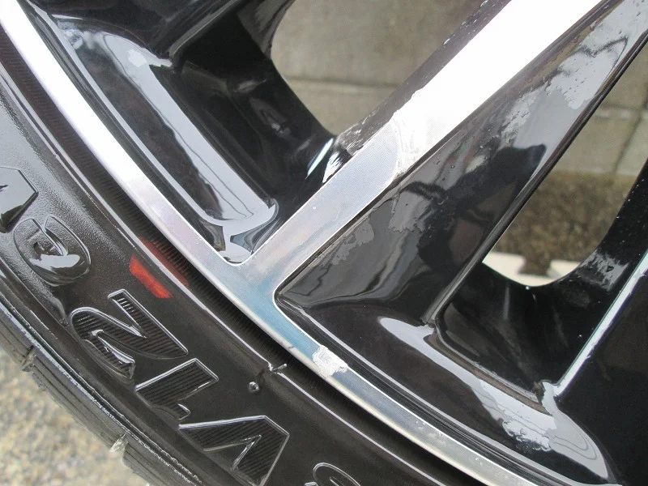
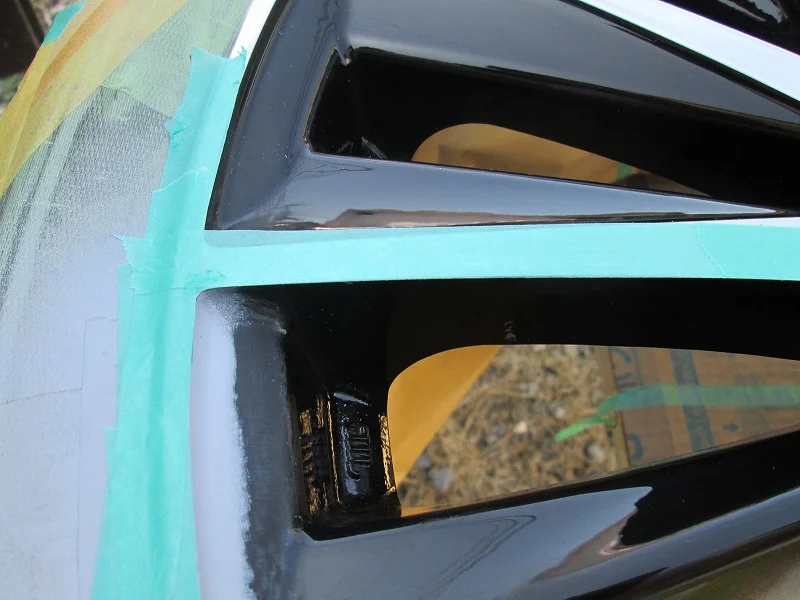
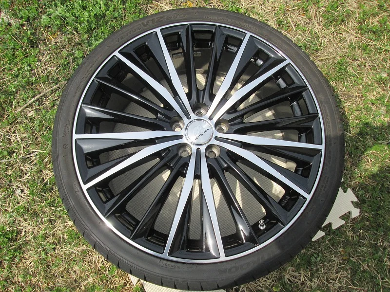
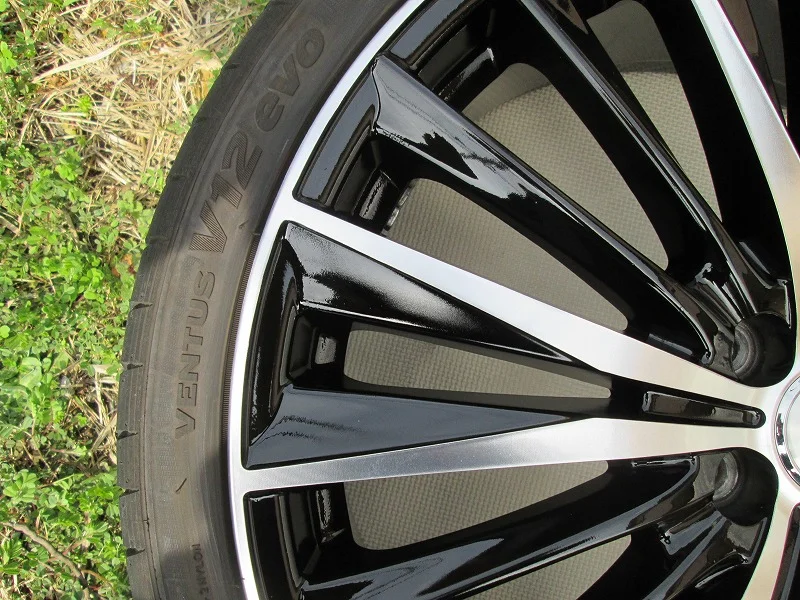
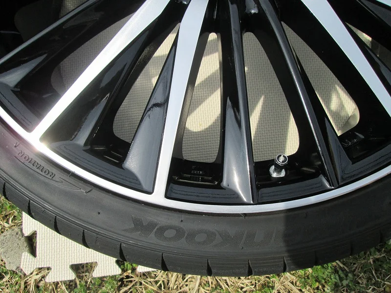

冬も終わって今タイヤ交換の時期ですね、

今回はまた、ポリッシュタイプのホイールです。

スポーク部分の、ポリッシュとブラックのコントラストが印象的なデザインです。

ビフォーがこれ

スポークとリムにのキズを拡大すると

ポリッシュ部分とブラックの部分との塗り分けが必要なので、

マスキングして塗り分けを行います。

こういうタイプは、キズの深さから、ブラック部分まで達していることが多いので、

削りだけでは対応できません。

アフターがこれ

キズ部文の拡大図

ヘアラインまでは再現できませんが、よく光るホイールなので

光沢の中にキズが隠れてわからなくなったようです。

充分満足頂けたと思います。
