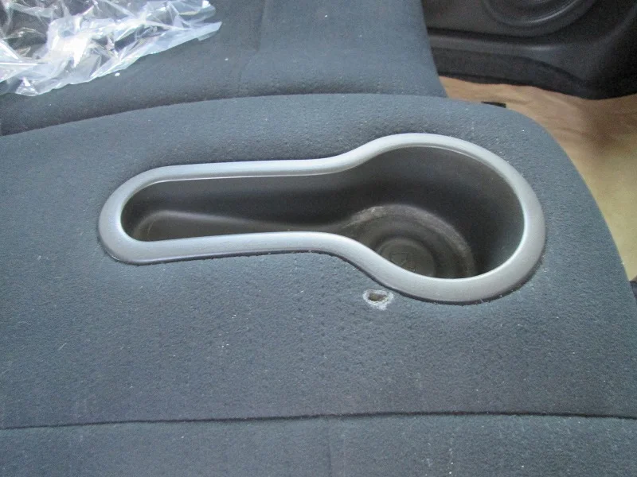
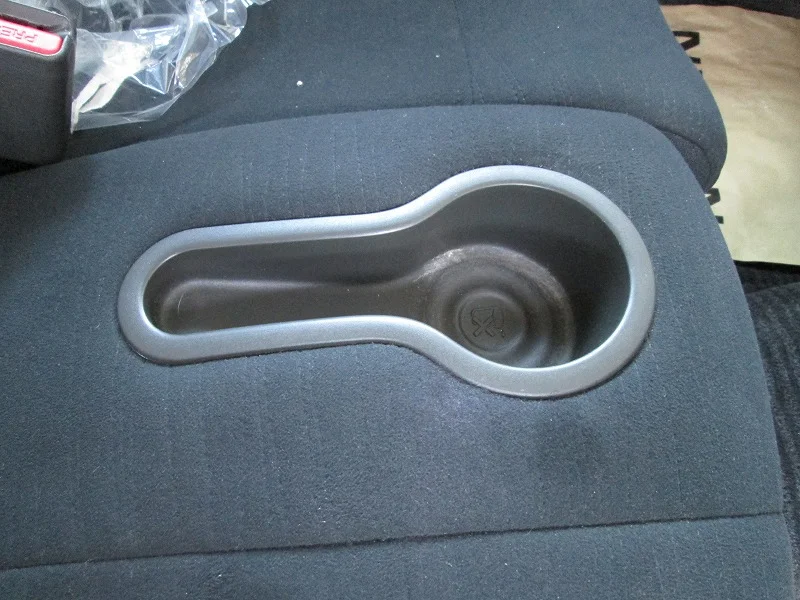

四月に入り、桜が満開を迎えましたね！いかがお過ごしでしょうか？

今回は甲賀市の自動車屋さんの中古車でキューブの運転席側にできたタバコの

コゲ穴リペアです。

ドリンクホルダーのすぐ横で、勝手な想像ですが、コーヒーを飲みながら一服して思わず

火種を落としちゃったのでしょか？（笑）

ビフォーがこれです。

アフターがこちら

しかし、愛煙家の方にとっては厳しいご時世ですね・・・。

マイカーの中が唯一ゆっくりタバコが吸える空間なのかもしれませんね、ご察しいたします。(´ε｀；)
