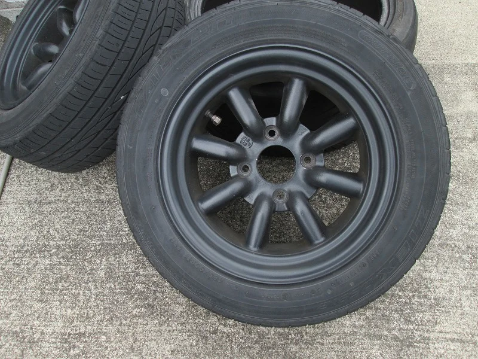
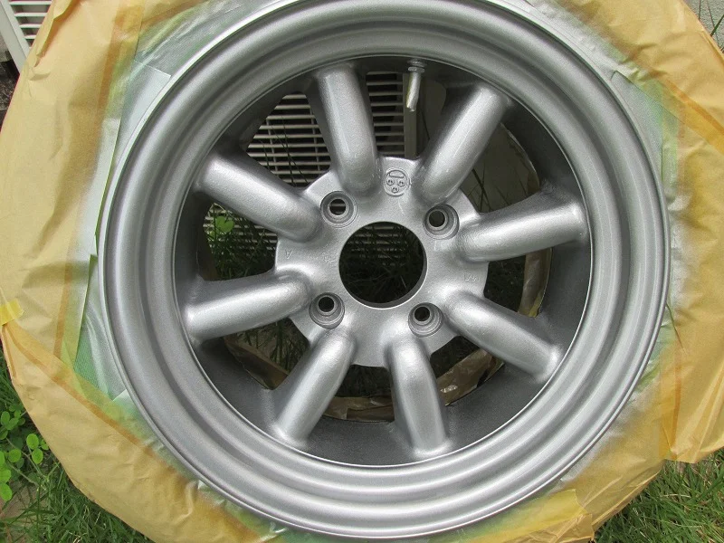
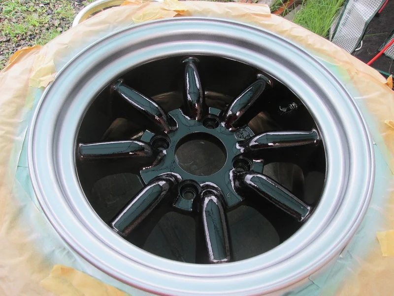
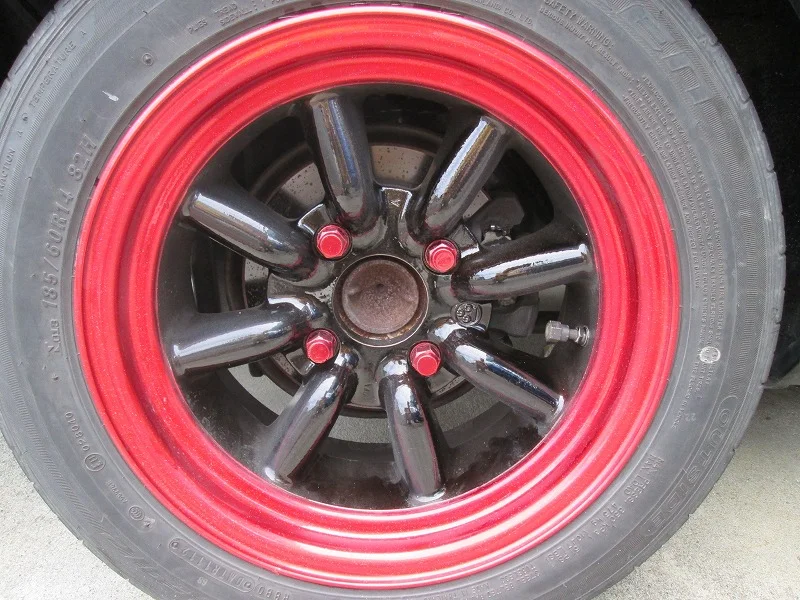
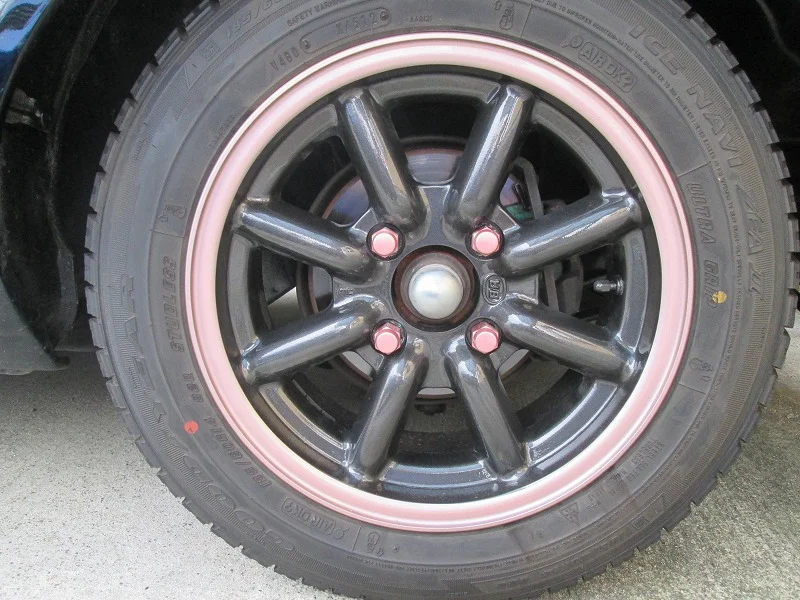

毎日雨の日が続いていますね、皆様いかがお過ごしでしょうか？

ところで、こんな時は気分を変えてホイールのカラーチェンジをしてみませんか？

今回やってみたのは、ハチロクに履かせていたワタナベ製のホイールです。

当時ものなので相当古いものだと思いますが、ちょっとおしゃれに（笑）

まず、下色を明るめのシルバーに塗ります。

それから、スポーク部分だけ「キャンディーブラック」にカラーリングします。

そして、リムの部分をキャンディーレッドに塗ります。

中にキラキラのラメを入れてみました。光が当たるとキラキラします。

おまけとして、ホイールナットをリムの色に合わせてカラーリングして完成です。

武骨なイメージのワタナベ製もかなりオシャレになったでしょう？（笑）

ついでに、同じようにエイトスポークデザインのブラックレーシングのホイール（冬用タイヤに履かせている分）も

オシャレにしてみました。

リムとナットをピングゴールドに、スポークはメタル入りのブラックです。

ユーザーが奥様なので、女子仕様カラーにしましたが、もちろん他のバリエーションもできます。

いかがでしょうか？
