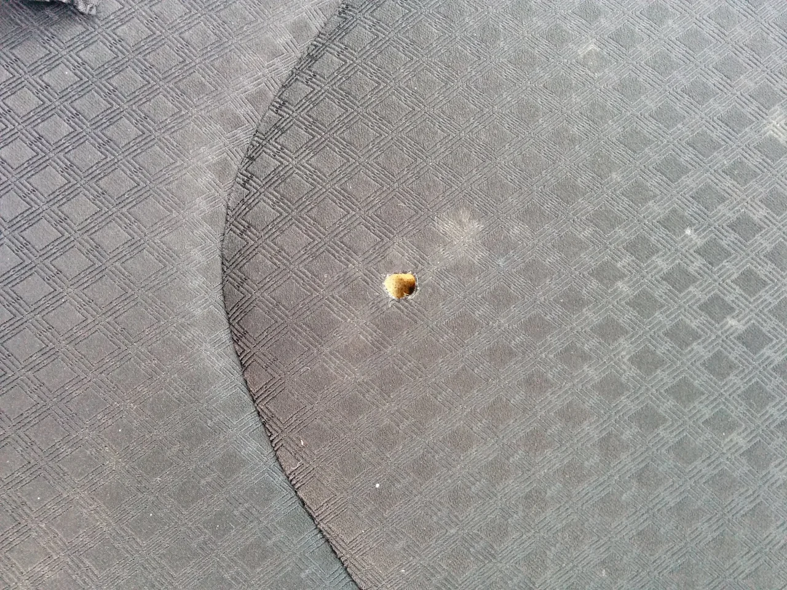
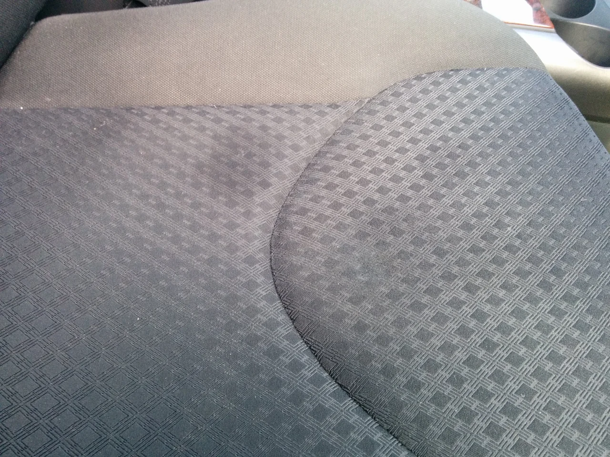

今日はバレンタインデーでしたね、もうすっかり気にしなくなりましたが（笑）

お店には実にたくさんのチョコレートが売られていますね～

あれは残ったらいったいどうするんだろう？なんてそちらの方が気になる今日このごろです。

ところで、今日はシートのコゲ穴リペアです。

ビフォーがこれ

ナイロン製の繊維だと熱に非常に弱く、火種を落としたらひとたまりもありません・・・。

アフターがこれ

リペアの前にかなり汚れていたので、クリーニングしたため、所々まだ濡れていますが、シミではありません（笑）
