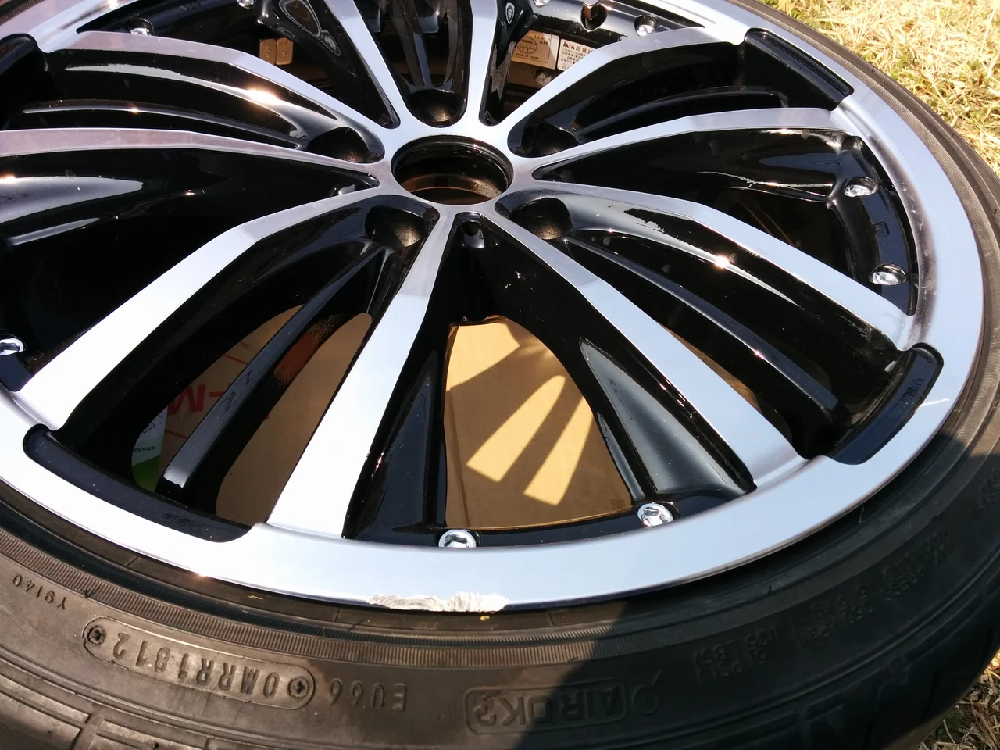
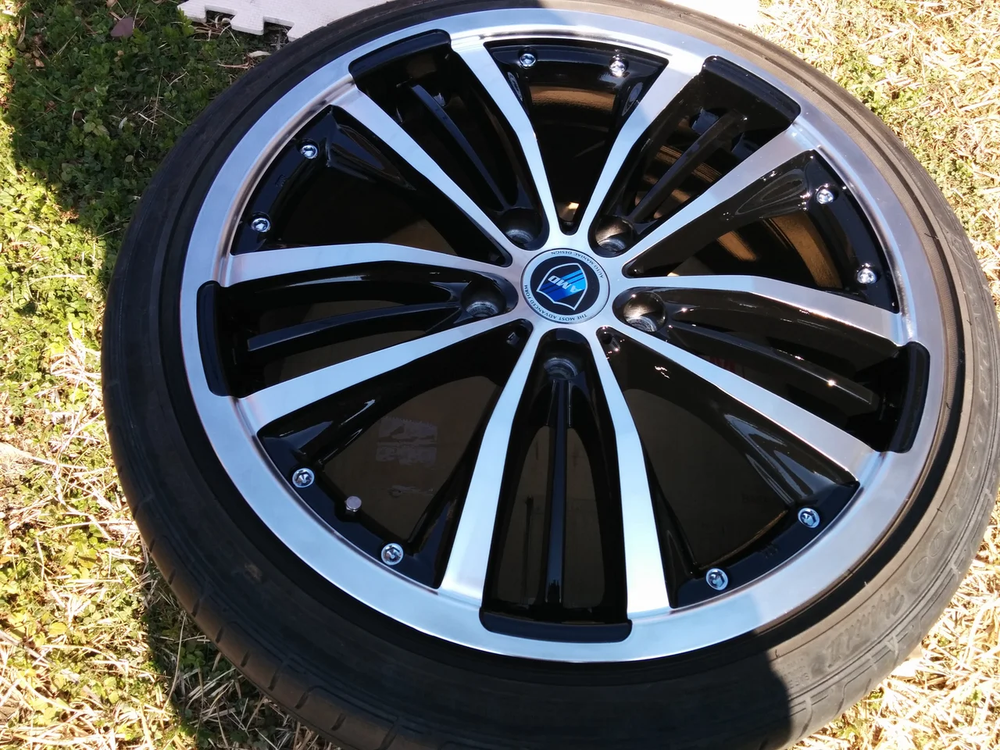

本当に最近暖かいですね！そして花粉も・・・。

ところで、今日は最近はやりのポリッシュタイプのホイールのガリキズです。

ポリッシュは別名ダイヤカットとも言いまして、CDの裏面のような

角度によってキラキラ光る細かい線（ヘアライン）が刻まれているため

本来はもう一度旋盤でダイヤカットをやり直さないかぎり直せません。

しかし、かなり高額なため、高額なホイールにしか需要が見込めないため、

ハンドメイドで、少しクオリティーは落ちますが、治す方法があります。

ビフォーがこれ

かなり深めのキズです。

アフターがこれ

キズは完全に消え、ほとんど気にならないレベルまで回復したと思います。
