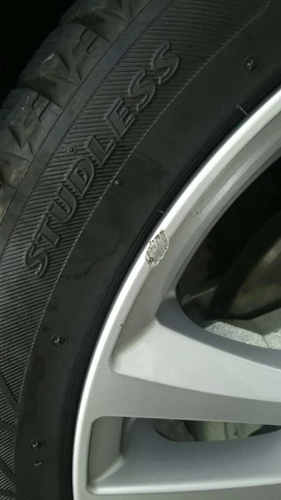
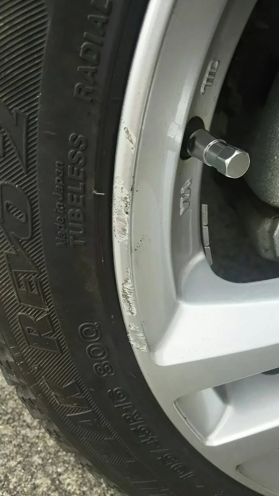
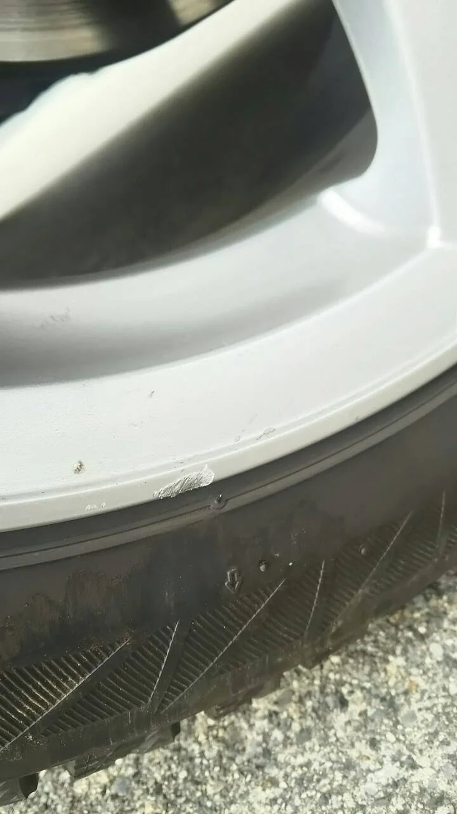
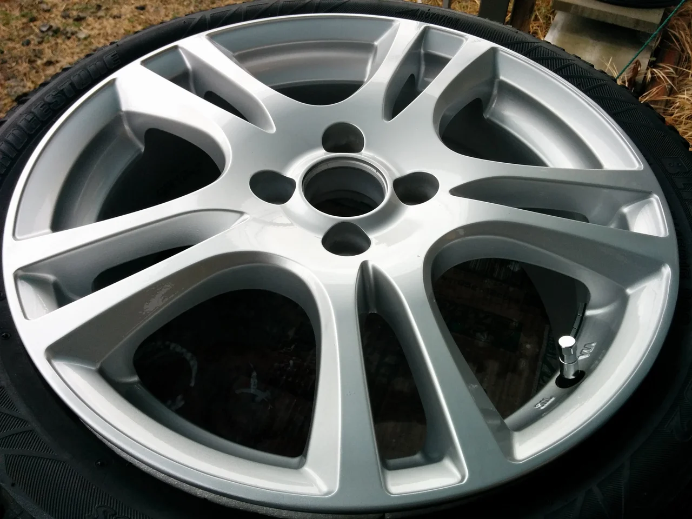
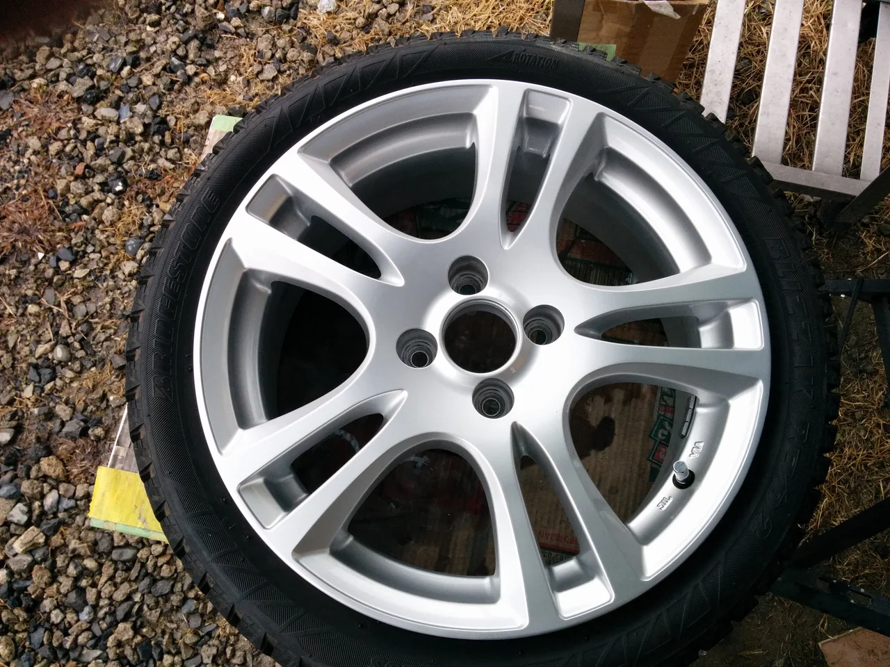

今日は風が強くて冷たいですね、でも日差しがあると少し暖かさを感じます。

最近やたらとホイールの仕事ばかりやっているように思いますが（笑）

これも時期的なものでしょうかね？

ところで、今日はシルバータイプのガリキズリペアです。

ビフォーがこれ

色んなところにガリキズが入ってしまっています。

塗装タイプはフレークの目が中くらいのシルバーで、

一般的によくあるタイプです。

アフターがこれ

全体的に入っていたキズもキレイに直りました。

このタイプのホイールは4本セットで販売されていることが多く

一本だけ交換と言っても、もう製造されていない事が多いので、

4本とも買い替えることを思えばリペア出来ればお得です。

お希望の方はまた連絡お待ちしています。
