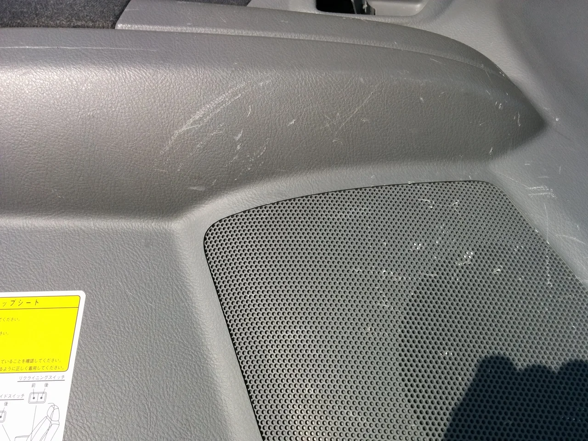
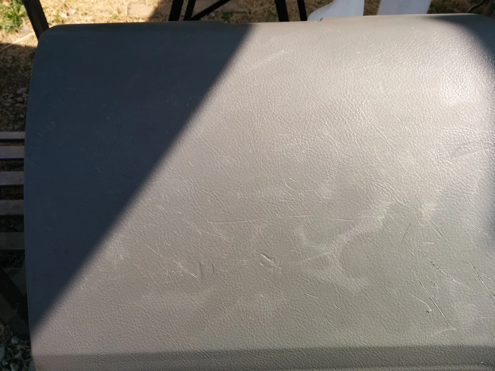
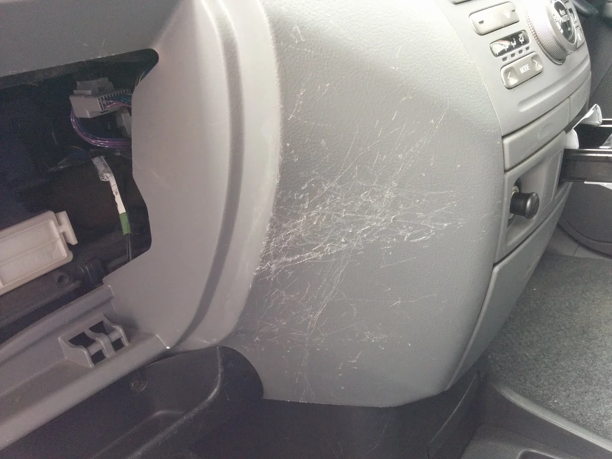
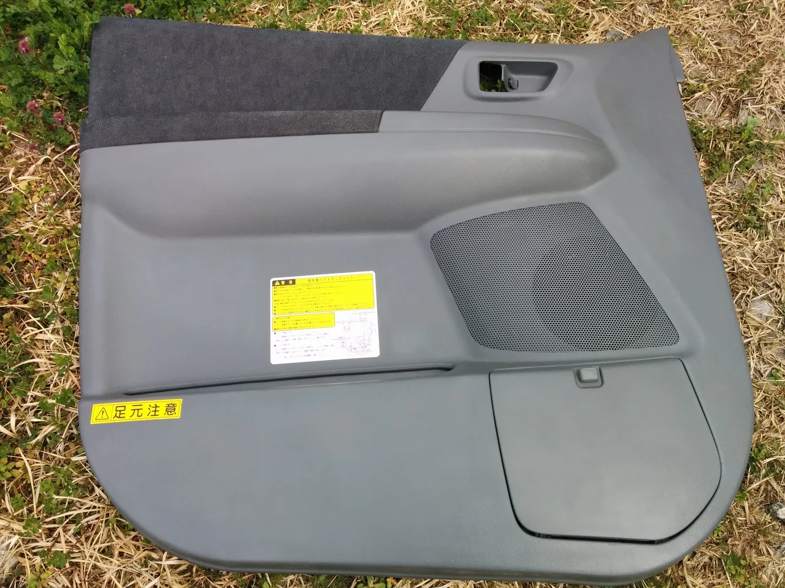
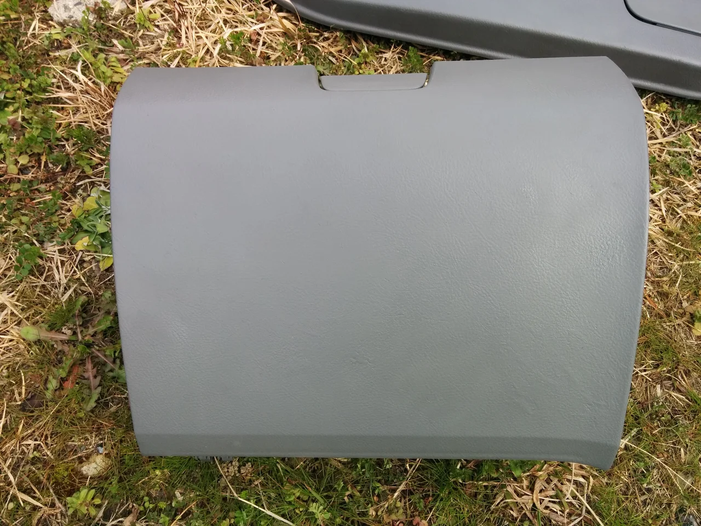
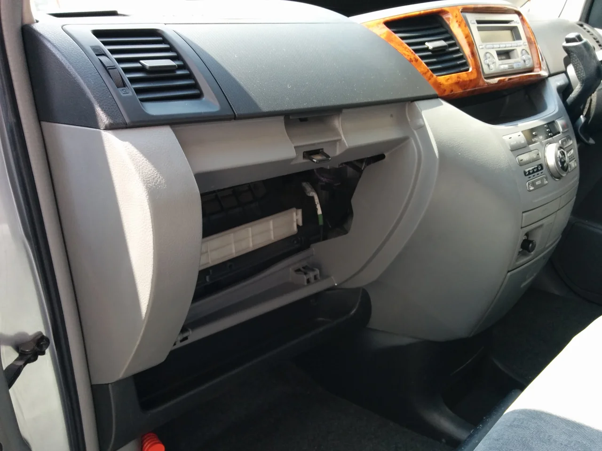

早いもので、新学期も始まり桜も散ってしまう季節になりましたね。

でも今日から少し寒の戻りがあるそうなので、皆さん風邪などには注意してくださいね。

我が家はこの機会に灯油を使いきってしまおうかと思っています。

ところで、今回はちょっと内装のひどいキズのリペアです。

ビフォーがこれ

もしかして、野球のスパイクを履いた元気な子供さんでも送り向かいをされて、

毎回乗り降りの時に足が当たったのか？（笑）と勝手な憶測をしてしまうぐらいひどいキズですね！

アフターがこれ

無数のキズがあって全て完全に直す事はできないので、目立つキズを中心に直した後、細かいテクスチャーをつけて

シボ模様を再現して目立たなく仕上げました。

福祉車両ということで、なかなか代わりの車が無いので喜んでいただけたと思います。

これからもリペアで出来る可能性を追求していきたいと思います。
