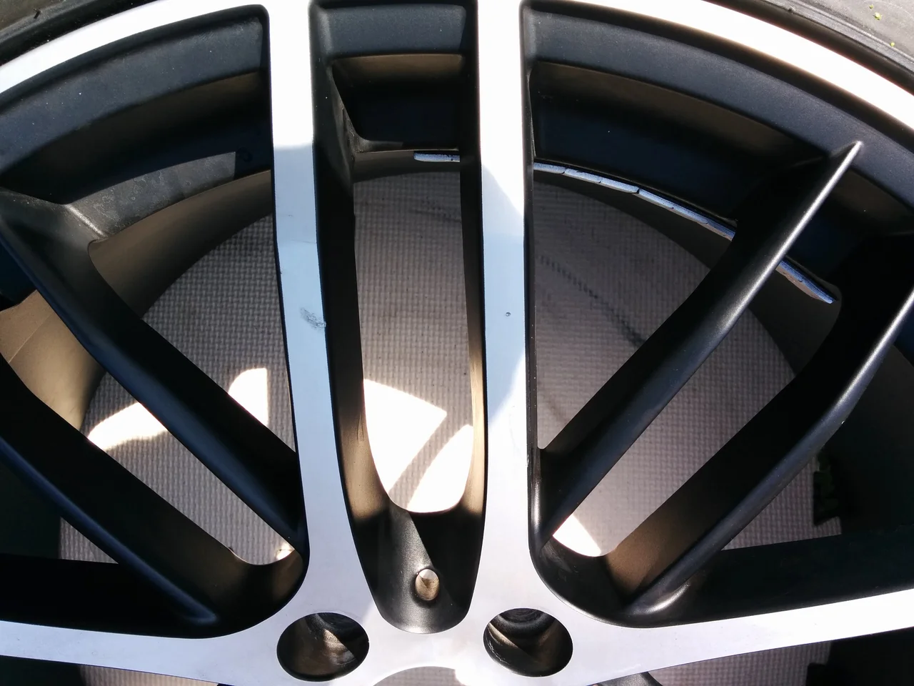
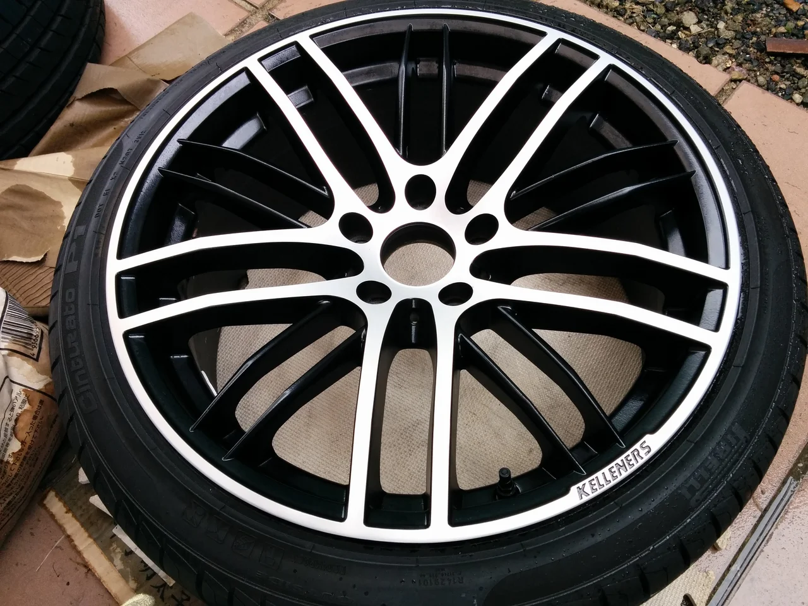

いよいよ晴れると初夏の陽気ですね、皆さん紫外線には注意して下さい！（笑）

ところで、今日はポリッシュタイプのホイールリペアです。

ビフォーがこれ

このタイプのホイールは下地にダイヤカットと言って、文字どうり、ダイヤモンドの刃で

細かいヘアラインを刻み、それを色んな角度からみてキレイに光らせる特殊な加工が

されています。

なので、もう一度ダイヤカット自体を刻み直さないかぎり再現は不可能なのですが、

このホイールに限っては表面のクリアが半ツヤ塗装だったため、少し鈍い光り方でした。

結果的に塗装でもほとんど目立たない仕上がりにすることができました。

アフターがこれ

クリアをかけ直したので、耐久性も格段に上がったと思います。
