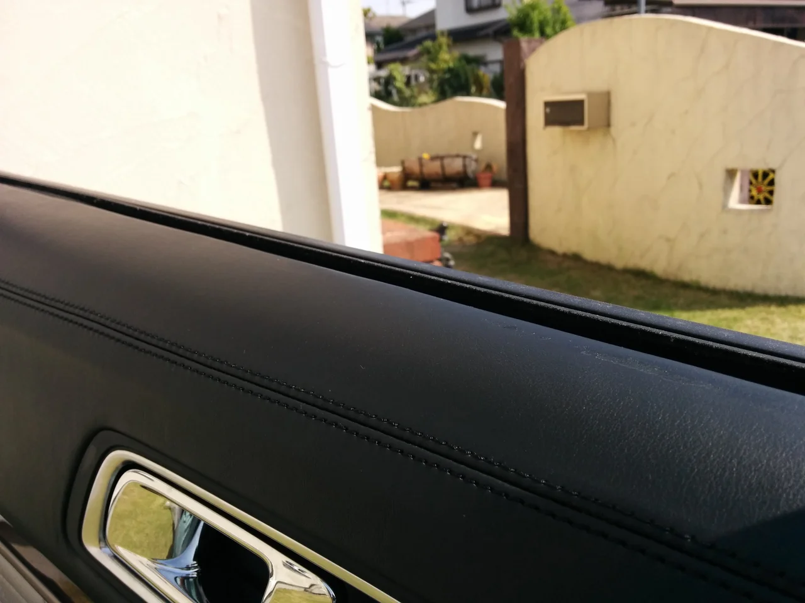
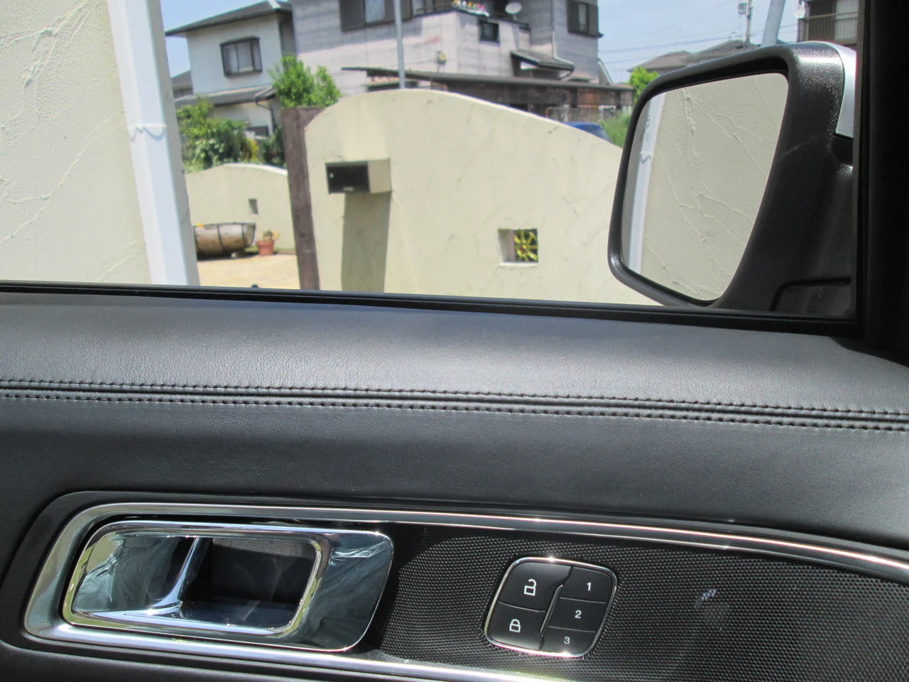
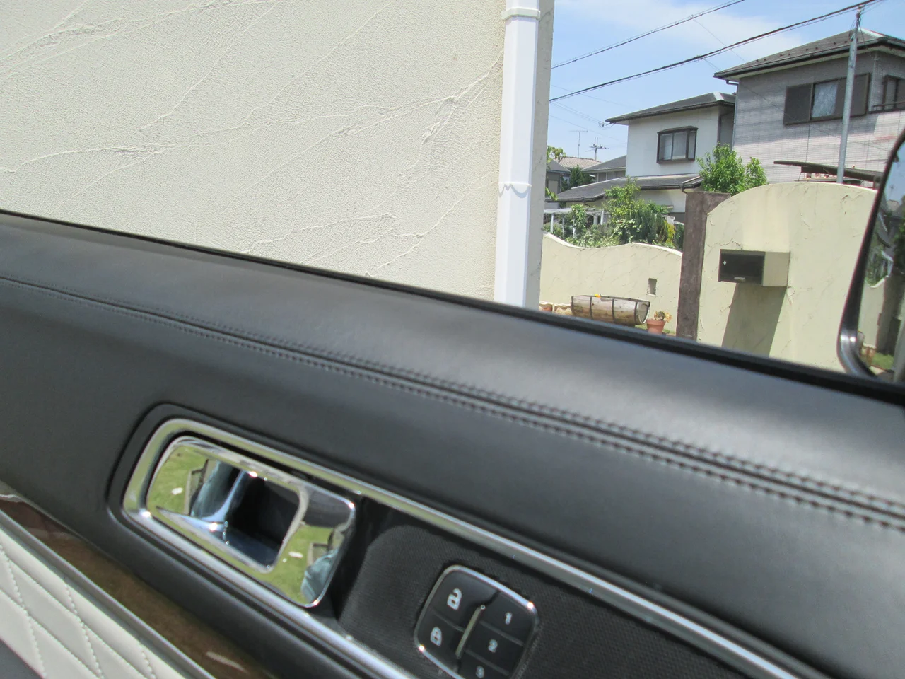

もうすぐ梅雨ですかね？少し蒸し暑くなってきましたね・・。皆さんいかがお過ごしでしょうか？

ところで、今回はフォードのドアトリムのリペアです。

ビフォーがこれ

テープの貼り跡がウインドウの近くに残ってしまっています。テープののりには溶剤成分が含まれていますので、長時間貼っているうちに素材の表面を溶かしてしまうことになります。ご注意下さい。

アフターがこれ

補修材で埋めて再塗装しました。

ちなみに、当店で使用している内装用の補修材は全てISO9000取得の安全性が確認されたものです。

有機溶剤などの有害なものを含まない、水性の塗料を使用していますので、ご安心下さい。
