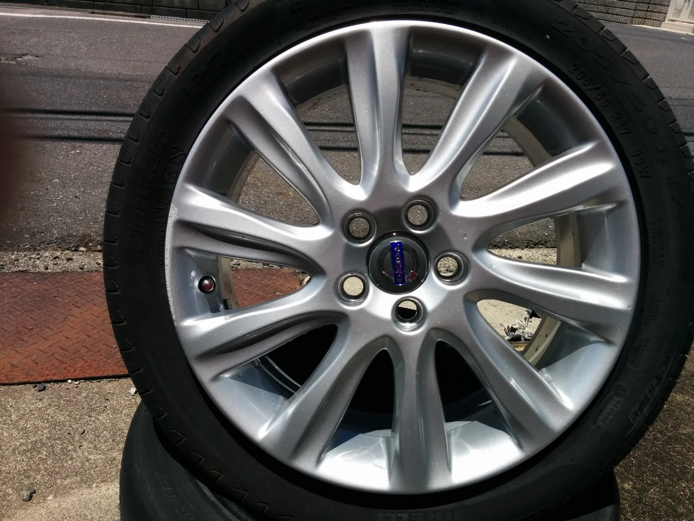
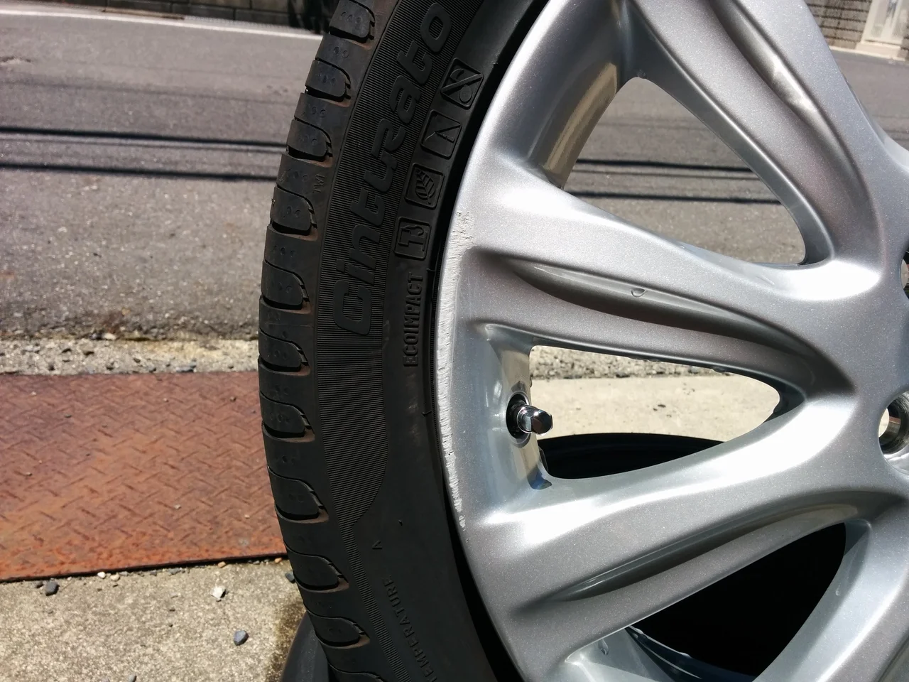
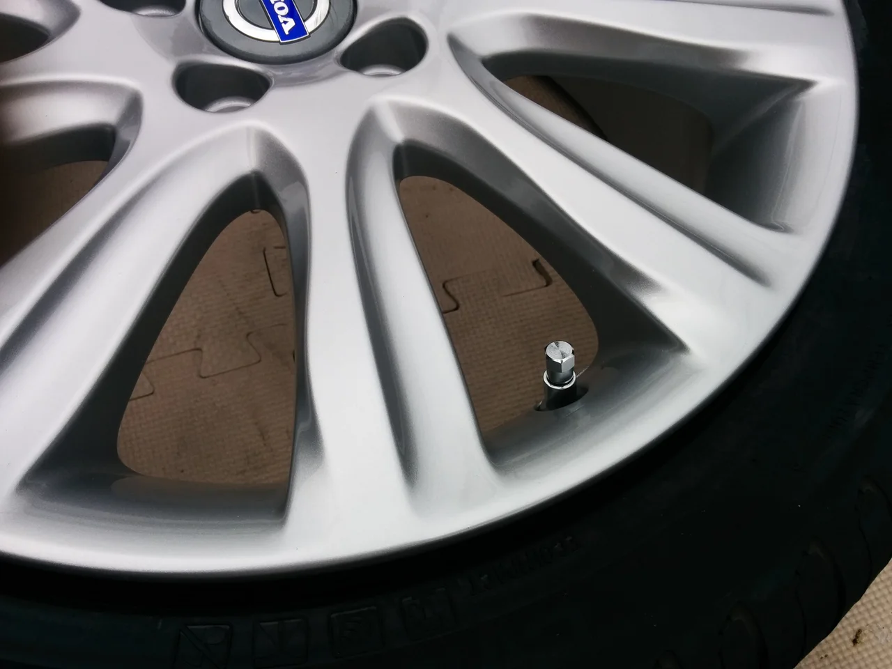
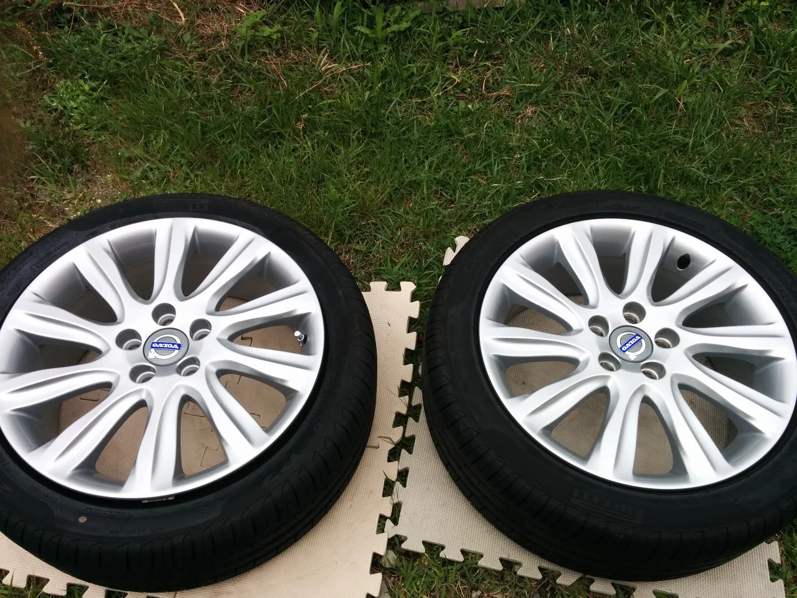

だんだん蒸し暑くなってきましたね、みなさんいかがお過ごしでしょうか？

鳥の鳴き声で朝目覚めることがよくありますが、夏を告げる鳥ホトトギスの声を聞きました。

この鳥の特徴的な鳴き声が何と聞こえるか？「テッペンカケタカ」「トッキョキョカキョク」

どうも僕には、「特許許可局」と言ってるように聞こえます（笑）みなさんはどう聞こえますか？

ところで、今回はボルボの純正ホイールのリペアです。

ビフォーがこれ

拡大図

比較的浅いキズですが、下地までいってます。

アフターがこれ

ボルボの持っている色味を合わせました。

右が見本でお預かりしたホイール、左がリペアしたものです。

リペアしたことはおそらくおわかりにならないでしょう。

モデルによって微妙に色味が違うので、調色で調整します。ボルボは輝きが強く、シルバーの中でも明るい色が特徴です。
