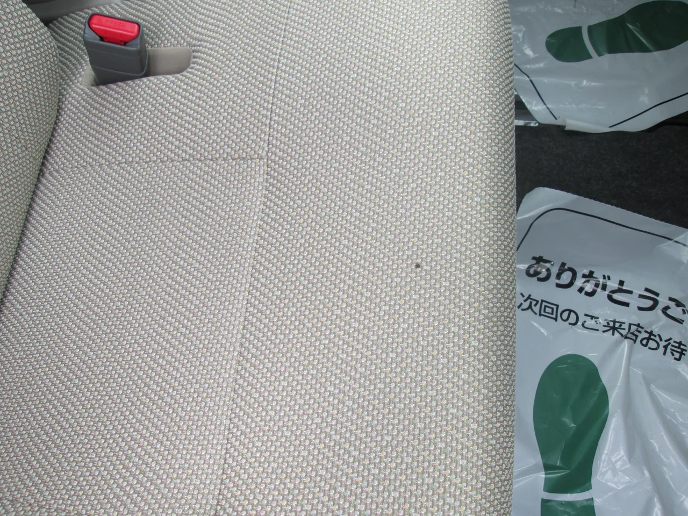
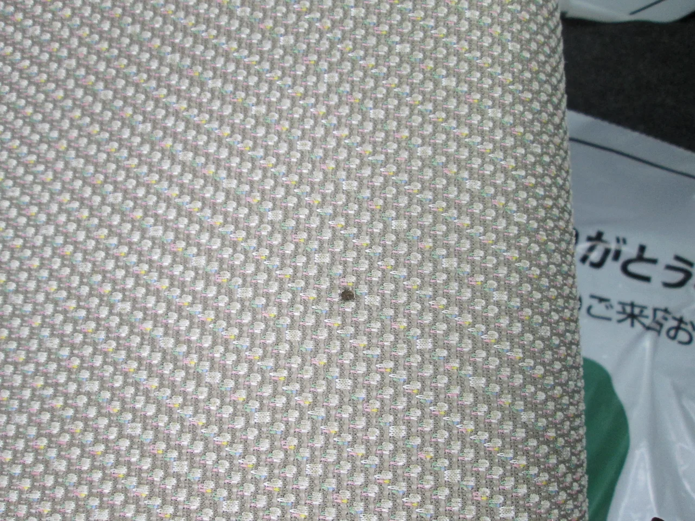
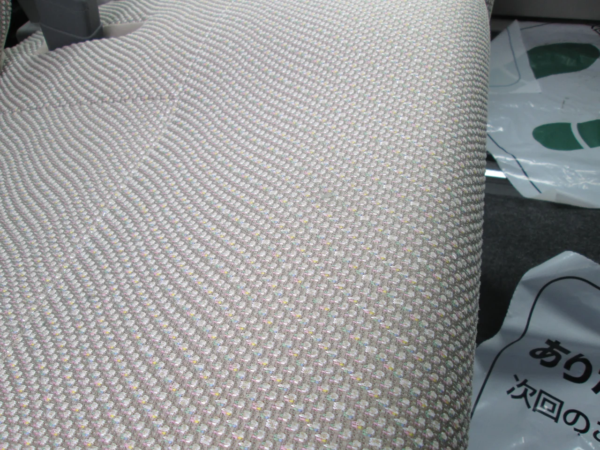

梅雨前半はまだそんなに暑くないので、やはり晴れるとホッとしますね（笑）

しかし、だからといってずっと曇っているのも意外と悪く無いですね、濡れるのも嫌ですが

殺人的な太陽の暴力？よりはずっと処しやすい。皆さんはいかがお過ごしですか？

ところで、今回はダイハツ・タントの運転席シートのコゲ穴です。

すでに売約済で、「最短でお願い！」とのオーダーにお応えして

早速出張施工してきました。

ビフォーがこれ

ほんとに小さな穴です。

もうちょっと寄り！

この機械織りの柄がイヤですね～（笑）

アフターがこれ

寄りです。

この模様を見ていると吸い込まれそうな錯覚に陥るのは

私だけでしょうか？（笑）
