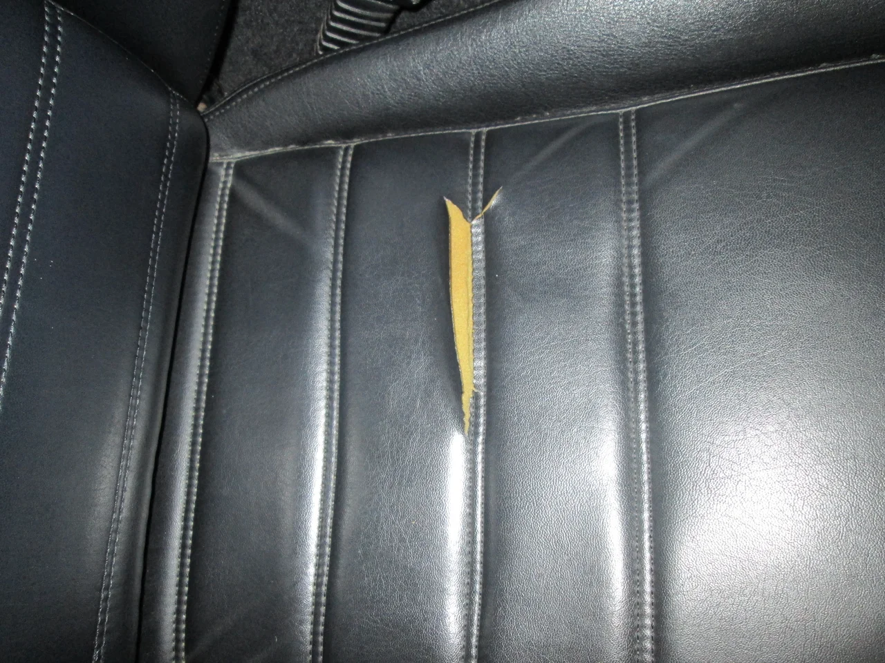
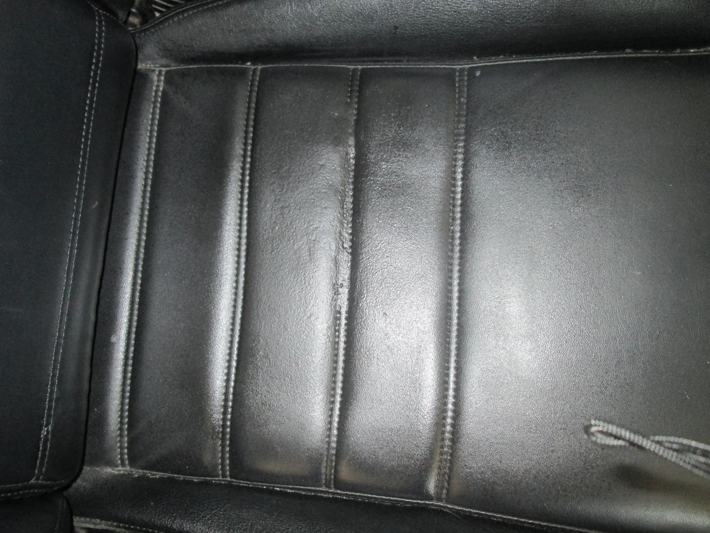
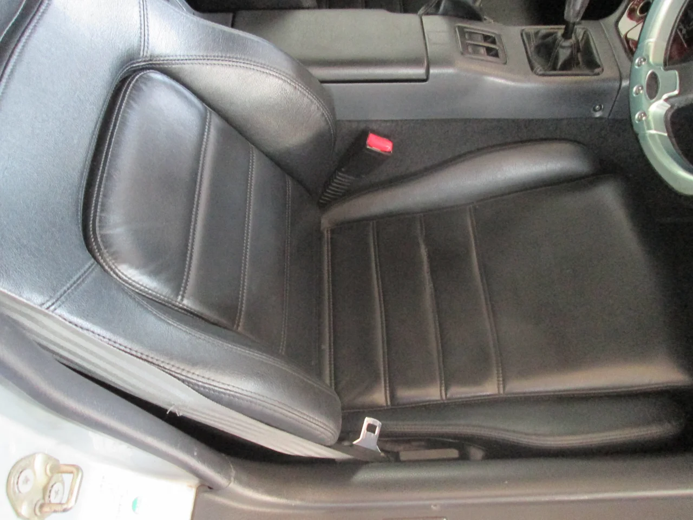

毎日暑いですね、特にこの湿気が体にまとわりつく感じがつらいです。

みなさん、熱中症には注意してくださいね、こまめな水分補給をお願いします。

ところで、今回はスズキ「カプチーノ」のシートリペアです。

ビフォーがこれ

経年劣化でぱっくりいっちゃってます。

アフターがこれ

ちょうど縫い目のところで、かなりテンションがかかるので、苦労しました。

でも、強度はバッチリです。取り換えがきかない貴重な車なので

頑張りました。
