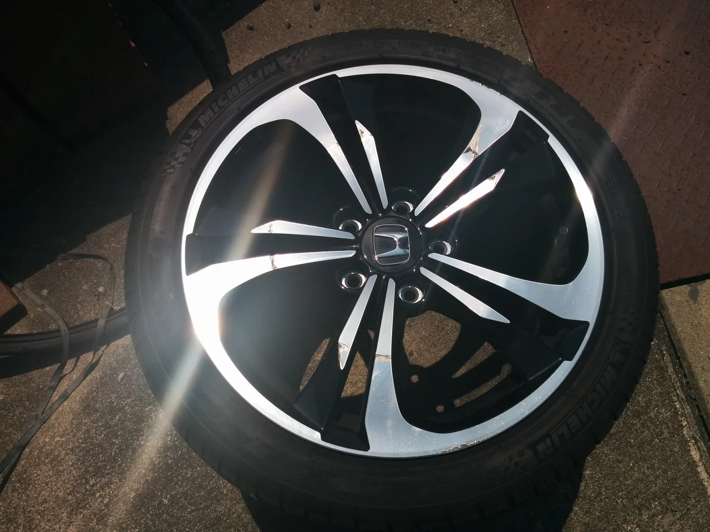
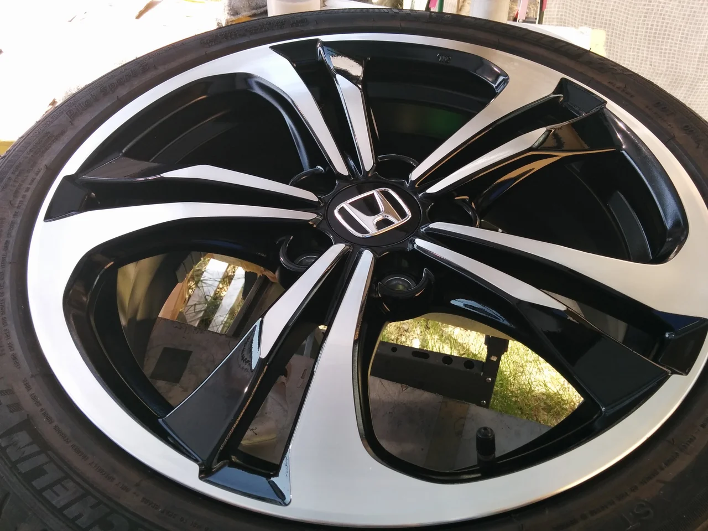
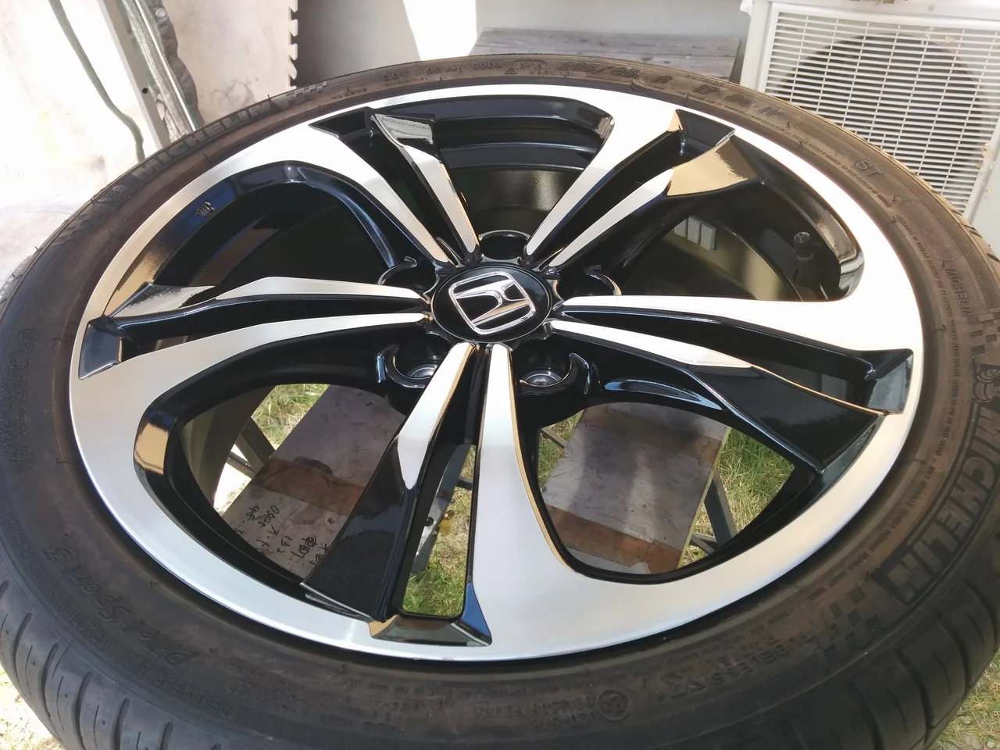

最近寒さが身に応えますね、皆さんいかがお過ごしでしょうか？

ところで、今回は最近とても多くなってきたポリッシュタイプのホイールリペアです。

ビフォーがこれ

直す方法は3通りほどありまして、ほぼ完璧に直したければ、ダイヤカット（もう一度ヘアラインを切り直す）方法です。

これはキレイに治りますが、金額的には一番高額になります。

そこまでお金をかけたくないという方には、塗装で傷の部分をカバーして目立たなくする方法があります。

ポリッシュ風塗装で、光沢を合わせますが、ヘアラインの再現はできません。

その他、デザインによっては、研磨でリペアが可能なものもあります。こちらも比較的安価でできます。

アフターがこれ、（ポリッシュ風塗装によるリペアです）

もう一枚

詳しく知りたい方は、見積もり無料でご相談に応じます。よろしければメールかお電話下さい。
