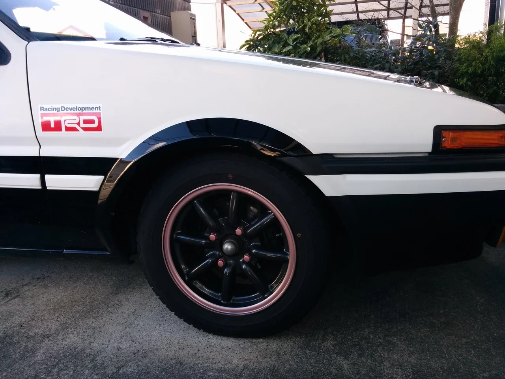

今日は雨でとっても肌寒いですね、でもまだ「雨」のうちは本格的な寒さじゃない、

これが雪に変わると厄介ですね・・。みなさんは冬用タイヤのはめ替えはされましたか？

備えあれば憂い無しです。

ところで、冬は暗くて寒いので、少しでも明るい気持ちで過ごせるように奥様のために

可愛いデザインにカラーチェンジしてみました。（笑）

ビフォーは写真がありません・・。でもブラックレーシングのホイールで全面黒です。

アフターがこれ

リムのラインだけこれはなんという色でしょう？多分「シャンパンピンクゴールド」だと思います、

ナットもおそろいの色にしました、クリアの上から吹付け塗装してあります、下地とスポークはマウンテングレーという

渋いグレーです。本人は気に入ってくれました、僕が乗るわけじゃないから完全に遊んでいます（笑）
