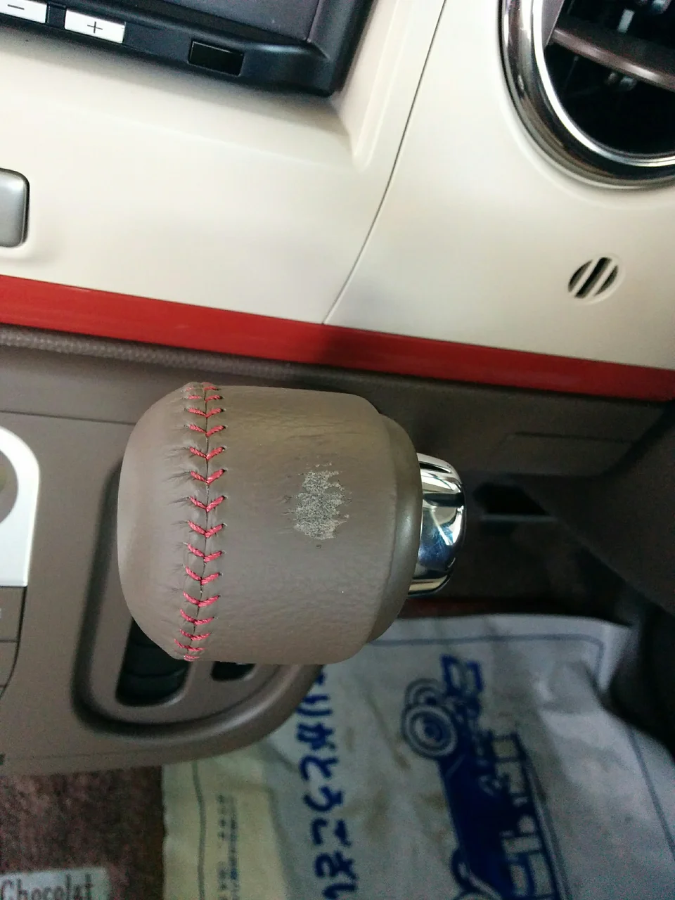
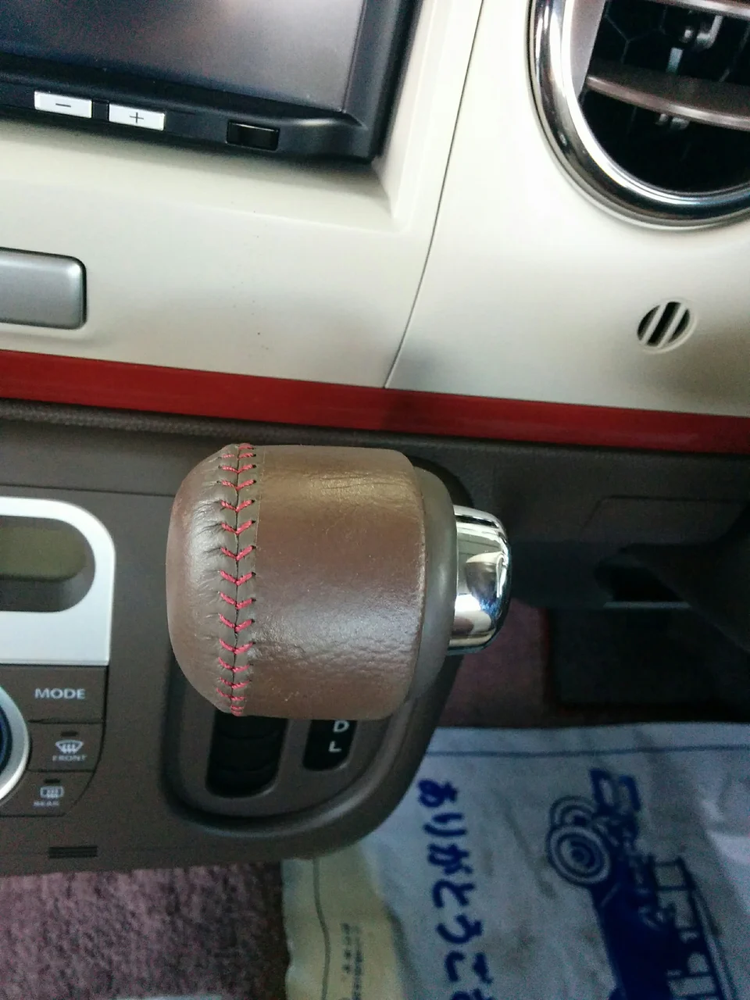

しばらく更新をサボっているうちにすっかり春になってしまいました。

皆様いかがお過ごしでしょうか、いつも今年こそはちゃんと更新しようと思いつつ

ついつい時間が過ぎてしまうそんな毎日です。

ところで、先日中古車やさんからの依頼で、ラパンのシフトノブのリペアをやりました。

キズというか、前のユーザーさんが指輪でもされていて、チェンジのたびにあたっていたのでしょうか？

一箇所だけ革がはげてしまっています。

ビフォーがこれ

そして、アフターがこれ

とってもおしゃれな色あいですね（笑）

毎日必ず目が行くところですから、キズが有ると気になってしょうがないのではないでしょうか？

でもすっかりわからなくなりました。
