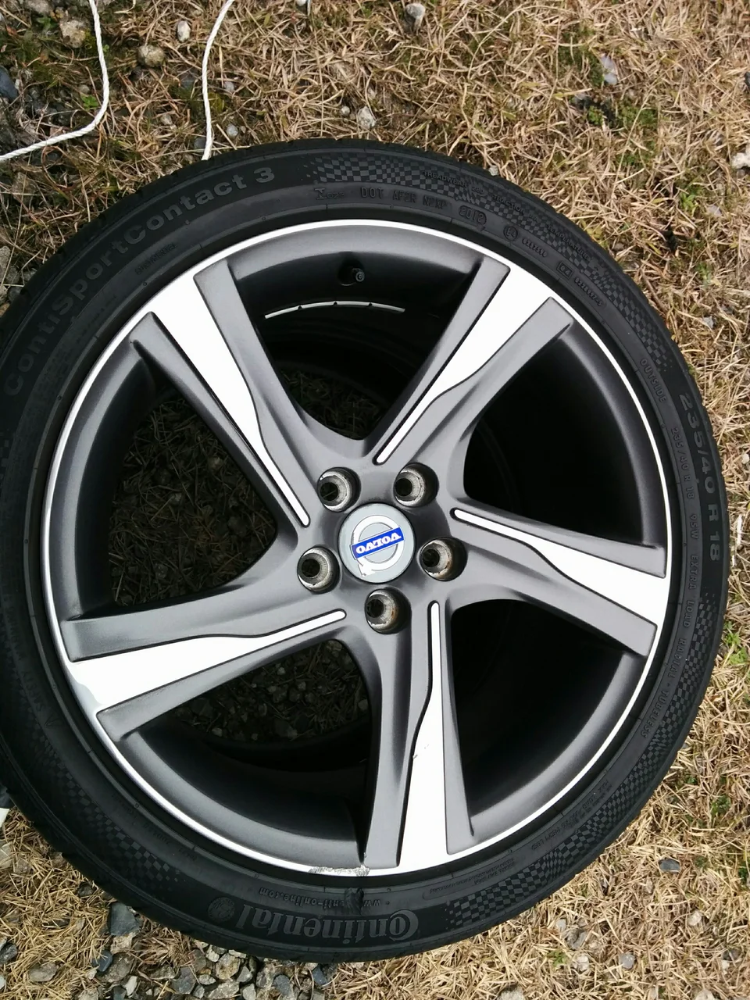
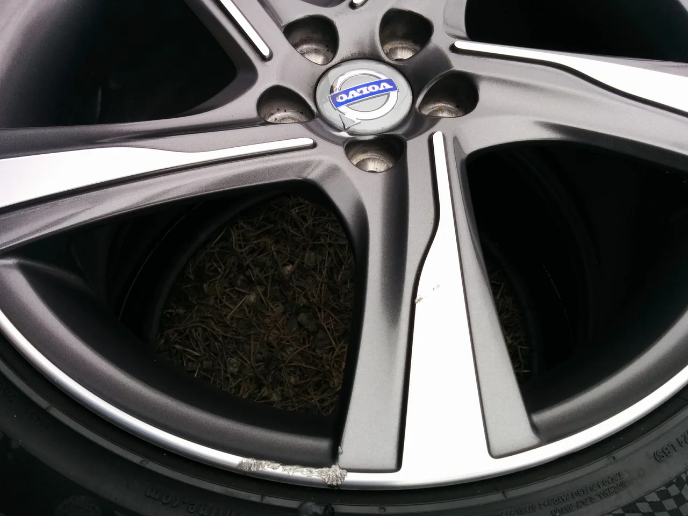
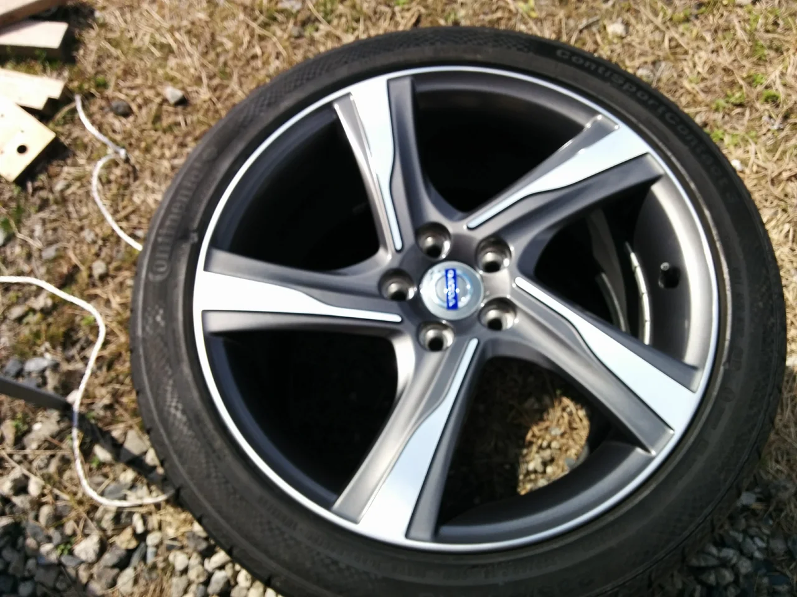
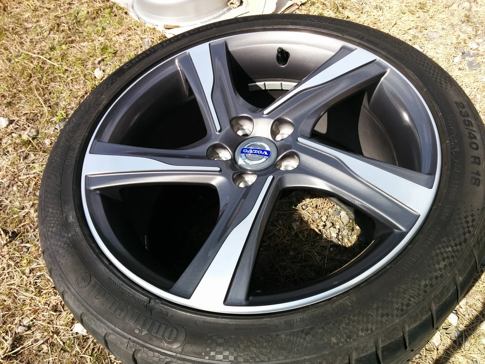
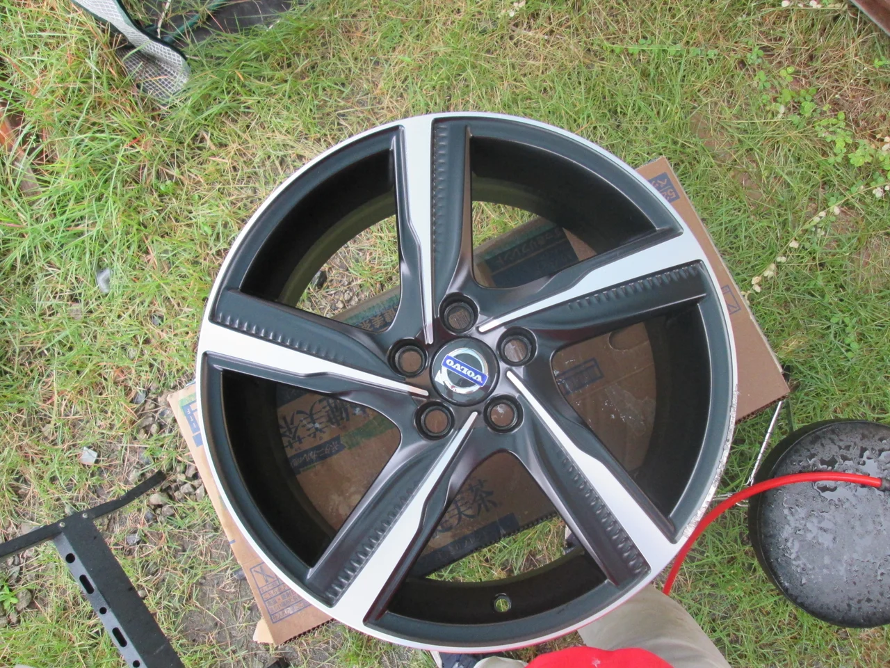
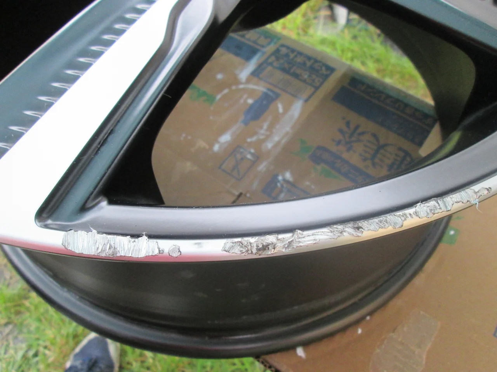
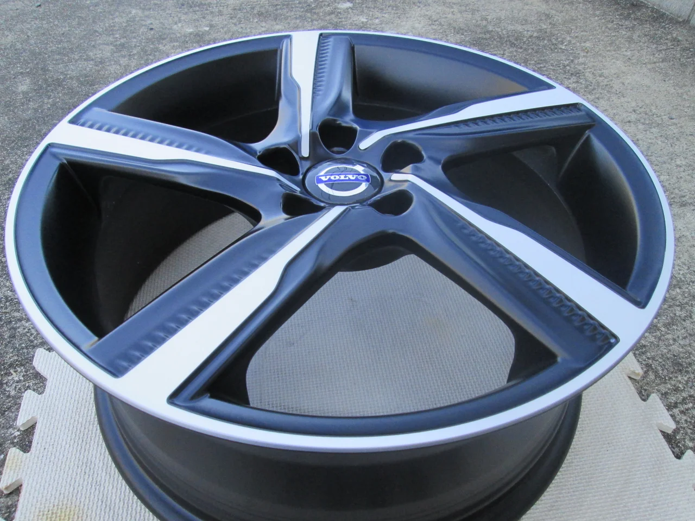
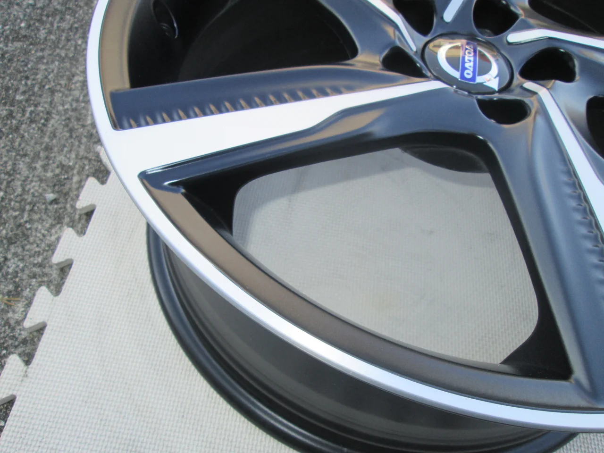

すっかり春めいてきましたね、皆さんいかがお過ごしでしょうか？

でも、・・・それにともなって最近くしゃみがよく出ます（笑） なかなか快適な時期は短いですね。

ところで、今回はボルボの純正ホイールのリペアです。

ビフォーがこれ

キズ部分アップ

このタイプはスポークとリムの部分が「ダイヤカット」で、CDの裏面のような細かいヘアラインがダイヤモンドの針で

彫ってあるため、本当に直そうと思うと本部に送って専用の機械で彫り直さない限り再現できません。

しかし、それだと料金が高額になるため、クオリティーは少し落ちますが、塗装によって

ぱっと見わからない程度に仕上げる事はできます。

今回は塗装でリペアしました。

アフターがこれ

ヘアラインは消えてしまいますが、キズのイタイ感じは隠れます。

お客様の要望によってどちらでも対応いたします。

参考までにダイヤカットを掘り直した他の事例を紹介いたします。

ビフォーがこれ

アフターがこれ

一本あたりの料金は

塗装によるリペアだとインチ数とキズの状態にもよりますが、12000～18000円ぐらい

ダイヤカットの掘り直しだと 30000～40000円ぐらいかかります。

お悩みの方はご相談に応じます。お電話下さい。
