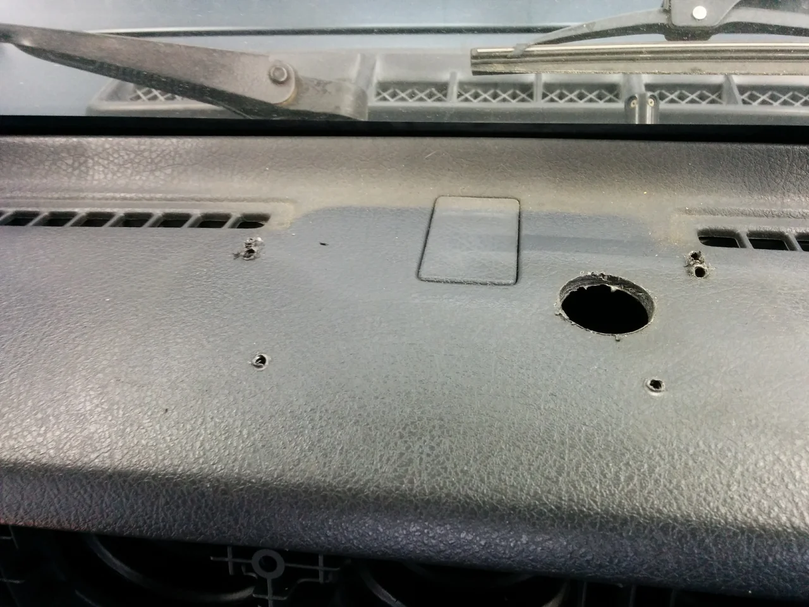
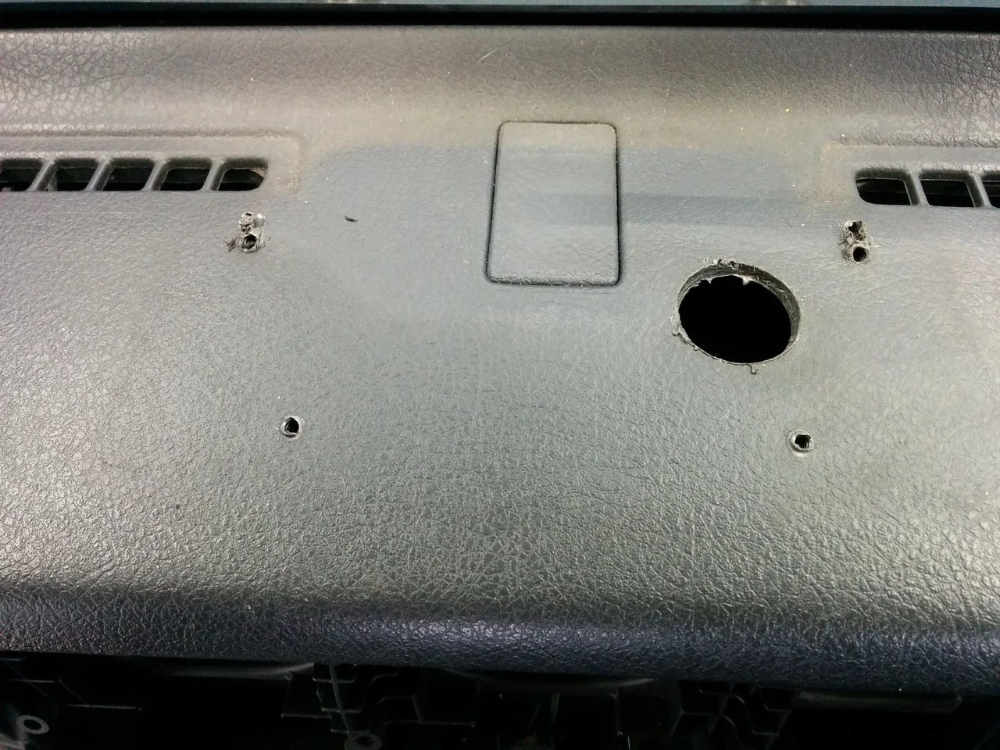
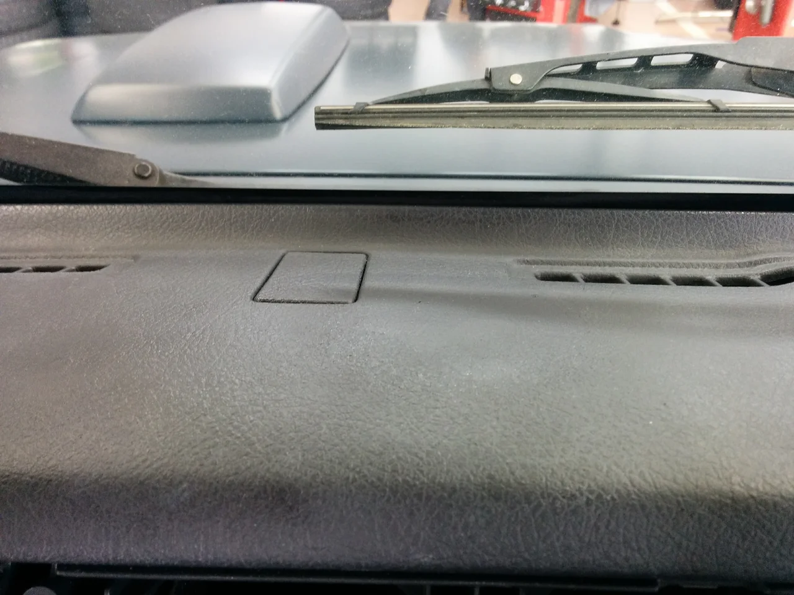

今日は朝から雪が降って、とっても寒い日になりました。

道路はすぐ溶けて積もるようなことはありませんでしたが、我が家の土の地面は薄っすらと雪が積もりました。

皆様いかがお過ごしでしょうか・

ところで、今日はスズキジムニーのダッシュボードのリペアです。

ビフォーがこれ

なんかすごいことになっていますが、どうやらこの車種はダッシュに方位磁石をつけてあるものがありまして、それを外したら

このような大穴とビス穴が空いてしまったようです。（汗）

アフターがこれ

オーダーとしては、パット見わからなくなれば良い！とおっしゃいましたので、早急に仕上げました。

このあとも作業されるらしく、スピード仕上げの2.5hです。（笑）

しかし・・、ジープは乗り降りが大変ですね（汗）ちょっと明日筋肉痛かも？です。（笑）
