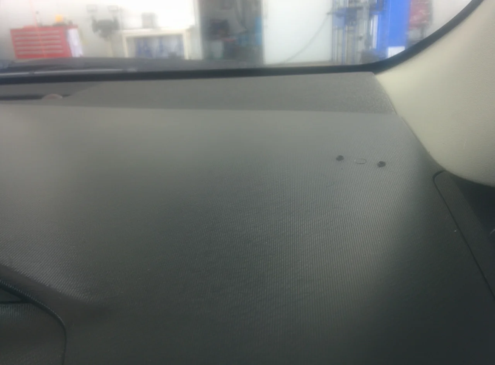
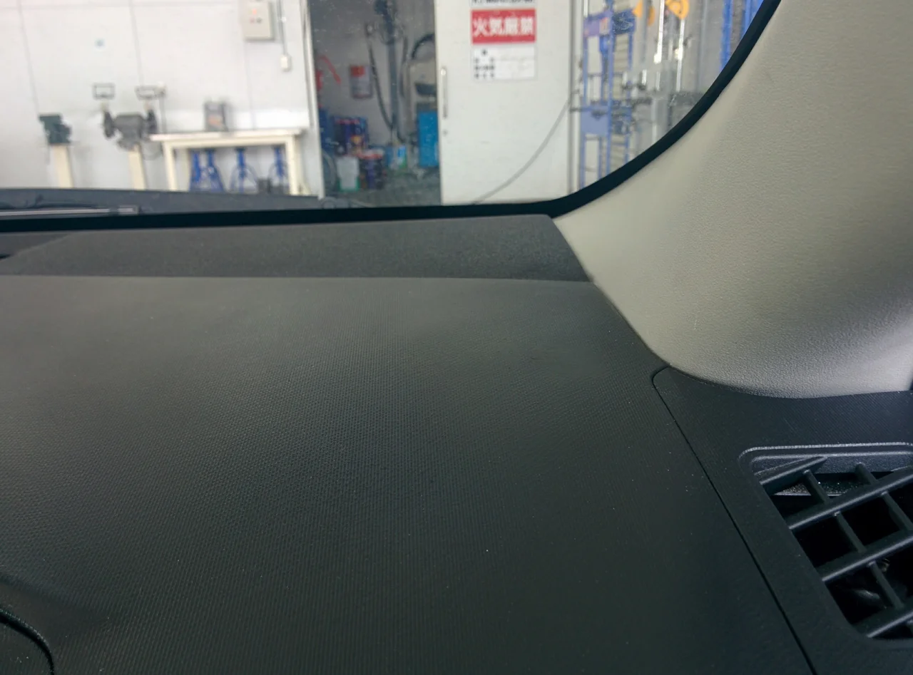

ついに6月、ジメジメした季節がやってきましたね・・。

そしてすでに蒸し暑い！今年の夏が思いやられます。でも、食欲はあるので、しっかり食べて

夏を乗り切ります（笑）

ところで、今回はトヨタ アクアのダッシュボードのキズリペアです。

ビフォーがこれ

なんでも、レーダーを取り付けておられたようで、ビス穴と丸い輪っかのようなあとが残っています。

アフターがこれ

このアクアは、プリウスの弟分のような車で、ダッシュの模様も似ています（笑）

この機械的なドット柄は正直再現が難しいので、あまり好きではありません（笑）

なので、今回はなるべく小さく直しました（汗）
