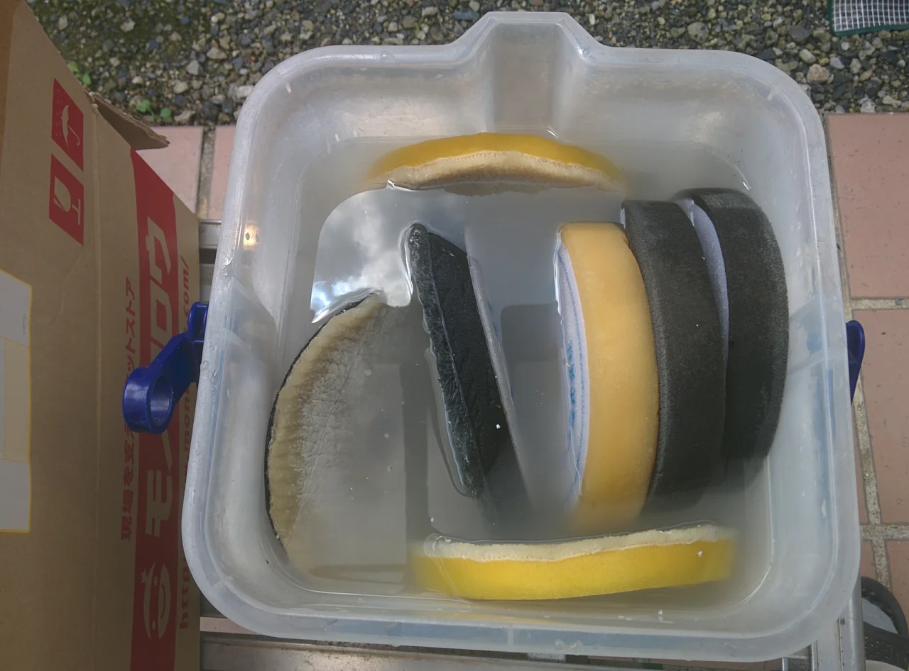
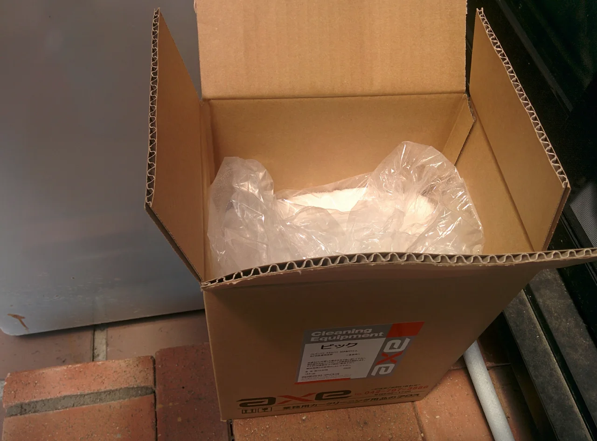

毎日うっとうしい空模様が続いてますね、皆様いかがお過ごしでしょうか？

中国、九州地方では災害が発生し、大変な思いをされている方々がいらしゃって心が痛みます。

早くおさまってくれることをお祈りします。

ところで、今日は朝から貴重な晴れ間が見えたので、ボディー磨き用のバフを洗濯しようと思います。

まずは洗剤につけ置きをしておきます。

こびりついたコンパウンドはなかなか落ちませんから・・。

そして、洗剤はバフクリーニング専用の洗剤です。

コンパウンドなどを溶かしてきれいに洗うことができる業務用です。

普通の衣類の洗剤ではきれいに落ちませんから、きれいに落ちていないと

作業に支障をきたします。

ツール類のメンテにも気をつけないといけませんね。
