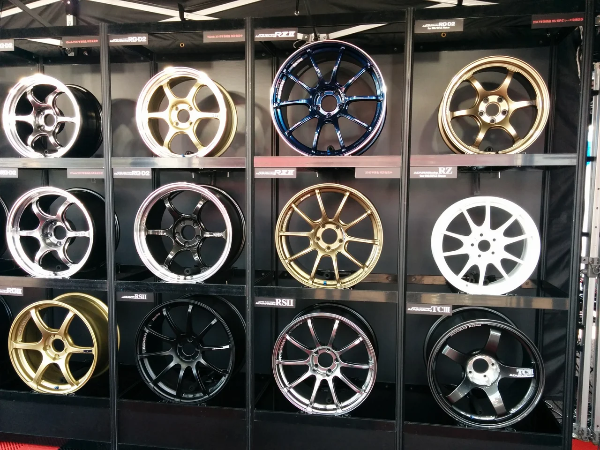
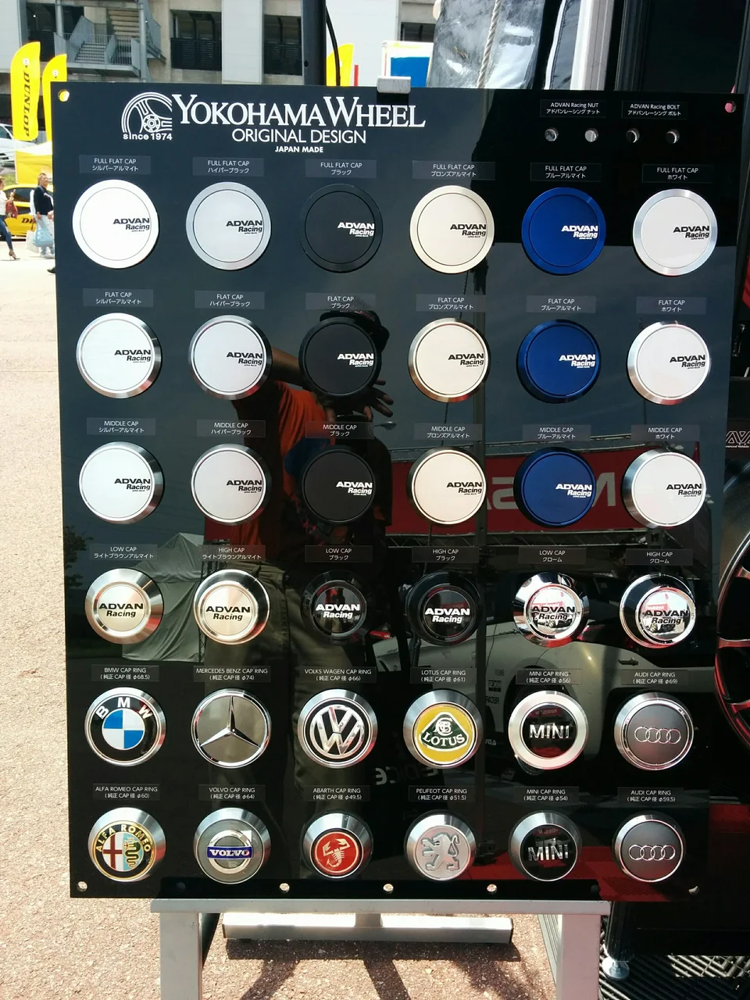
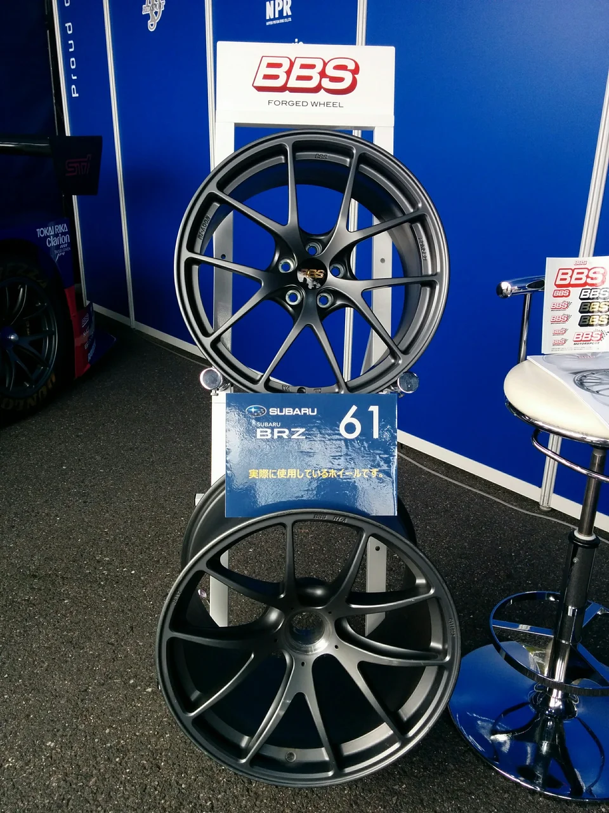
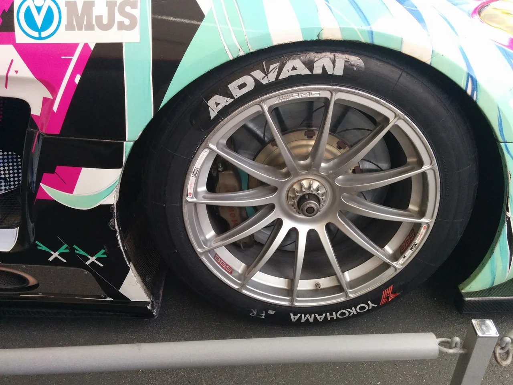
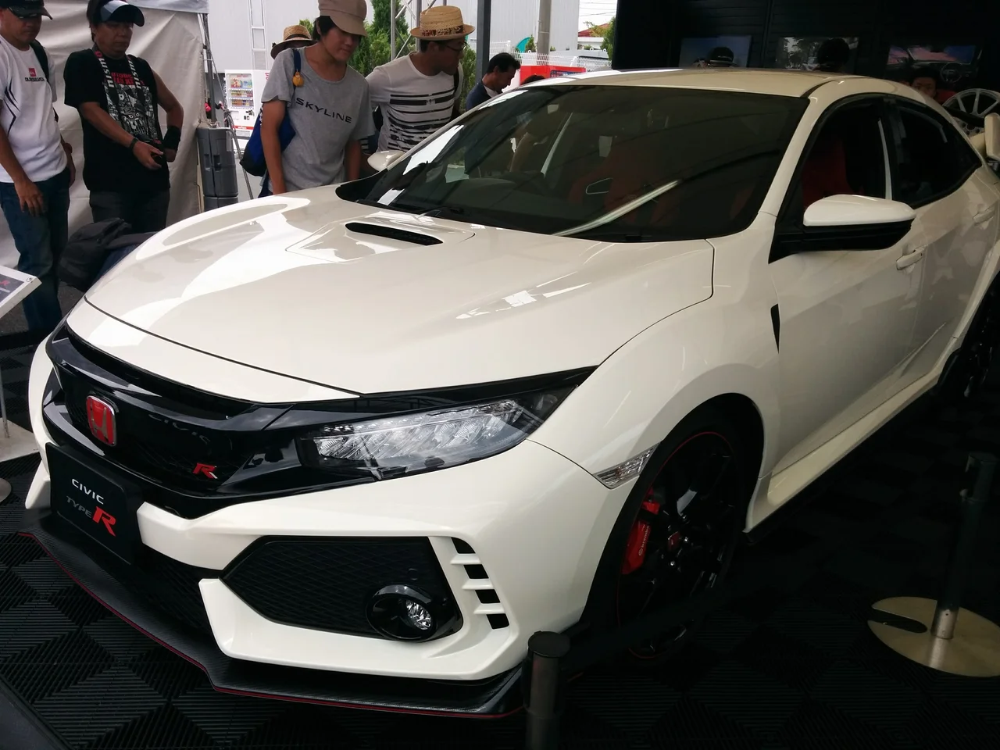
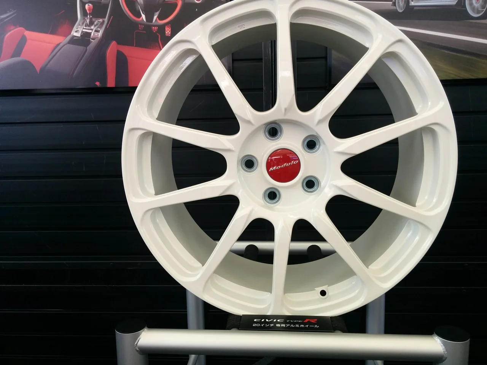
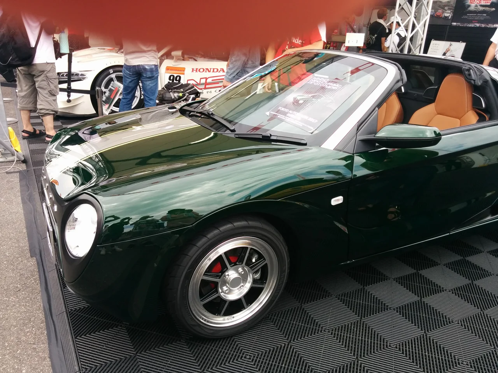
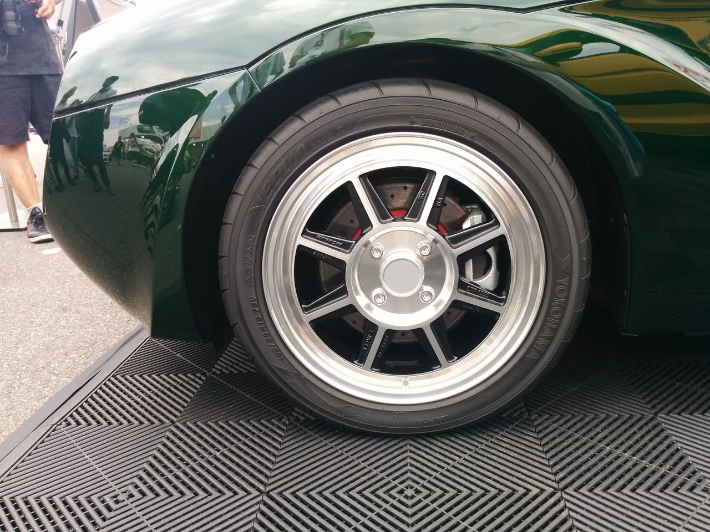

鈴鹿GTのイベントブースで見かけたホイールについてアップします。

まずはRAYSです。

いろんな車に提供されています。以下そのオリジナルキャップです。

そしてBBS

初音ミク号はメルセデスなので当然AMGです。

他にはHONDAのシビックタイプRの専用ホイール

ホンダと言えば最近人気のS660ですが、これはレアなレトロ調の限定バージョン

こういうレトロなデザインにはホイールもどこかノスタルジックなデザインが似合いますね。

あんまりホイールばかり見ていると、かみさんに叱られてしまいました。（笑）
