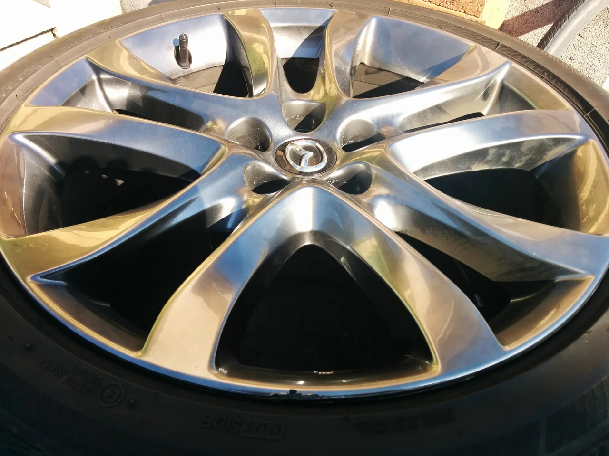
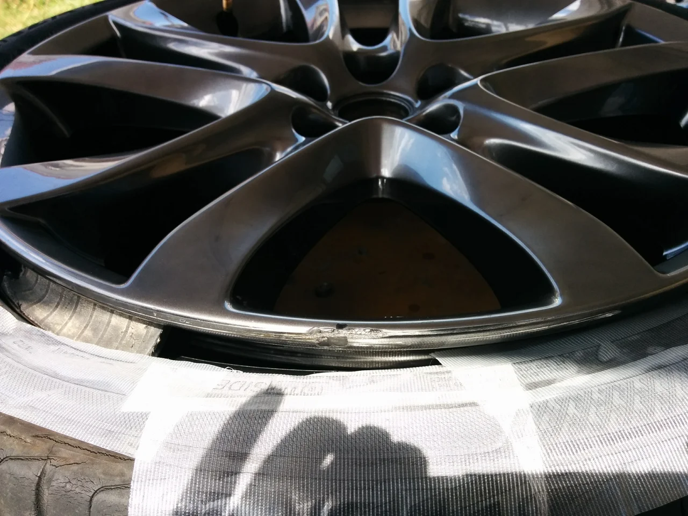
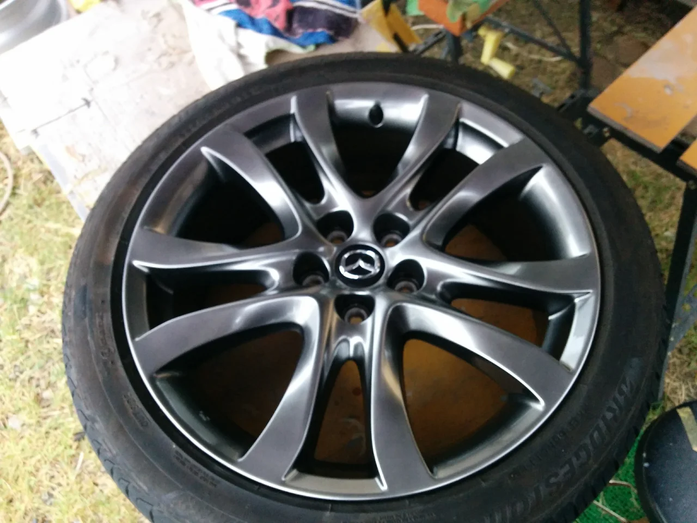
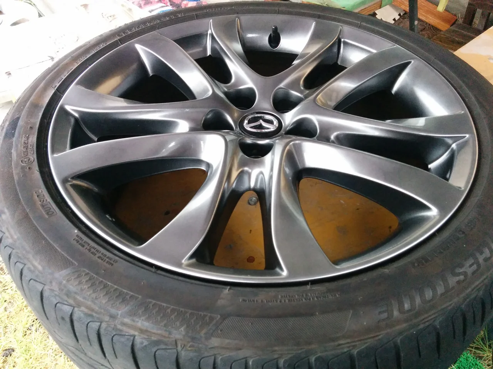

今月に入ってめっきり秋らしくなりましたね、気持ちの良い日が続いておりましたが・・。

でも、もうすぐ秋雨や台風の季節がやってきます。快適な季節は短いので、この時を大切にしたいですね！

ところで、今回はマツダの純正ホイールのリペアです。

塗装のタイプとしては、「ハイパーシルバー」です。

下塗りが黒ベースのガンメタ調です。

ビフォーがこれ

リムの角です。

アフターがこれ

微妙な色味の調整が難しかったです。
