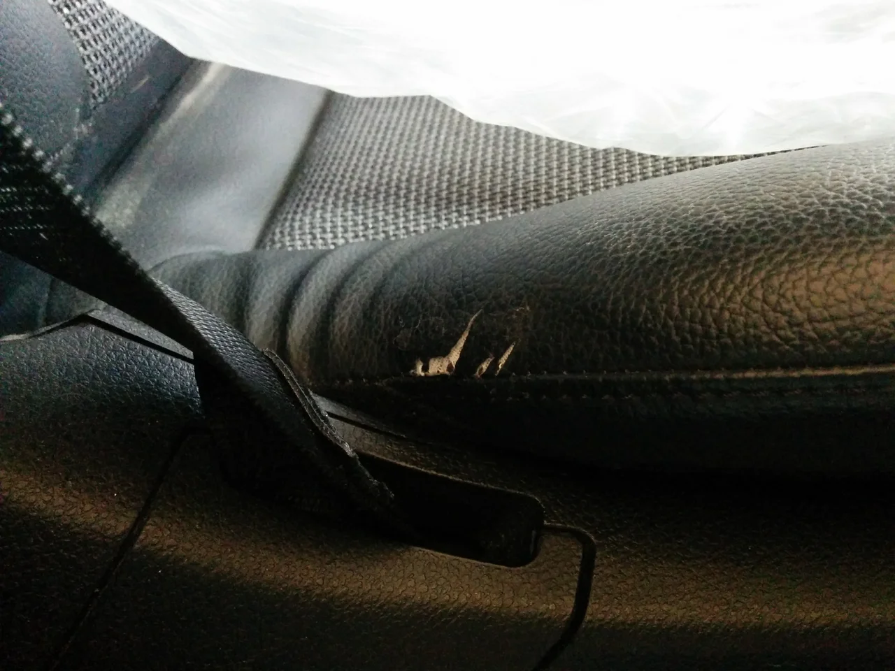
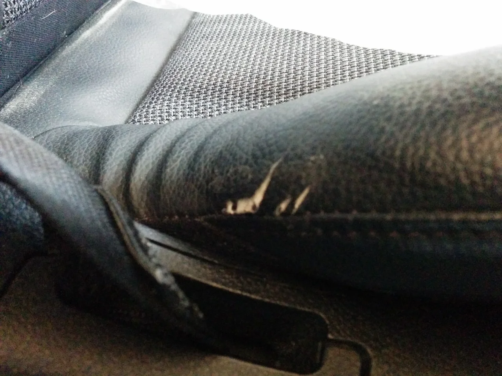
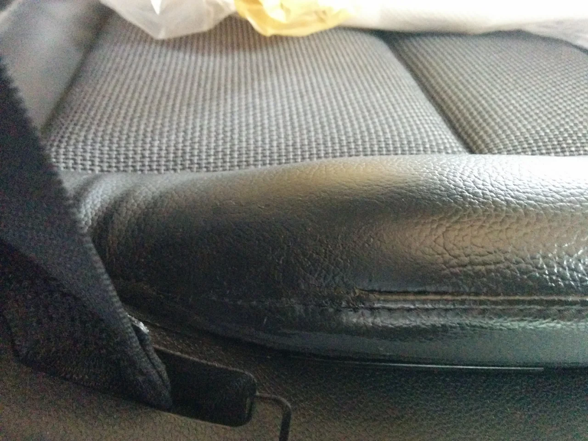

お彼岸も過ぎて、すっかり秋らしくなってきましたね、皆様いかがお過ごしでしょうか？

寒暖の差が激しいので、風邪など引かれないように気をつけてくださいね！

ところで、今回はベンツC20の運転席のシート破れです。

ビフォーがこれ

乗り降りのときにかなりテンションが繰り返しかかるところなので、破れてしまったのでしょう！？

アフターがこれ

かなり強度が求められるところなので、下地はナイロン糸で下縫いしてあります。

その後トータルリペアオリジナルの補修材で補修しました。

素材の伸縮についていけるのが大きな特徴です。

でも、少しやさしめに使用してね！[emoji:v-238]（笑）
