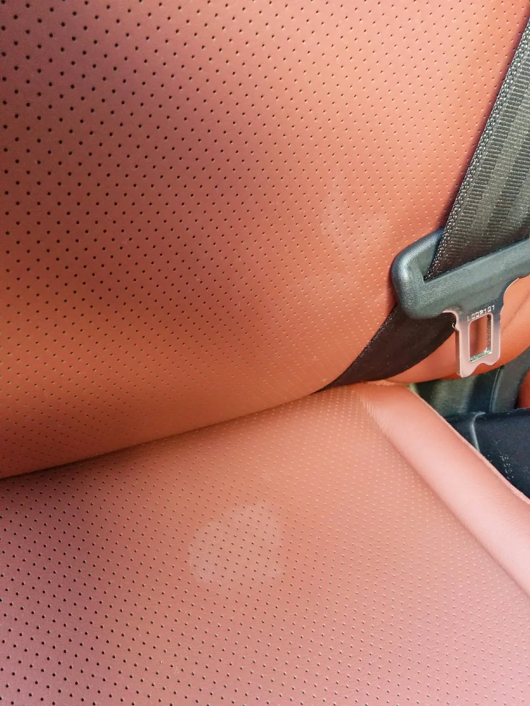
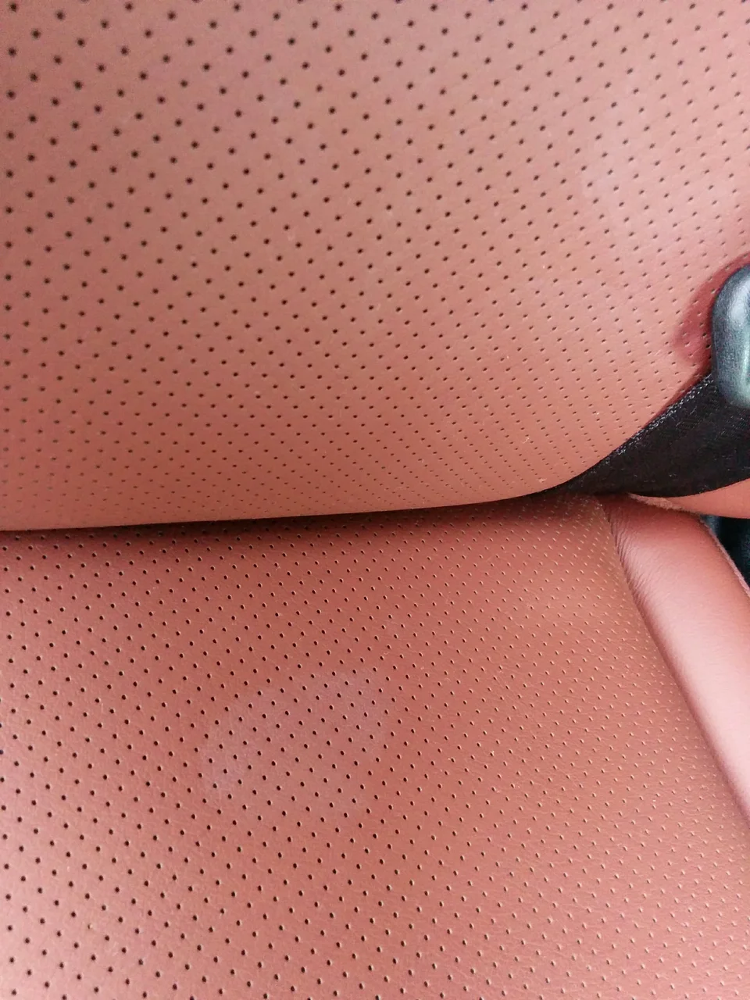
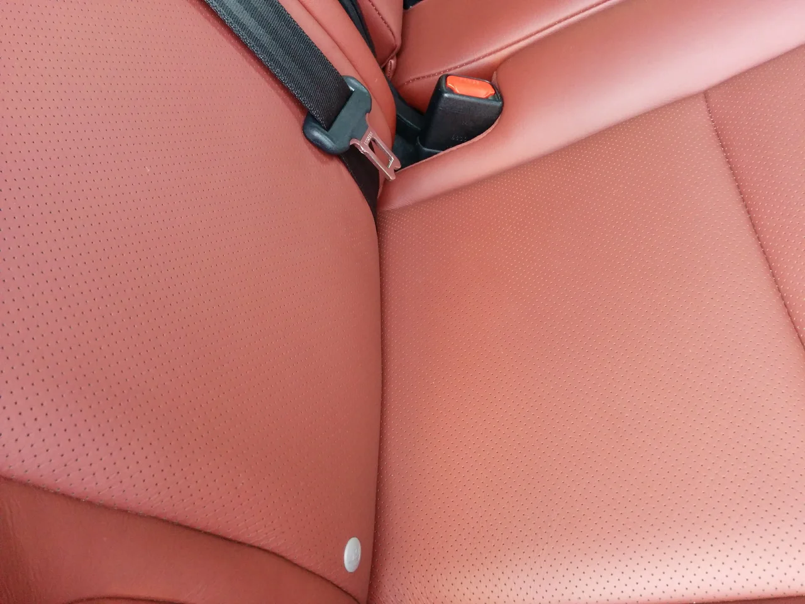

朝晩の寒暖差が大きい季節がやってきましたね。日が落ちたら急に冷えてきます、

皆さん、体調を崩さないように気をつけてくださいね！

ところで、今回はレクサスのシートの汚れです。

ビフォーがこれ

うっすらですが、白っぽい何かをこぼしたようなシミがあります。

アフターがこれ

表面が侵されていなければ、クリーニングで落ちることが多いですが、中まで浸透していたりすると

クリーニングでは落ちません。

その場合はリペアで直す事になります。
