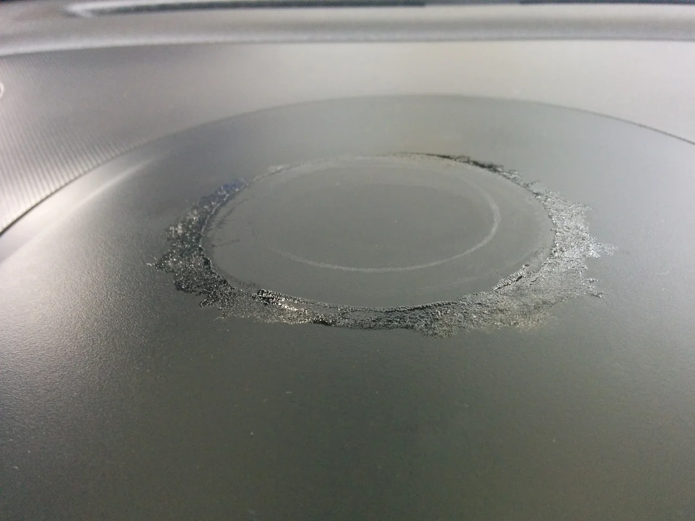
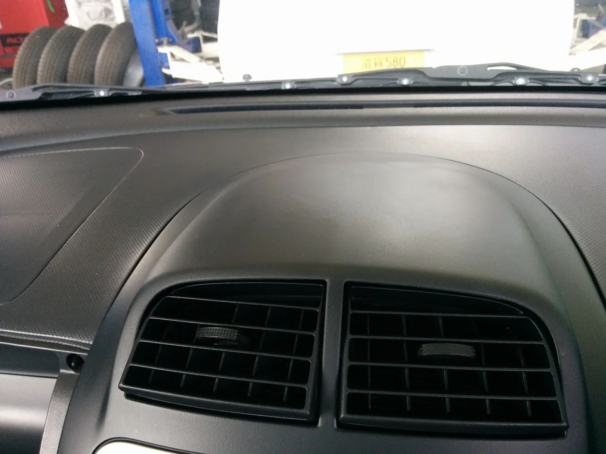

しばらく肌寒い日が続きましたが、連休中はまた少し季節が戻りましたね。

でもこれから少しづつ季節が進んでいくのでしょうね・・。秋風が郷愁をそそりますね。

ところで、今回はトヨタ パッソのダッシュに「スマフォホルダー」が貼付けあり

その部分が溶けてしまって「何とかして！」というご依頼でした。（笑）

ビフォーがこれ

あちゃ～！やってくれましたね！って感じです。（笑）

クリーナーで拭き取っても、表面の塗膜まで侵されており、一部はがれてしまっていました。

アフターがこれ

補修材で表面を整えて、再塗装しました。

理屈では簡単ですが、ダッシュは反射で面の艶や状態が反映されるので意外と難しいです。

ホルダーの説明書きを見たら、「毎回降車時には外しておいてください。」と書いてありました。

皆さん注意書きは守ってくださいね！
