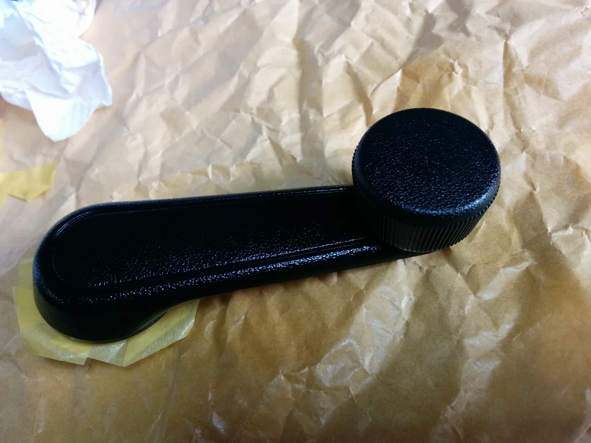
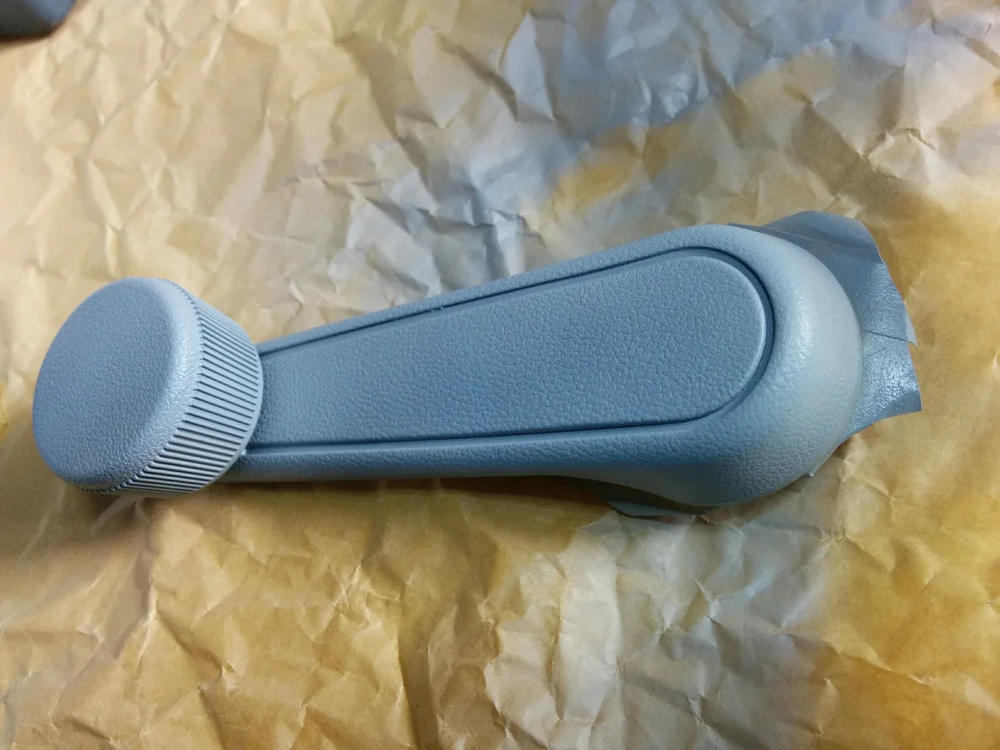
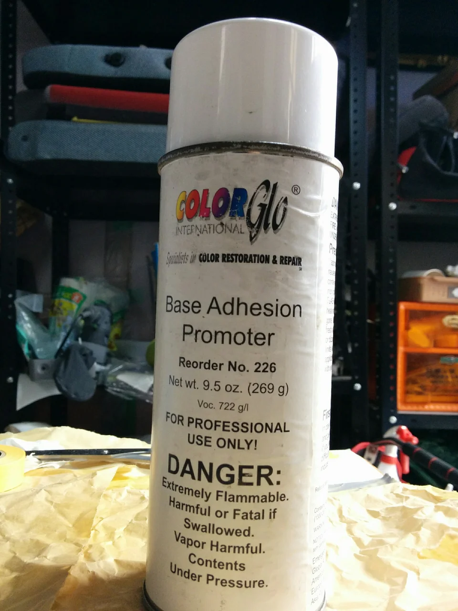
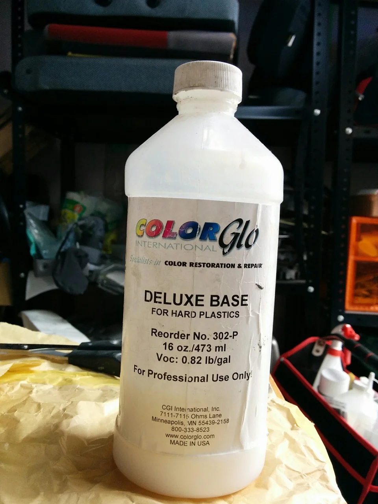
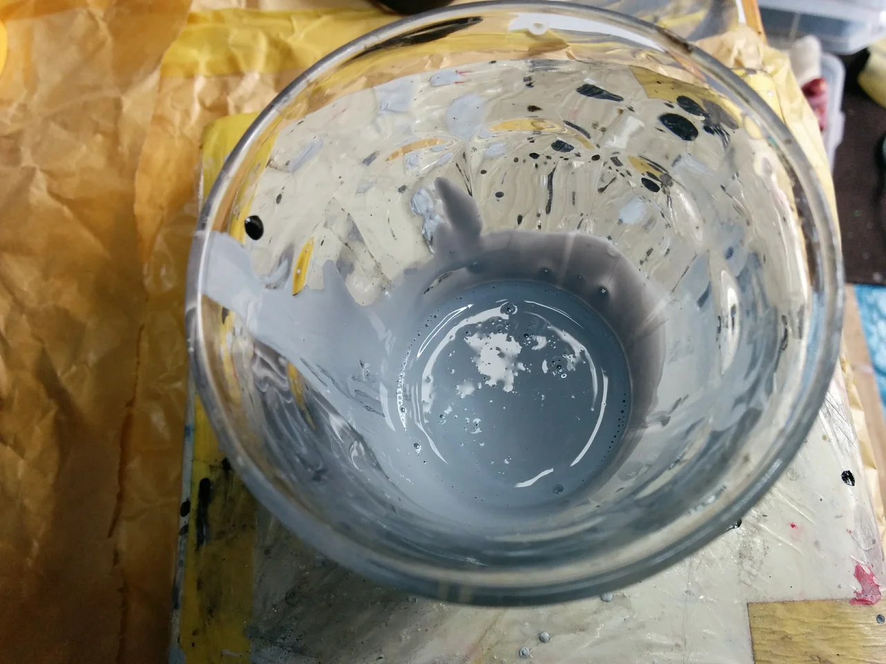
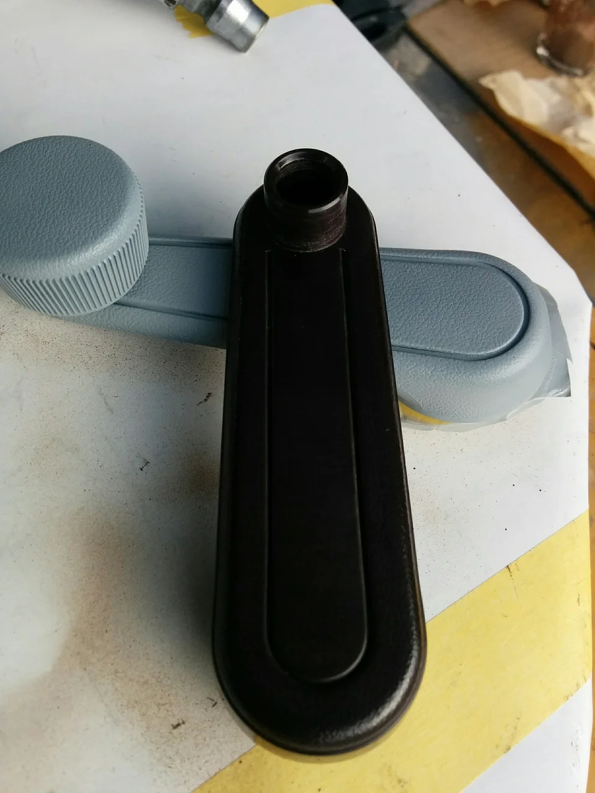
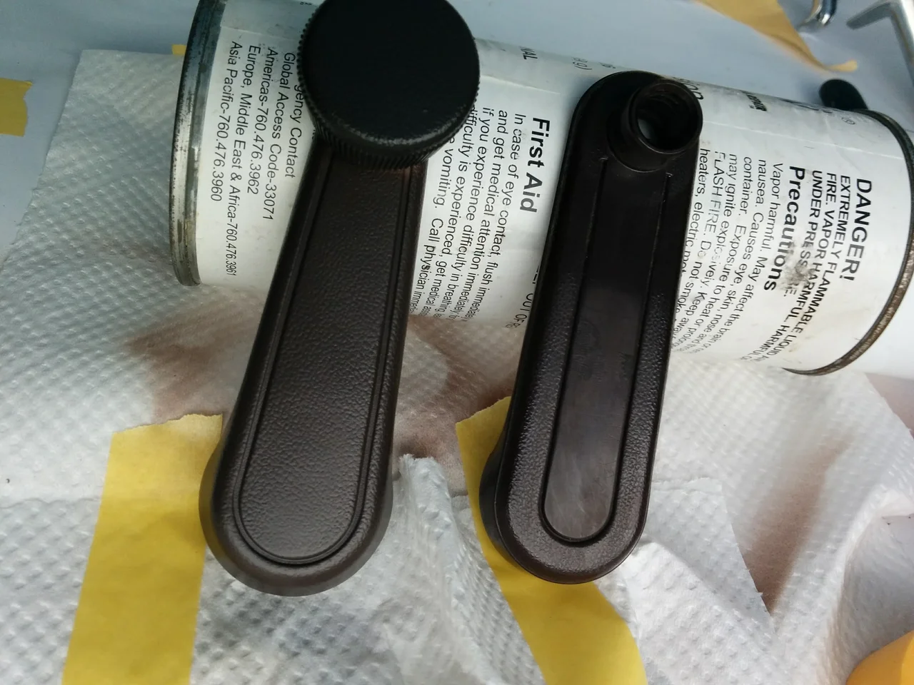
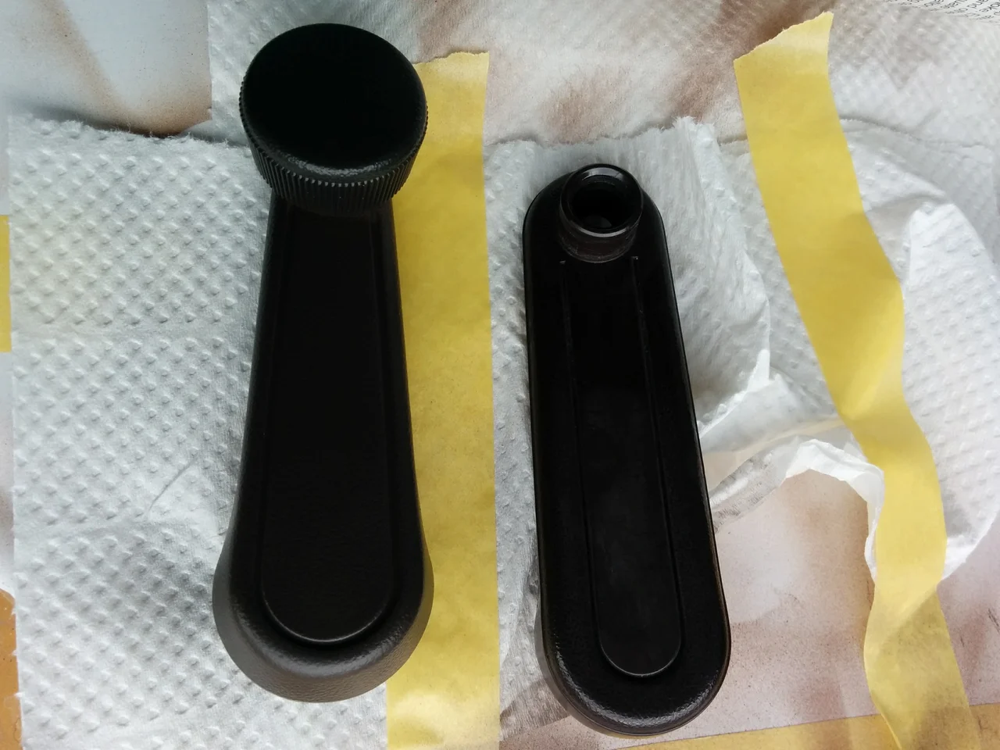
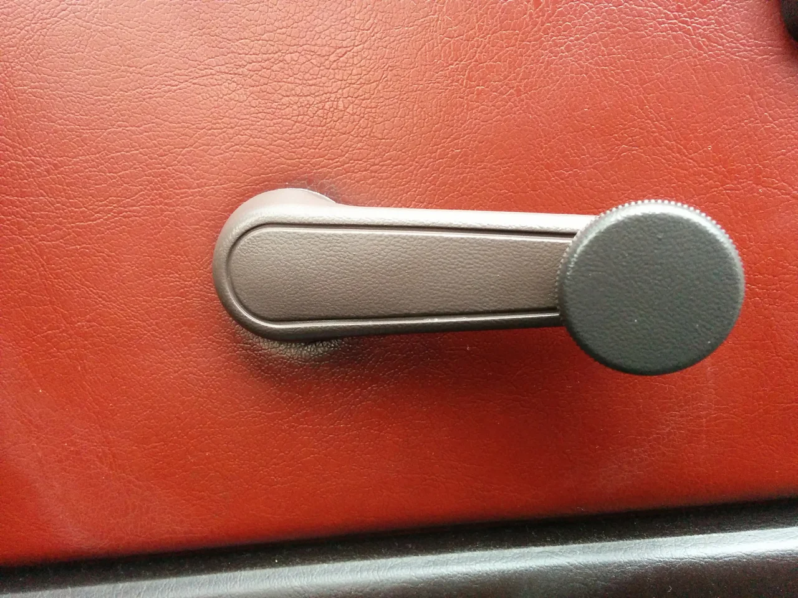

急激に寒くなりましたね、まだ秋だと思っていたらいきなり冬がやってきた感じです。

皆様いかがお過ごしでしょうか？

さて、今回は我が家のハチロクの「レギュレーターハンドル」つまり、窓を開け閉めするときに

くるくる回すあのハンドルです。お若い方はご存じないかも？（笑）

ビフォーがこれ

うちのハチロクは内装が前期型だったので、交換部品はもうないと言われました。

なので、後期型のものを仕入れて色を合わせることにしました。

黒のパーツをチョコレートブラウンにカラーチェンジします。

最初に一旦グレーに染めます。

何故かと言うと、黒のままだと極めて他の色に染まりにくいからです。

そして、下地の密着を高めるためにトータルリペアオリジナルの密着剤を使います。

このベースアドフュージョンプロモーターを全体にスプレーして充分に乾燥させます。

そして、カラーを入れた補修材これです。

デラックスベースに色を入れました。

このパーツの色に合わせます。

よく見たら形が違いますね！（笑）今気づきました・・。いいんです！問題なく使えるそうなので。

そして、はめてみました。

バッチリですね！ 写真の色味の違いはスマフォカメラの優秀さによるものです（汗）

車内がかなり暗めだったので、勝手に判断して明るい色に撮影されてしまいました（笑）

実際は一個前の濃いチョコレート色です。

細かいことですが、ハンドルのツマミの部分はより黒っぽい色だったので、忠実に再現しました。

面積は狭いですが、結構面倒なのでわざわざやる気が起きず、当分放置していましたが、

パーツ塗装の仕事のついでにやりました。

あまり需要は無いかもしれませんが、お悩みの方はお気軽にご相談下さい。
