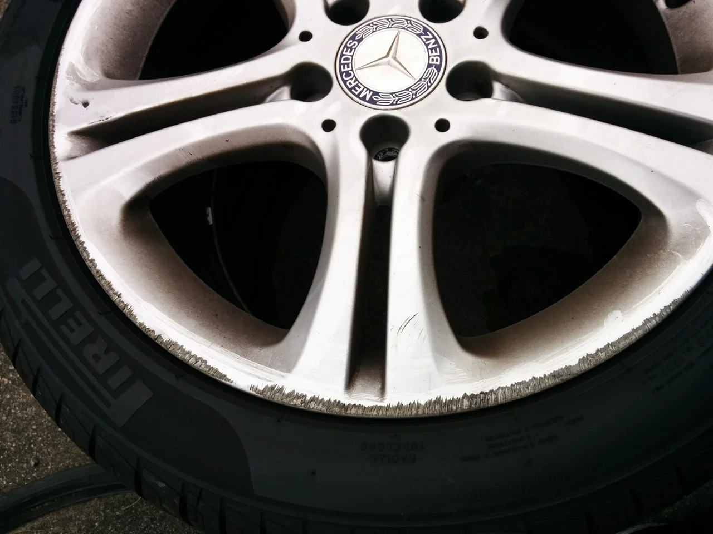
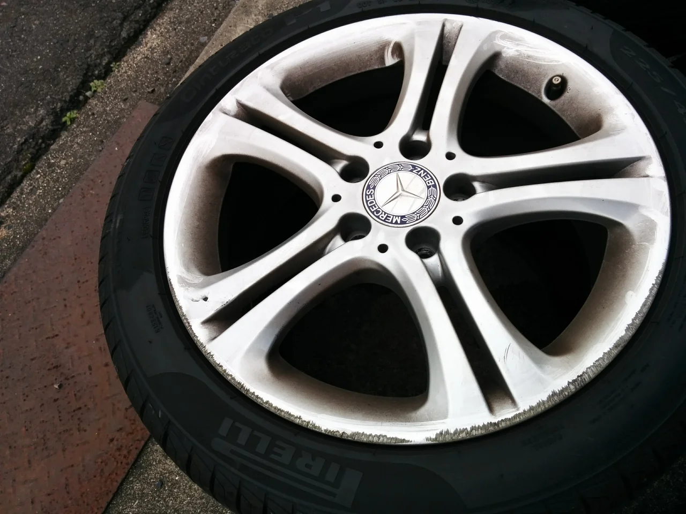
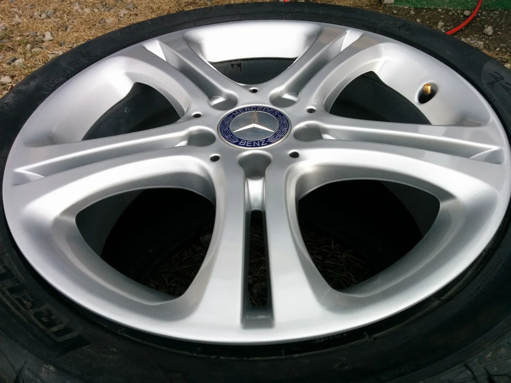
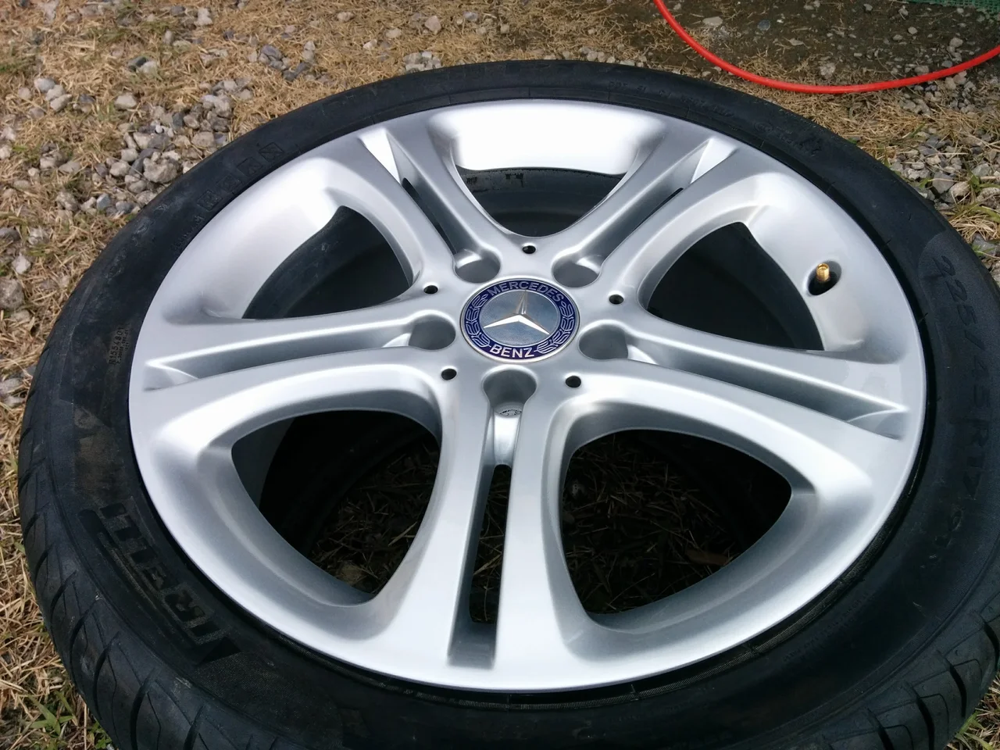

皆様、いよいよ12月になりましたね！本当に月日の過ぎるのは速いですね、しかも年々早まっているような気がします。

これは私の年齢のせいでしょうか（笑）

ところで、今回はベンツの純正ホイールのガリキズリペアです。

ビフォーがこれ

全体図

かなり広範囲ガリッてますね、ここまでひどいとせっかくのベンツも台無しですね・・・。

アフターがこれ

全体図

すっかりきれいになりました。

この色味の違いは、ホイール自体がかなり汚れていたのでそれによるものが大きいです。

クリーナーでがっつり洗っただけでかなりキレイになりました。洗った直後の写真がなくてスイマセン。

でもリペアするとかなりキレイにはなるので、一本だけやると違和感が出ることがあります。

できるだけ片側2本もしくは4本まとめての施工をおすすめします。
