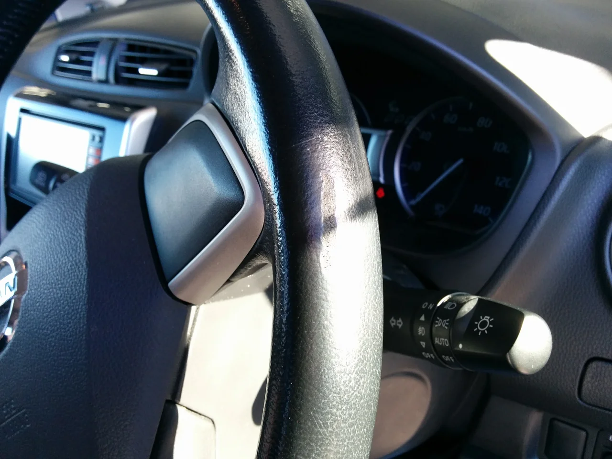
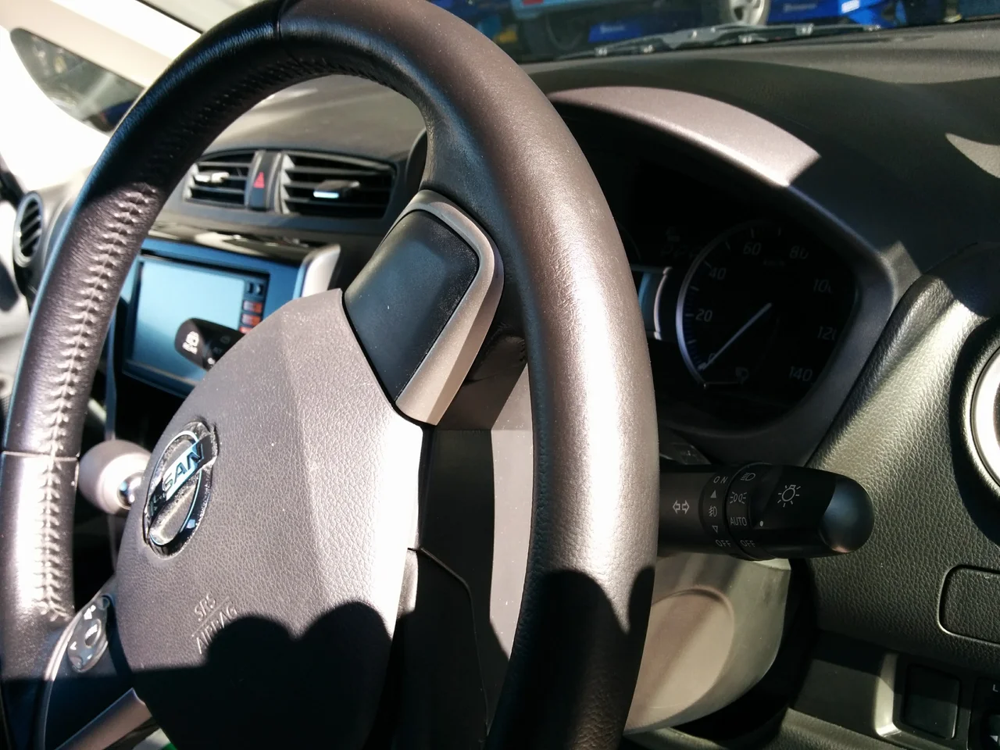
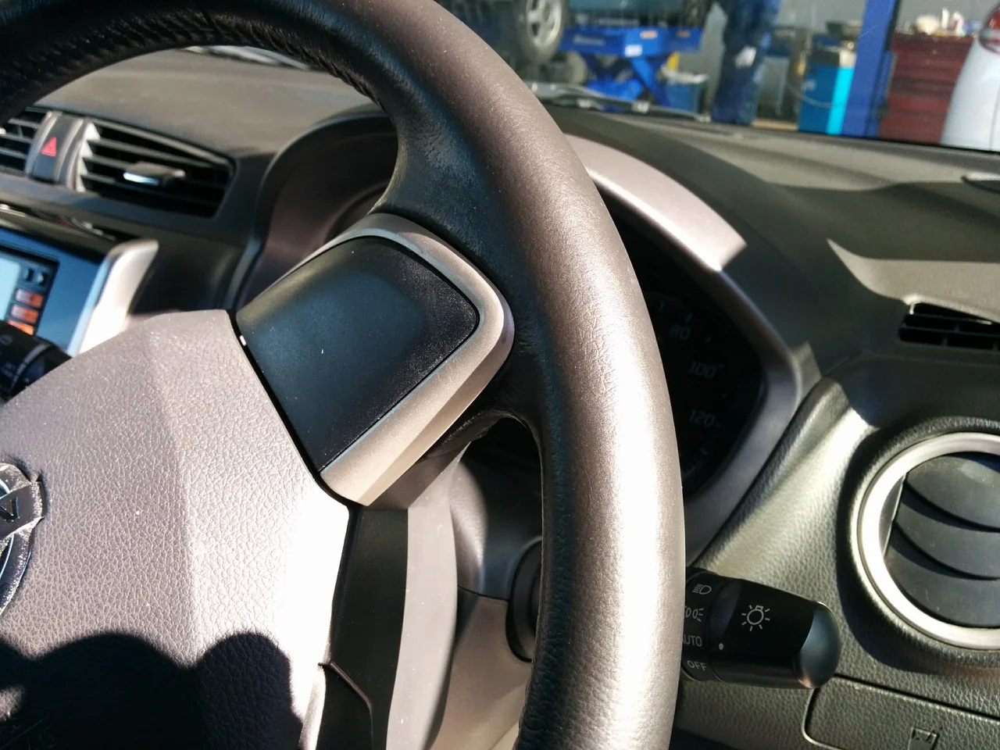

何か急に寒くなりましたね、皆様冬用タイヤの交換はされましたか？

私は今日に済ませました。めんどくさがりなので、いつもギリギリになるのですが、

いよいよ小雪がちらつく中での交換はこの上なく辛い！（笑）皆様も安全のため早めの交換を

おすすめします。

ところで、今回は日産デイズのステアリングのキズリペアです。

ビフォーがこれ

何か前のユーザーさんが「指輪」でもされていたのでしょうか？

ちょっと気になりますね！

アフターがこれ

アップです。

なるべくハンドルのシボ模様を再現しました。

お困りの方はご相談下さい。
