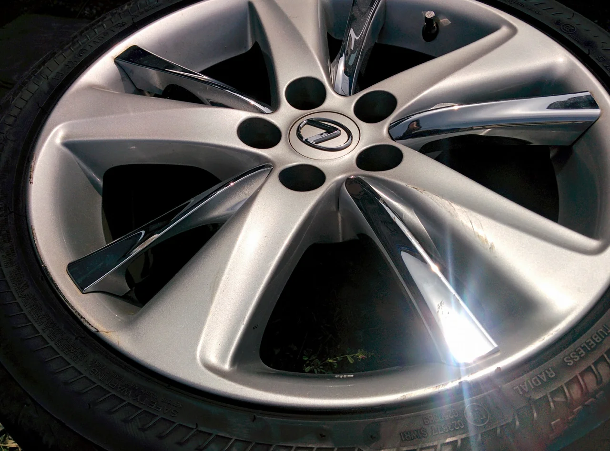
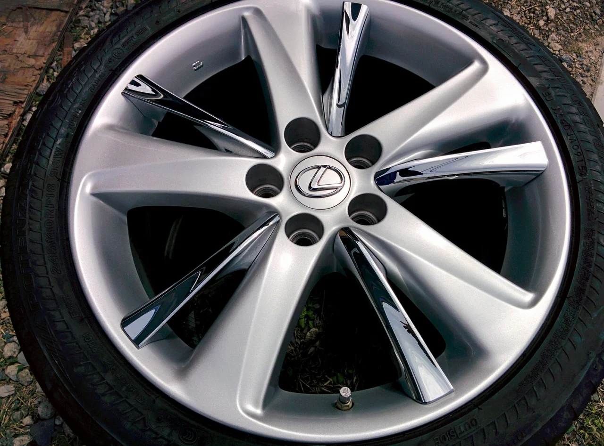

なんか急に暑くなりましたね！まだ4月なのに夏が来たみたいです。

最近の天候は極端ですね。 みなさま体調の管理には気をつけて下さいね。

ところで、今回はレクサスの純正ホイールのリペアです。

ビフォーがこれ

ちょっとわかりにくいかもしれませんが、リムの外周とスポークの一部に

キズが入っています。

アフターがこれ

どうやって直すの？と言う質問をよく受けますが、基本的にはボディーのキズと同じです。

浅いキズは表面を削って再塗装、深いキズは埋めて成形したあと再塗装します。

ボディーとの違いは、素材がアルミなのでアルミ専用のフィラーを使うことと

塗料がボディーのようなカラーNO.などが無いため、メタルのフレークの細かさや

色味などをその都度調色して合わせる必要があること、そして、ハイパーシルバーなどのように

特殊な塗装方法が為されているものも多いのが特徴です。

当店ではそのような特殊な塗装やポリッシュのホイールにも対応しております。

お困りの方はご相談下さい。
