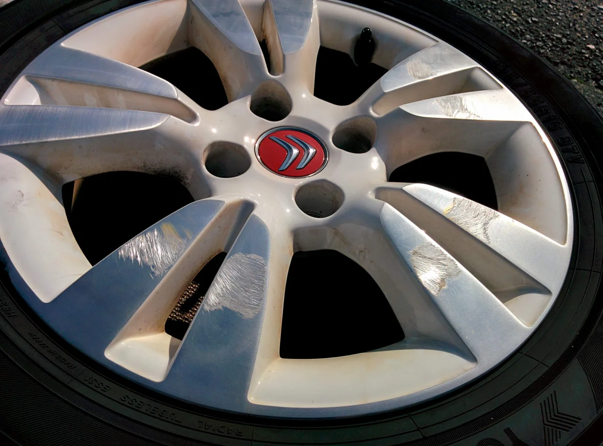
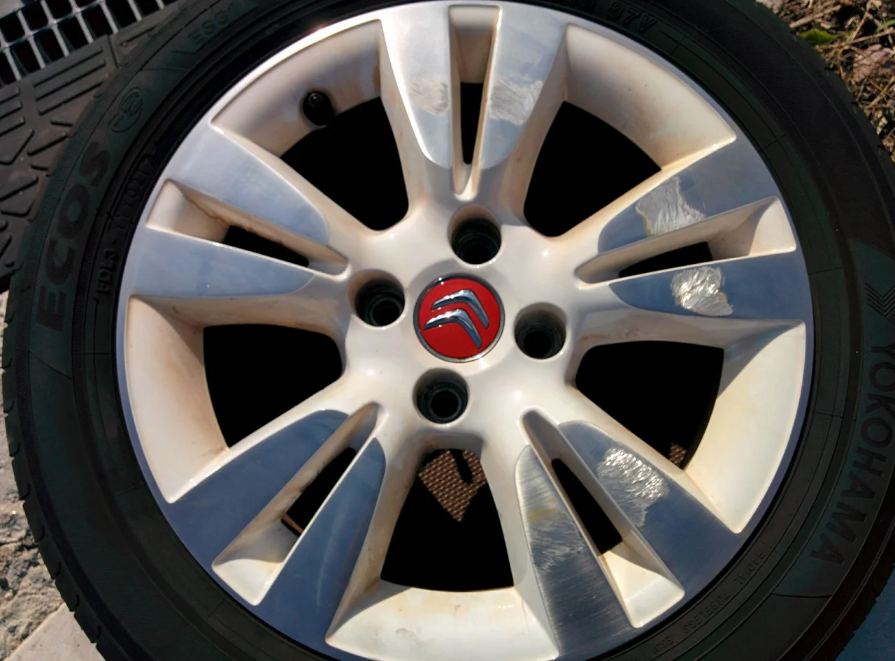
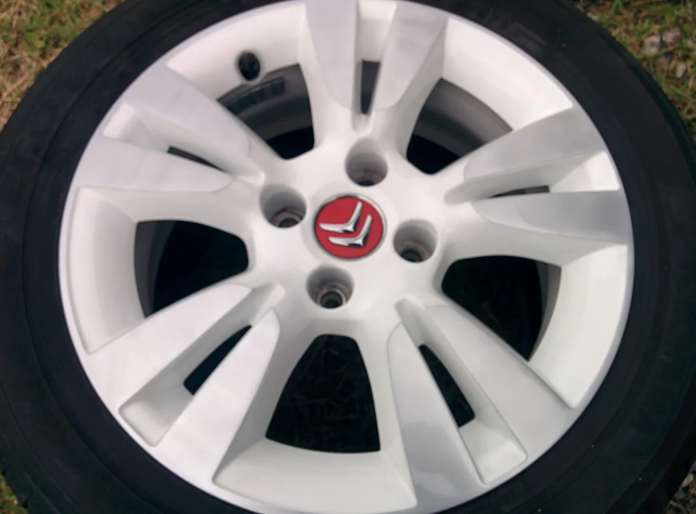

鬱陶しい梅雨に入りましたね、皆さんいかがお過ごしでしょうか？

ところで、梅雨時期の晴れの割り合いは意外にも30～40％だそうで、

週のうち1～2日、3日に1日は「晴れ」ということになります。

毎日雨ばかり降っているような気がしますが、実際はそうではないようです。

それに、梅雨の前期は晴れの日や中休みも多く、逆に末期はまとまった雨の日が多いようです。

それをトータルすれば30～40％が晴れということではないでしょうか？

まあ、雨の日ばかりじゃないということでがんばりましょう！（笑）

さて、そんな話は置いといて今回はシトロエンの純正ホイールです。

ビフォーがこれ

かなり痛々しく「ガリってますね」

アフターがこれ

ちょっと光の加減で違って見えちゃいますが、同じホイールです。

お困りの方はご相談ください。
