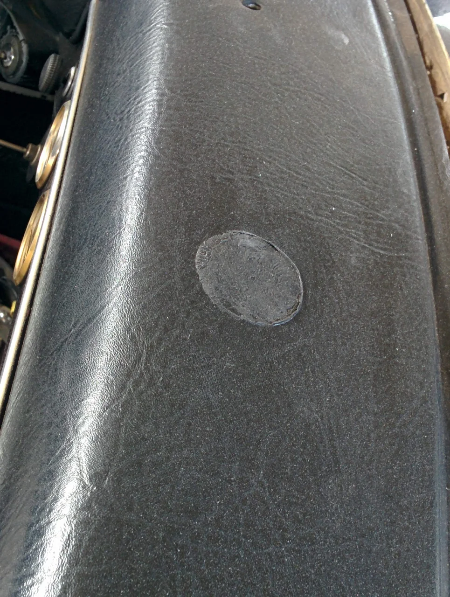
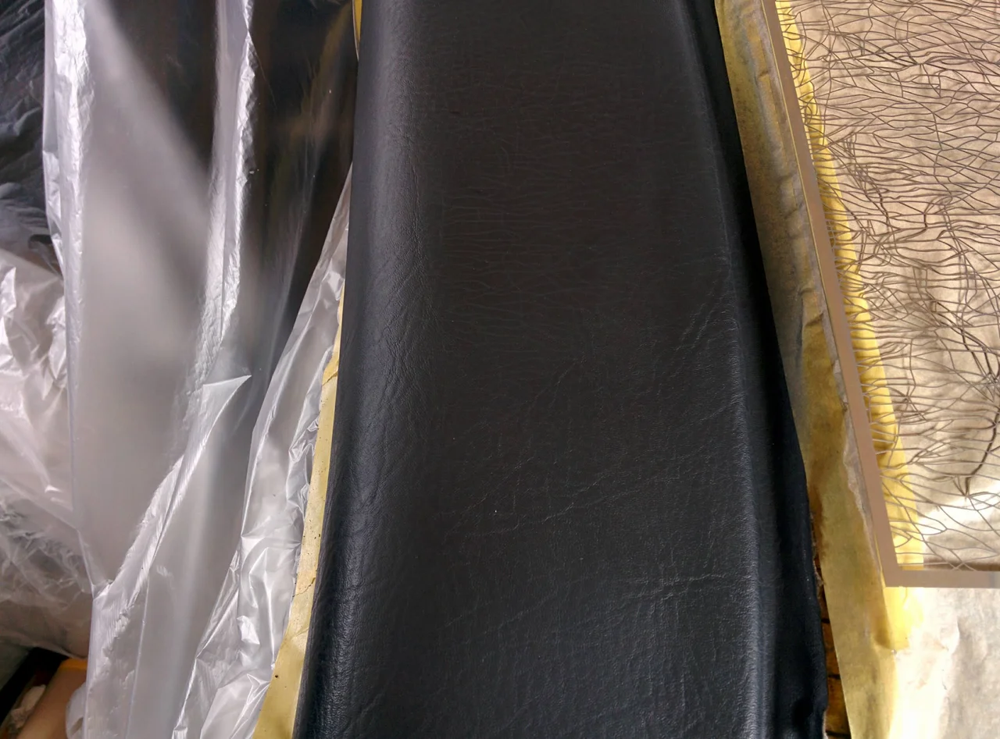

お盆も過ぎて少し暑さも一段落しましたね、しかし今年の夏は本当に暑かったですね。

皆様いかがお過ごしでしょうか？

ところで、今回はダッシュボードのナビの取付跡のリペアです。

ビフォーがこれ

くっきりとついてしまっています。しかも、接着剤の溶剤がダッシュの表面を侵し、クリーニングでは

落とせません。

アフターがこれ

こうなってしまえば、接着剤を除去して、表面を補修材で整え、できうる限りシボ模様の再現を

試みるしかありません。

お困りの方はお電話下さい。
