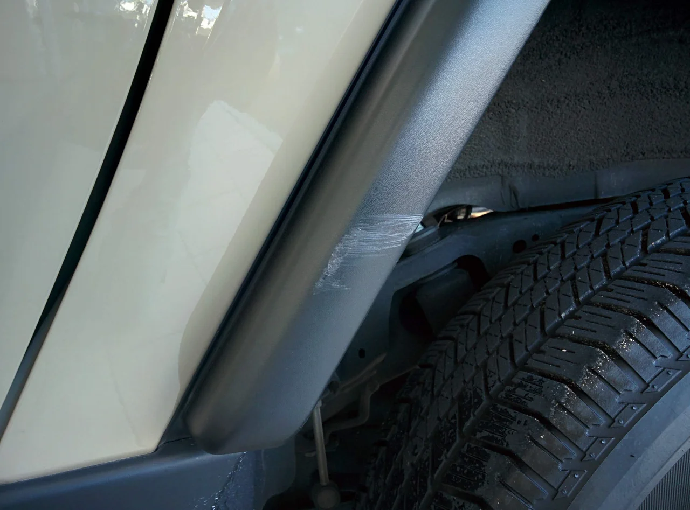
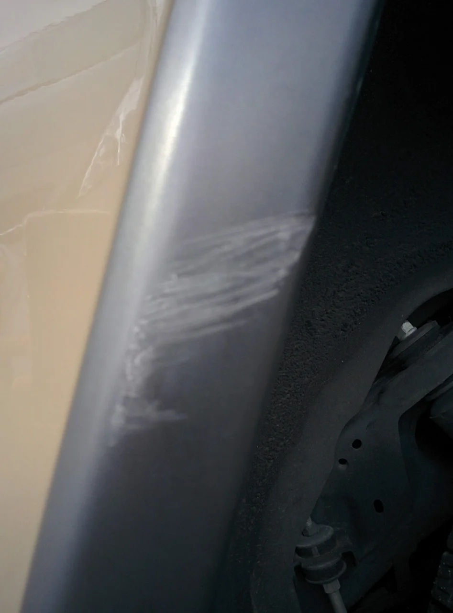
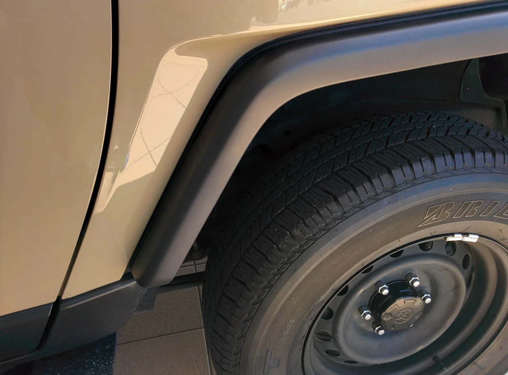
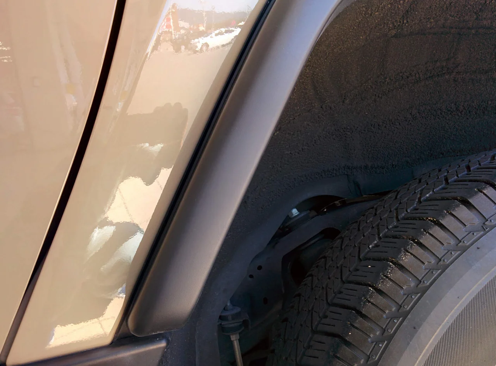

すっかり秋めいてきましたね、皆様いかがお過ごしでしょうか？

あんなに暑かったのが嘘のようです・・・。そして、仕事はサボっていませんが、相変わらず

ブログの更新はサボっていました（汗） 悪しからず。

ところで、今回は裏メニューのリペアで、ボディーのキズをリペアしました。

ボディーのキズといえば「鈑金屋さん」の領域なので、うちではそのような広範囲で

大掛かりな作業はやっていません。

しかし、ボディーのパーツでも鈑金屋さんではできない物があるみたいで、

それが今回の樹脂製のフェンダーなどです。

鈑金屋さんで使っているボディー用の塗料でやると、艶が出てしまい、違和感がある仕上がりになるようです。

ビフォーがこれ

アップです。

アフターがこれ

アップです。

トータルリペアオリジナルの樹脂と馴染みの良い補修材を

使用しています。

色は調色で作成しました。 艶はスプレーのやり方で大きく変わりますので、とてもむずかしいです。

お困りの方はご相談ください。
