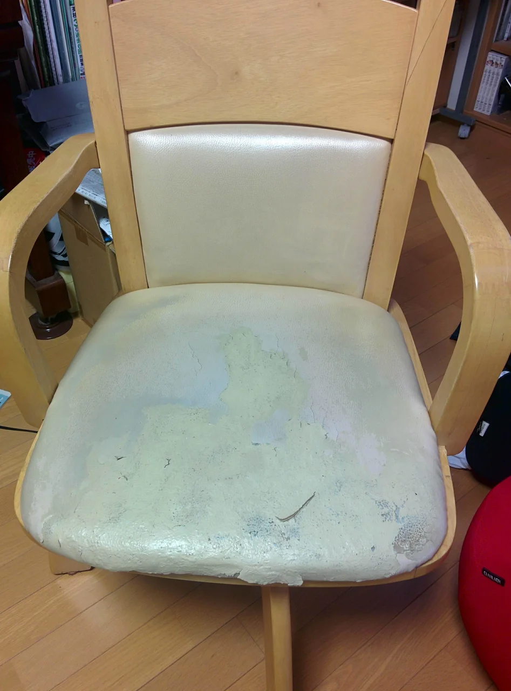
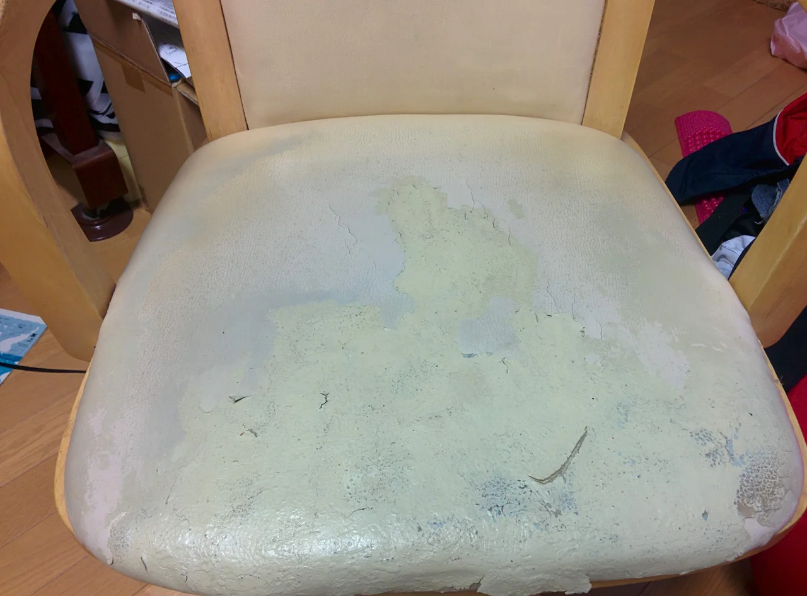
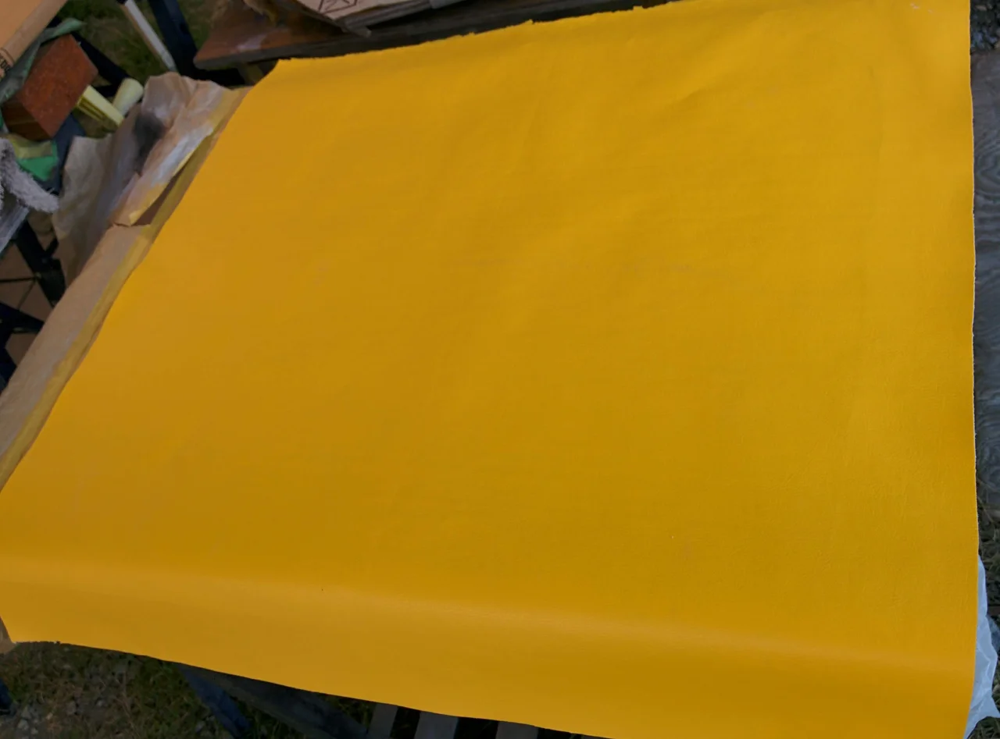
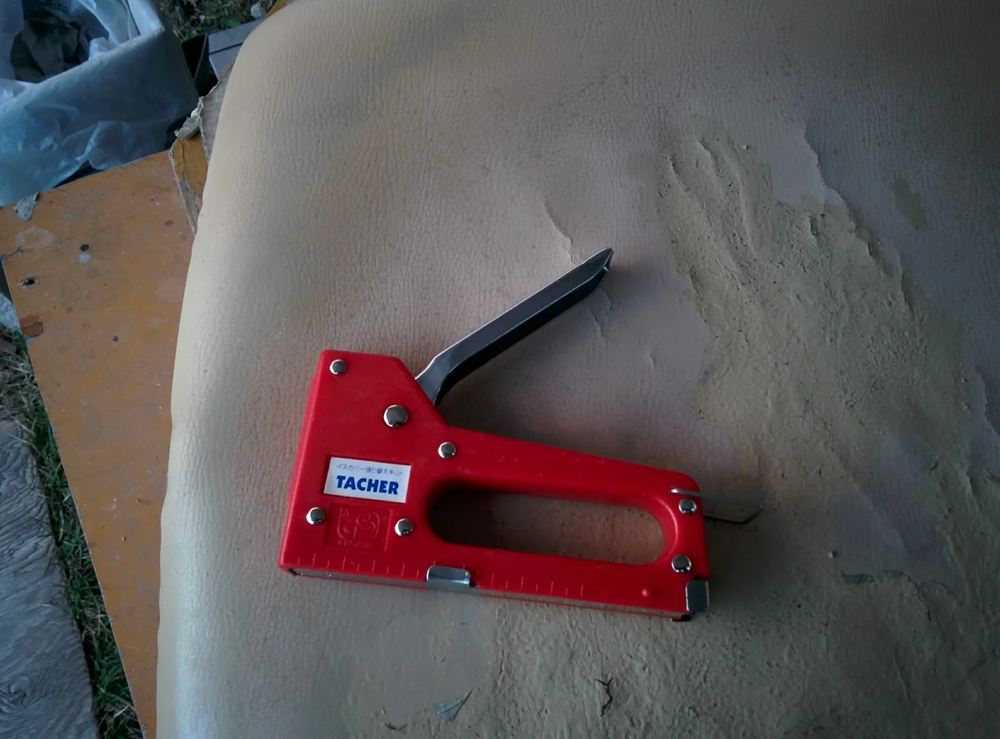
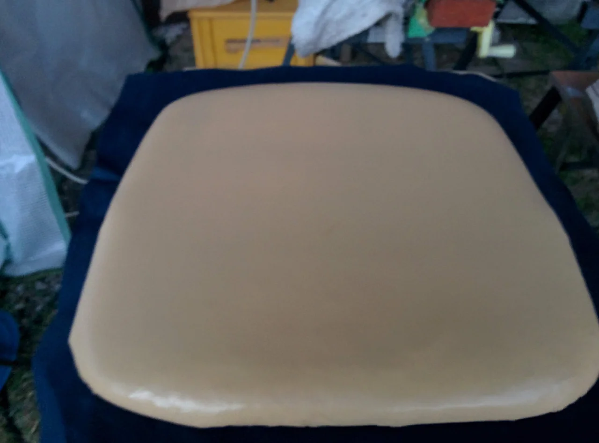
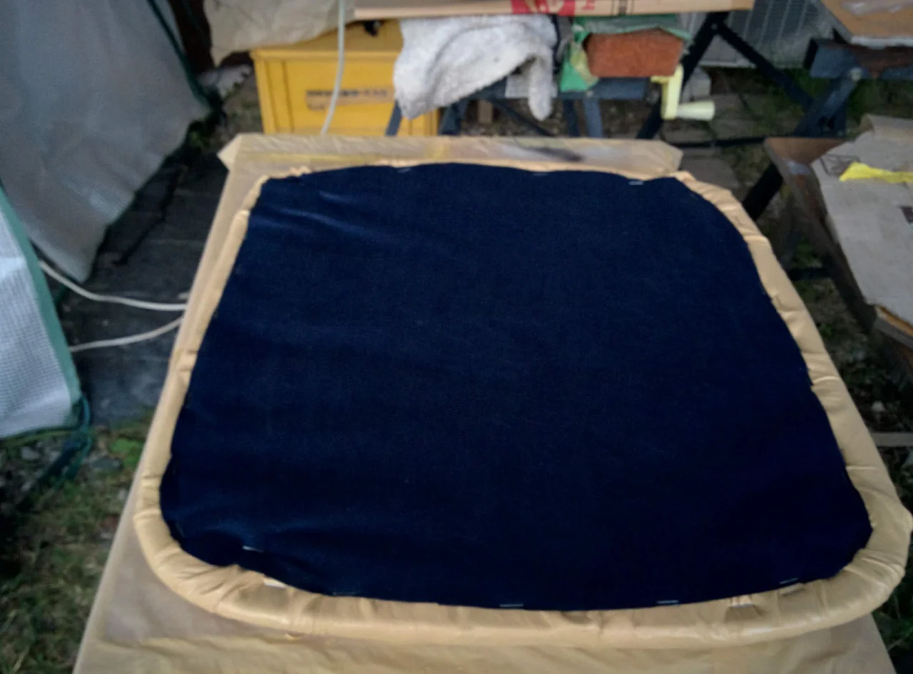
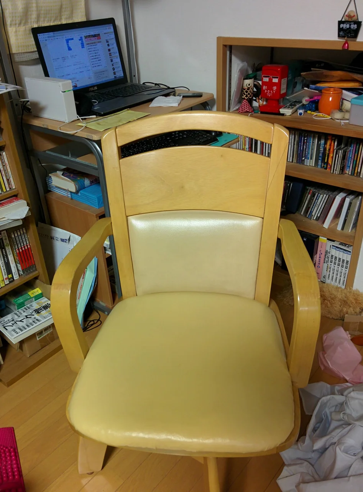

いよいよ朝晩冷え込んで来ましたね、そろそろ紅葉も始まってもう晩秋に差し掛かってきたのでしょうか？

皆様いかがお過ごしでしょうか？

僕は最近の気候に体がついていけずに、少し体調が優れませんでしたがようやく慣れてきました。

ところで、今回は我が家の椅子の張替えです。

もう10年以上使っているので、ぼろぼろの状態です。

アップ

こりゃひどい（笑）

貼り替え用のビニールレザーがどこにも売ってなくて困りました。

数年前まで近くのホームセンターにあったはずなのに無くなっていました。

仕方がないのでネットで買いました。

はっきり言って変な色！（笑）家庭ではどうにも使いようのない色です。

なので、もともとのクリーム色に染め替えました。

おっと、貼り替えにどうしても必要なのが、このタッカーです。

色はこんな感じです。

ついでにウラも貼り替えました。

完成です。

これでまだまだ使えそうです。
