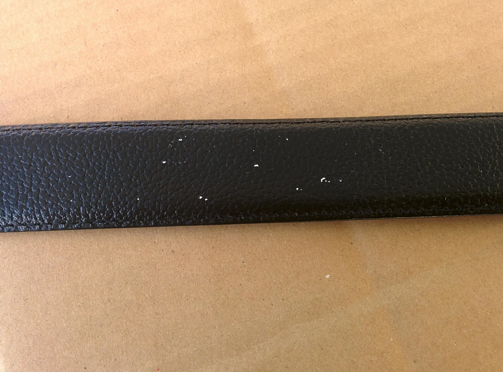
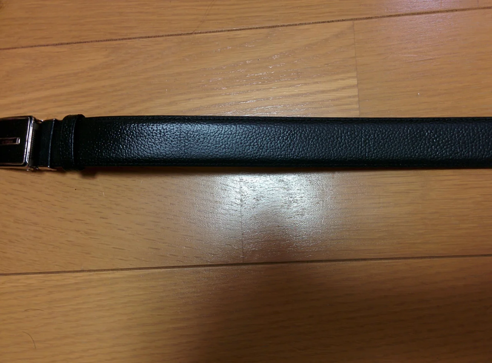
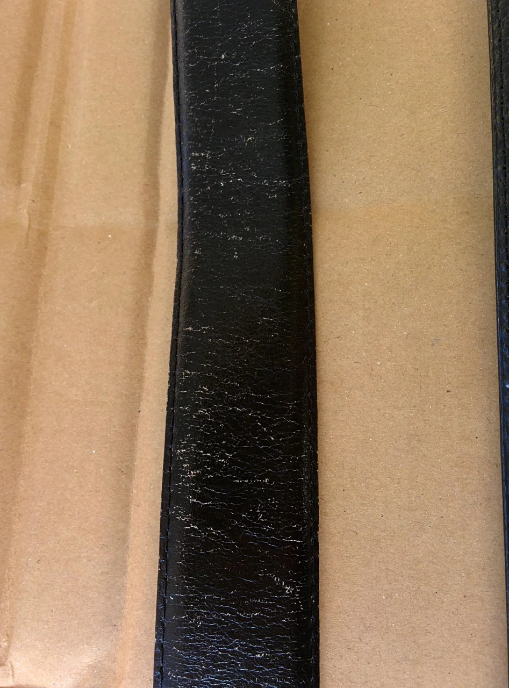
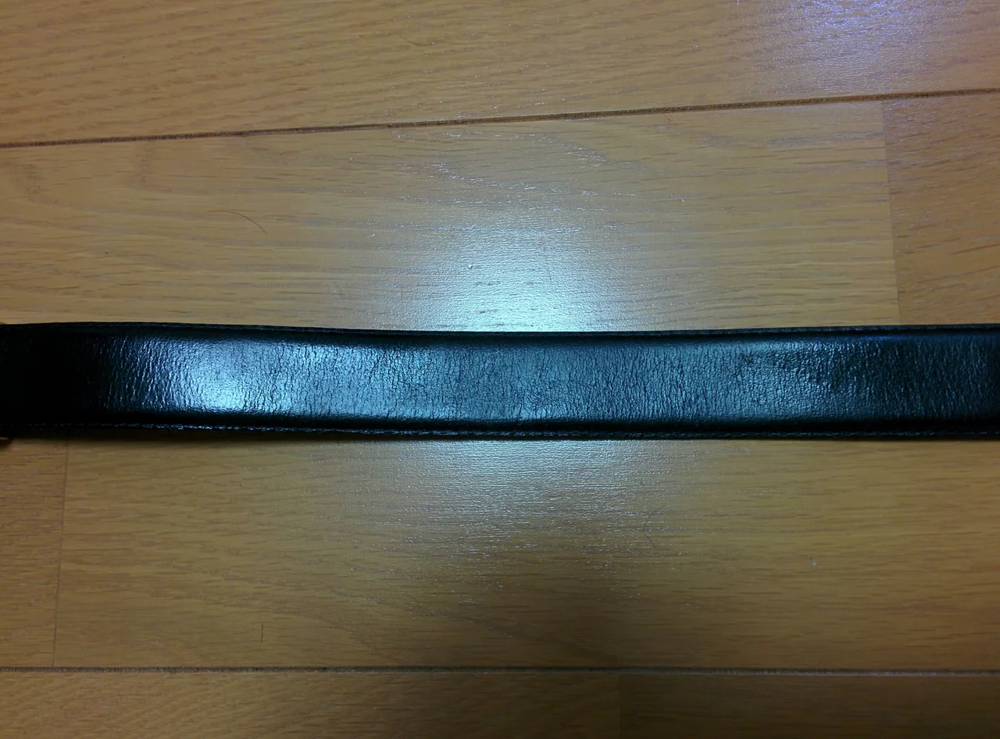

いつの間にか今年も最後の月にさしかかりましたね、今年は寒さがなかなかやって来ない（笑）ので

油断していました。皆様いかがお過ごしでしょうか？

ところで、今回はベルトのリペアです。

ベルトもしばらく使っていると、スレや剥げが発生します。

ビフォーがこれ

なんか点々と剥げています（笑）最初なんかよごれがついているのかと思って

クリーナーでこすりましたが、違いました。これは「剥げ」でした。

アフターがこれ

ブラックで調色して補修材をスプレーしました。

もう一丁

ビフォーがこれ

これもよくある曲げの部分の擦れによる剥げですね・・・。

アフターがこれ

これも補修材をスプレーでコーティングすれば艶と光沢も復活です。

まだまだ使えます。
