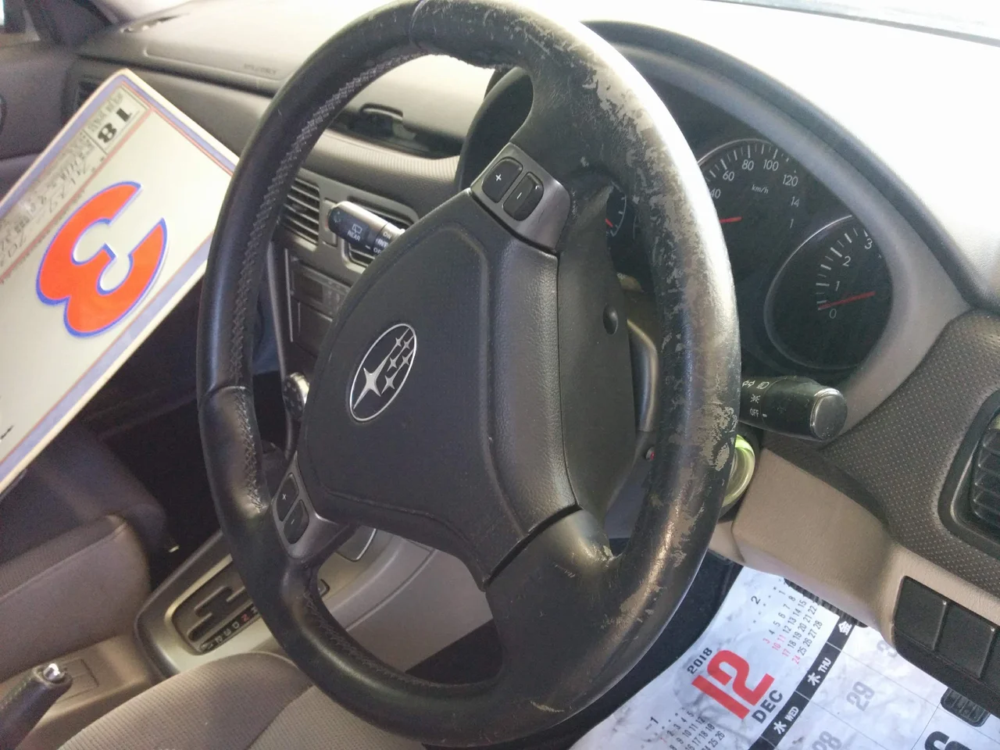
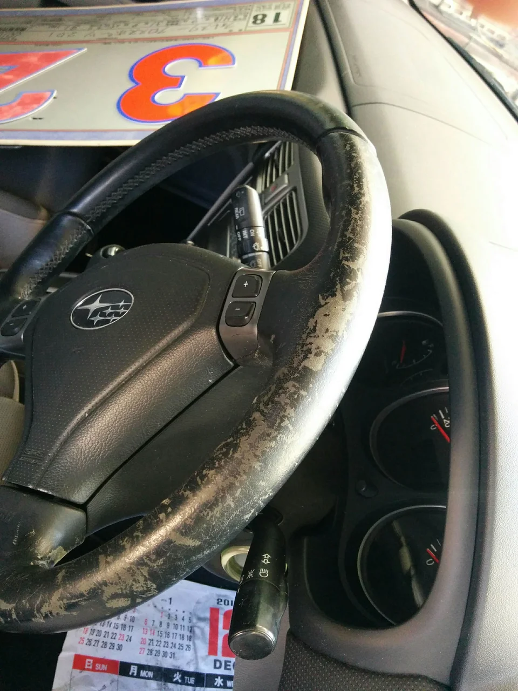
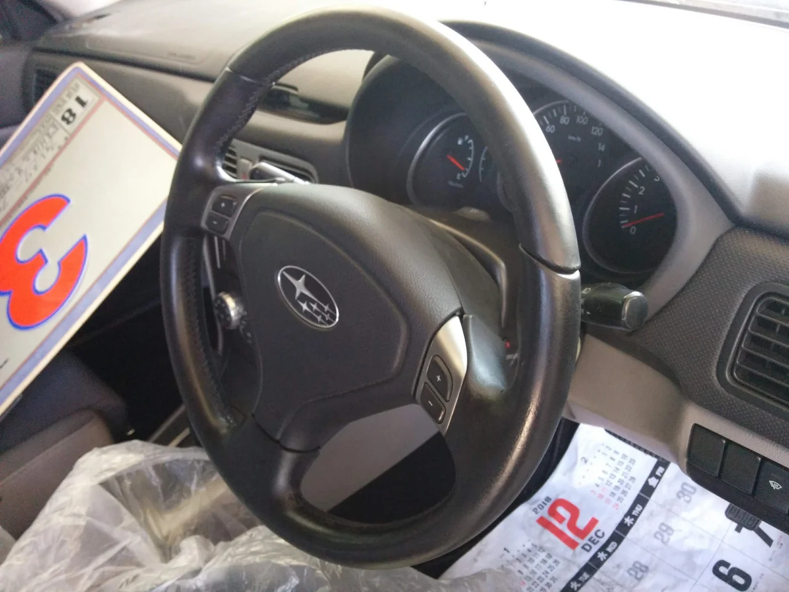
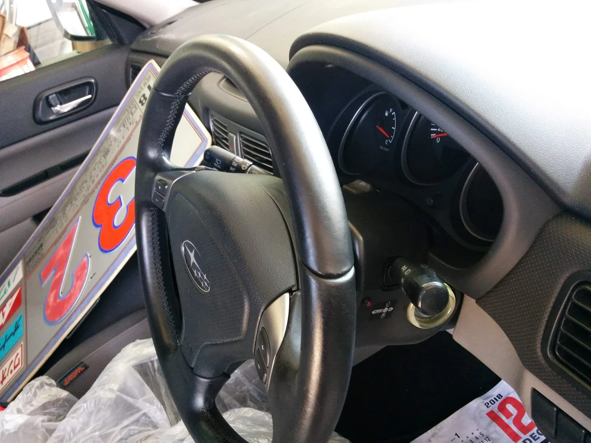

ついにGWに突入しましたね！ そして世間では新しい元号の話題でもちきりですね。

とにかく平和で暮らせることが何よりです、新しい時代もそうあることを願うばかりです。

ところで、今回はスバルのフォレスターのステアリングのリペアです。

ビフォーがこれ

角度を変えて

かなり使い込んでいますね、ハゲハゲです・・。

アフターがこれ

もう一枚

ほぼ全塗になりました。

ステアリングはどうしても必ず触るところでもあり、しかも人によっては強く握るクセの方がいらっしゃいます。

トータルリペアでは補修材に耐久性を高める添加剤を加えることもできます。

部位によって適宜使用しております。 お困りの方はお申し付け下さい。
