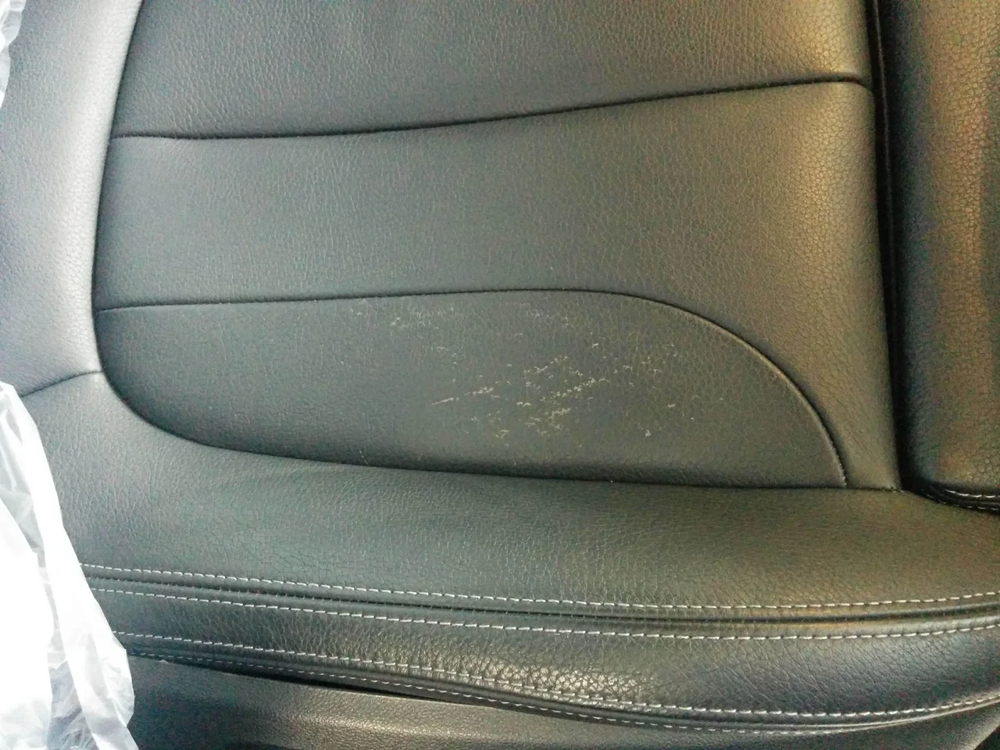
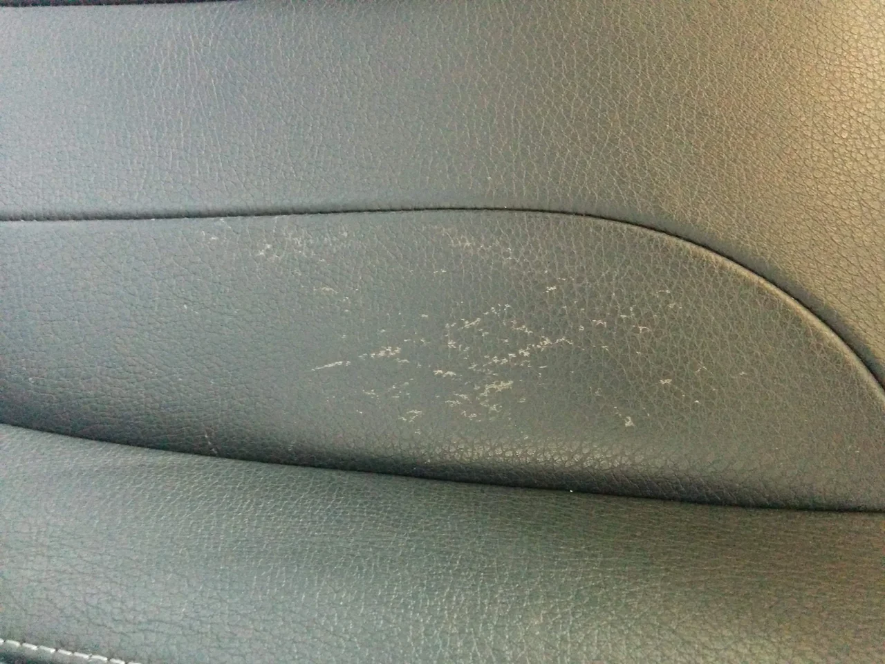
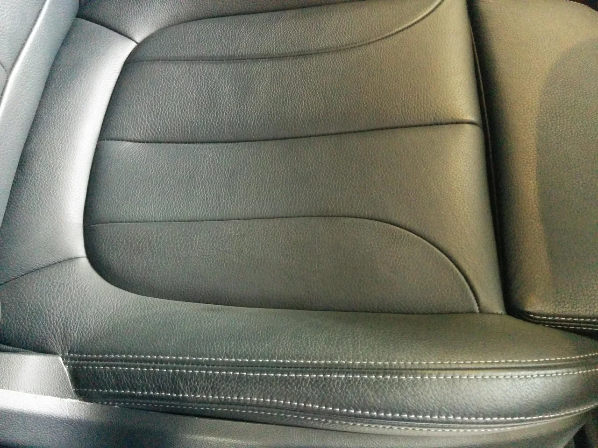
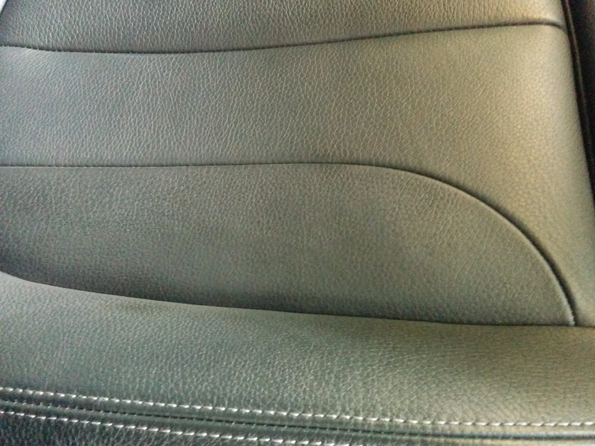

こんにちは、皆様お久しぶりです。

ぼちぼちコロナもおさまって来ましたが、いかがお過ごしでしょうか？

長らく更新をサボっておりましたが、死んだわけではありません（笑）ちゃんと仕事はしておりましたので

ご安心下さい。

今回は車のシートのリペアです。

車種はドイツの〇〇○だったと思います。

ビフォーがこれ

シートの座面が少し擦れて剥げてきています。

拡大図

そしてアフターがこれ

放っておくとここからいっきに劣化が進んでしまいますが、早めの補修で、耐久性が格段に上がります。

トータルリペアでは補修に擦れに強い強化剤を使用しています。

張替えになる前に早めにご相談下さい。
